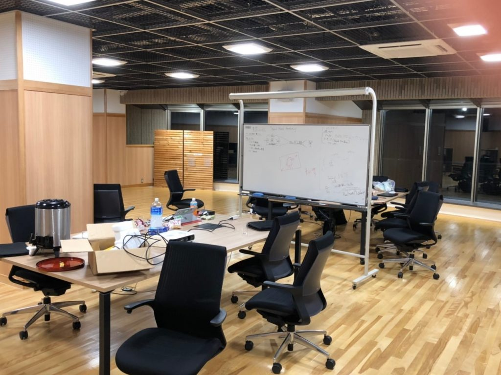

<!-- wp:paragraph -->

２年前に消滅してしまった合宿を再興したいということで、９月９日～９月１１日にかけて、福井県にある「泰澄の杜（たいちょうのもり）」で夏合宿を行いました。

<!-- /wp:paragraph -->

<!-- wp:paragraph -->

この合宿の目的はチーム開発を経験することということで、３人１組の２つのグループに分かれて開発をしました。開発をする時間は９月９日の１６時から９月１１日の１１時３０分まででした。最後の夜は徹夜をして、開発終了時間にはどちらも動くものを発表することができました。

<!-- /wp:paragraph -->

<!-- wp:paragraph -->

今回お世話になった「泰澄の杜」さんは、大人数が入れる多目的室を６人で使わせていただいたり、料理がおいしかったり大変満足しました。

<!-- /wp:paragraph -->

<!-- wp:paragraph -->

個人的な感想としては、開発時間がもう１日くらいあればよかったなと思ったので次に開発合宿をする際は３泊４日とかにしてもいいかなと思います。

<!-- /wp:paragraph -->

<!-- wp:paragraph -->
合宿とは関係のない話ですが、**大阪大学コンピュータクラブは後期も部員を募集しているので、入部したい方や見学したい方は是非メールを送ってください。**
<!-- /wp:paragraph -->

<!-- wp:image {"id":112,"width":369,"height":277} -->

<!-- /wp:image -->
