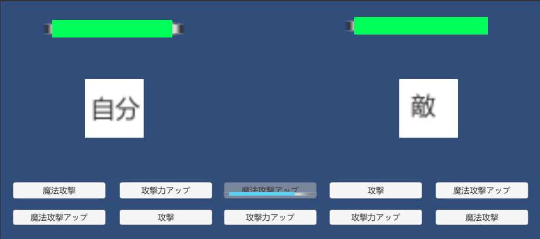

<!-- wp:paragraph -->

これはOUCC 2019年アドベントカレンダー　12/10　分の記事です。

<!-- /wp:paragraph -->

<!-- wp:paragraph -->

ちょこっと思いついてUnityで簡単に作ったゲームについて書きます。作ったといっても個人で自己満足するくらいの出来で、とても他人に見せられるものではないです。

<!-- /wp:paragraph -->

<!-- wp:paragraph -->

今回考えたゲームのテーマは、「デッキ作製系リアルタイム対戦ゲーム」です。戦闘画面のイメージは次の通り。

<!-- /wp:paragraph -->

<!-- wp:image {"id":125} -->

対戦画面

<!-- /wp:image -->

<!-- wp:paragraph -->

画面下にコマンドを10個程度用意し、ボタンをクリックするとその効果を発揮する、という感じで先頭を進めます。連打は禁止するために一定時間押せないようにし、また、押すたびにそのボタンが発揮する効果を変更します。ほんとはもっとカードっぽいものにしたいんですけど、もちろん著者にそんな技術や時間はありません。

<!-- /wp:paragraph -->

<!-- wp:paragraph -->

ボタンに現れる効果は、あらかじめデッキを作成しておき、そのデッキにおけるカードの割合で出す、ということを考えています。つまり、攻撃カード、攻撃力アップカード、魔法攻撃カード、魔法攻撃アップカードを各1枚ずつ入れたデッキなら、4分の1の確率で各カードが登場します。

<!-- /wp:paragraph -->

<!-- wp:paragraph -->

戦闘はこのボタンクリックのみで行います。そのため、図では攻撃系のカードしか表示してませんが、体力回復、防御力アップなどのカードも入れる必要があると思います。カードゲームをしたことがある人なら、使いたいカードをただひたすら入れてもうまく動かないことがよくわかると思います。なので、戦闘そのものより、戦闘しやすいようにデッキを作る、というのが主なゲームになると思います。そんなところまで作ってませんけど。

<!-- /wp:paragraph -->

<!-- wp:paragraph -->

ここからは、このゲームを作る場合どうするのがいいかということついてだらだら書こうと思います。

<!-- /wp:paragraph -->

<!-- wp:paragraph -->

まず能力アップ系のカードについてですが、戦闘中に何回も押されるため、効果を小さくする必要があります。1.1^100は約14000なので、まあ1.1倍とかがいいのかなと思います。また、1回の戦闘で終わるのはせっかく強くしたのに、という感じだったり難易度的にもその敵に対しデッキを作るだけになるので、フェーズの形で1つ前の状態を受け継いで次の敵キャラとの戦闘に入る、とするほうがいいんじゃないかと思ってます。

<!-- /wp:paragraph -->

<!-- wp:paragraph -->

デッキ作製系ゲームを謳うならカードの種類もいろいろ必要だと思うんですけど、上に挙げたもの以外だと普通の攻撃だけでなく必殺技を設けるとか、あとはレベルの高いカードを用意して、効果が1.1倍でなく1.2倍になったり、次にカードが押せるようになるまでの時間が短くなるみたいな効果を追加したらいいんじゃないかと思います。あとは、デッキを2つ用意しておいてデッキを入れ替えるカード、というのもゲーム性が上がるんじゃないかと思います。

<!-- /wp:paragraph -->

<!-- wp:paragraph -->

ここまでいろいろ書いてきましたが、僕はこのゲームを最後まで作るつもりはありません。そんな気力がないので。なのでここまで作って完成ということにします。すでにこういうゲームがあるなら教えてほしいです。

<!-- /wp:paragraph -->
