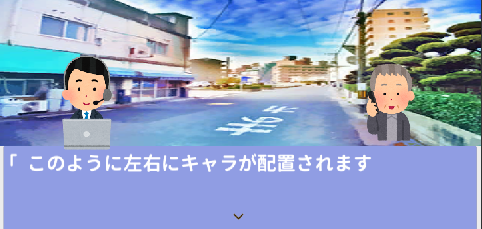
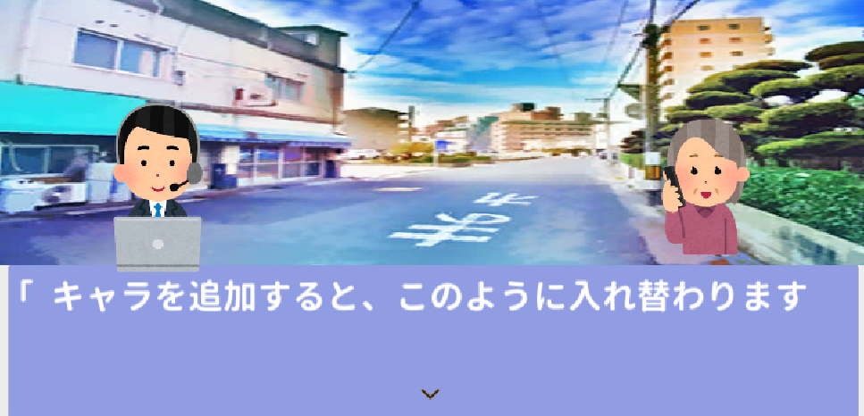
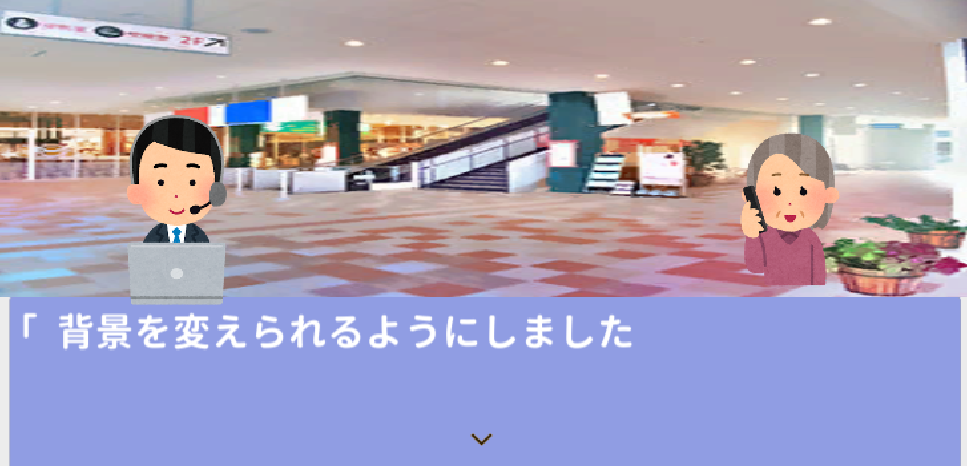
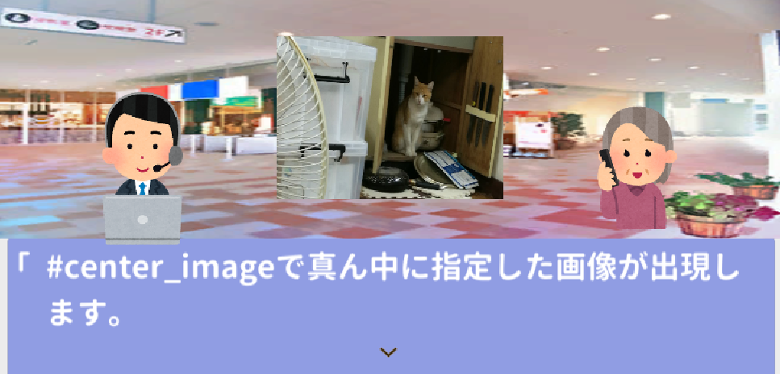
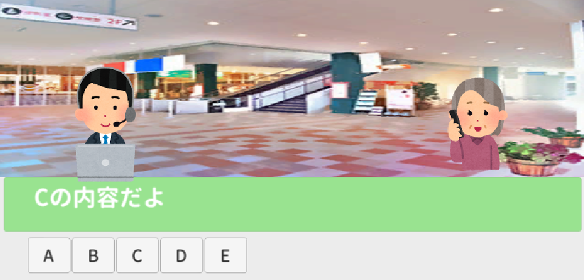

<!-- wp:heading -->
<h2>はじめに</h2>
<!-- /wp:heading -->

<!-- wp:paragraph -->

この記事は<a href="https://adventar.org/calendars/4650">OUCC Advent Calender 2019</a>の23日目の記事です（完成したのは12/31です）

<!-- /wp:paragraph -->

<!-- wp:paragraph -->

パワポケから野球要素を抜いたノベルゲームみたいなのを作りたかったので、12月から土台作りを始めました。 土台作りといっても基礎となる部分は以下のサイトを参考に作成しました。

<!-- /wp:paragraph -->

<!-- wp:core-embed/wordpress {"url":"https://kanchi0914.hatenablog.com/entry/2019/10/02/181617","type":"wp-embed","providerNameSlug":"hatena-blog","className":""} -->

https://kanchi0914.hatenablog.com/entry/2019/10/02/181617

<!-- /wp:core-embed/wordpress -->

<!-- wp:paragraph -->

今回はこれをパワポケ風に近づけるために追加した機能を書きたいと思います。

<!-- /wp:paragraph -->

<!-- wp:heading -->
<h2>1　キャラの立ち位置を二か所にする</h2>
<!-- /wp:heading -->

<!-- wp:paragraph -->

パワポケでは左右にキャラが立って、会話が展開されるので、まずはキャラを左右に立たせるようにしました。このとき、３人目のキャラを追加するときは、既にいるどちらか二人のうちの一人を消して、３人目のキャラを追加するようにしました。

<!-- /wp:paragraph -->

<!-- wp:gallery {"ids":[150,151]} -->
- 
- 
<!-- /wp:gallery -->

<!-- wp:paragraph -->

Gif画像をUpしたかったのですが、容量的に上げられませんでした...

<!-- /wp:paragraph -->

<!-- wp:heading -->
<h2>2　背景画像を変える</h2>
<!-- /wp:heading -->

<!-- wp:paragraph -->

#bg_imageで背景を変えられるようにしました。

<!-- /wp:paragraph -->

<!-- wp:gallery {"ids":[152]} -->

<!-- /wp:gallery -->

<!-- wp:heading -->
<h2>3　真ん中に画像が出るようにする</h2>
<!-- /wp:heading -->

<!-- wp:paragraph -->

背景と同じ要領で真ん中に画像が出るようにしました。背景との違いは#center_imageで真ん中に画像が出現して、#center_image_offでその画像を見えなくするといったところです。

<!-- /wp:paragraph -->

<!-- wp:gallery {"ids":[153]} -->

<!-- /wp:gallery -->

<!-- wp:heading -->
<h2>４　選択肢の内容をメッセージボックスに表示する</h2>
<!-- /wp:heading -->

<!-- wp:paragraph -->

選択肢のボタンを表示させて、ボタンに触れるとそのボタンのテキストの内容をメッセージボックスに表示するようにしました。

<!-- /wp:paragraph -->

<!-- wp:gallery {"ids":[154]} -->

<!-- /wp:gallery -->

<!-- wp:heading -->
<h2>５　その他機能</h2>
<!-- /wp:heading -->

<!-- wp:paragraph -->

そのほかに追加した機能としては、BGMを変える機能や、SEを鳴らす機能、コマンドで使用している'#'をメッセージボックスに表示させるためのエスケープシーケンスを実装しました。

<!-- /wp:paragraph -->

<!-- wp:heading -->
<h2>６　まとめ</h2>
<!-- /wp:heading -->

<!-- wp:paragraph -->

以上述べたような機能を実装しましたが、パワポケ風にするためには、パラメーターの追加やフラグ管理など、追加しなければならないことが沢山あるのでこれからも追加していきたいと思います。 今回は容量の都合上、gif画像を使えなかったので、次に投稿するときはgif画像を上げられるようなブログで書きたいなと思います。

<!-- /wp:paragraph -->

<!-- wp:heading -->
<h2>お借りした素材</h2>
<!-- /wp:heading -->

<!-- wp:paragraph -->

キャラクターの素材：いらすとや様 背景素材：<a href="https://ayaemo.skr.jp/">あやえも研究所様</a> 出演：部室に侵入した猫様

<!-- /wp:paragraph -->
