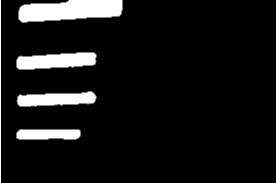
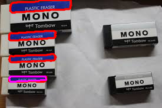
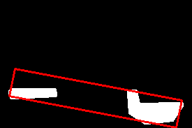
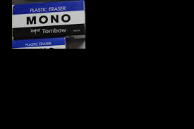
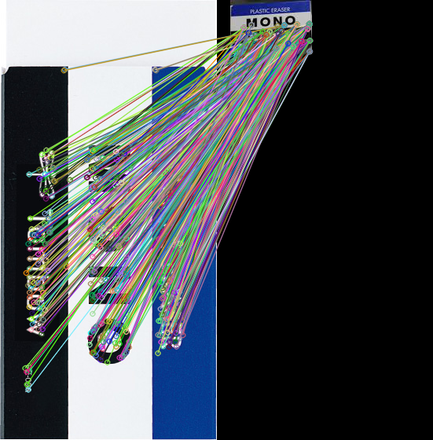
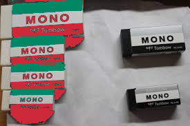
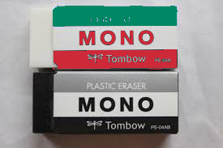

<!-- wp:table -->
<ul class="border-2">
<li><a href="#a1">～あらすじ～</a></li>
<li><a href="#a2">道のり①　消しゴムの青いところを取得 </a></li>
<li><a href="#a3">道のり②　MONO消しゴムを判別</a></li>
<li><a href="#a4">道のり③　MONO消しゴムをイタリア化  </a></li>
<li><a href="#a5">結果</a></li>
<li><a href="#a6">コード</a></li>
<li><a href="#a7">参考・その他</a></li>
</ul>
<!-- /wp:table -->

<!-- wp:block {"ref":211} /-->

<!-- wp:heading -->
<h2 id="a1">・～あらすじ～</h2>
<!-- /wp:heading -->

<!-- wp:paragraph -->
<p>　クリスマスではないけど、一応アドベントカレンダーの名目で二日目の記事書かせてもらいますOUCCの2DCG班長です。最初は適当にunityの音声認識の記事でも書いてやり過ごそうと思ってたんですが、一日目の先代の部長が結構頑張ってたんで、それを見て急遽書く内容変更して、一日で出来るけどそこそこ難易度のあるテーマを考えました。シートン学園を見ながら3時間くらい悩んだ結果、PCの隣にあったMONO消しゴムのデザインがエストニアの国旗に似ているな～とふと気が付いて、現在に至ります。</p>
<!-- /wp:paragraph -->

<!-- wp:html -->
<BR id="a2">
<!-- /wp:html -->

<!-- wp:heading -->
<h2>・道のり①　消しゴムの青いところを取得</h2>
<!-- /wp:heading -->

<!-- wp:paragraph -->
<p>　コードが300行あって説明が大変なので要点をかいつまんで書きます。読んでも幸せになれない可能性があるので、青い鳥をお探しの方は結果まで飛ばした後、AMAZONにお買い求めください。</p>
<!-- /wp:paragraph -->

<!-- wp:paragraph -->
<p>※実行環境はwindows10、Python3.8で、使用ライブラリはOpenCVとNumPyです。</p>
<!-- /wp:paragraph -->

<!-- wp:paragraph -->
<p>・MONO消しゴムが写っている画像を読込み</p>
<!-- /wp:paragraph -->

<!-- wp:paragraph -->
<p>・読み込んだ画像をガウス平滑化</p>
<!-- /wp:paragraph -->

<!-- wp:paragraph -->
<p>・cv2.inRangeで青周辺の色域選択＆選択部分取得</p>
<!-- /wp:paragraph -->

<!-- wp:paragraph -->
<p>・cv2.dilateで白い部分を膨張させ、erodeで収縮</p>
<!-- /wp:paragraph -->

<!-- wp:paragraph -->
<p>↑（これは白い部分の中に散見される黒い所を出来れば除去したいなという希望でやってます。）</p>
<!-- /wp:paragraph -->

<!-- wp:html -->

<!-- /wp:html -->

<!-- wp:paragraph -->
<p>・cv2.findContoursで輪郭を取得</p>
<!-- /wp:paragraph -->

<!-- wp:paragraph -->
<p>・各々の輪郭についてcv2.contourAreaで輪郭領域内の面積を求め、小さすぎる領域や、大きすぎる領域を除外。</p>
<!-- /wp:paragraph -->

<!-- wp:paragraph -->
<p>・一面真っ黒の画像をnp.zerosで生成。</p>
<!-- /wp:paragraph -->

<!-- wp:paragraph -->
<p>・各輪郭について黒一色の画像にcv2.drawContoursで輪郭を描画</p>
<!-- /wp:paragraph -->

<!-- wp:paragraph -->
<p>・cv2.momentsで輪郭で囲まれた各領域の重心を求める。</p>
<!-- /wp:paragraph -->

<!-- wp:paragraph -->
<p>・cv2.floodFillで先ほど輪郭を描画した画像について重心を含む領域を塗りつぶし。</p>
<!-- /wp:paragraph -->

<!-- wp:paragraph -->
<p>↑領域の中の黒い点を塗りつぶしで除去</p>
<!-- /wp:paragraph -->

<!-- wp:paragraph -->
<p>・塗りつぶし画像のnp.averageが大きければ塗りつぶし失敗なので、cv2.bitwise_notで反転。</p>
<!-- /wp:paragraph -->

<!-- wp:paragraph -->
<p>・こうして作成された塗りつぶされた画像(輪郭の数だけ存在)と輪郭情報をペアでリスト(名前：blue_area)に格納。</p>
<!-- /wp:paragraph -->

<!-- wp:paragraph -->
<p>・消しゴムの黒い部分に関しても同様にして、リスト(名前：black_area)に格納。</p>
<!-- /wp:paragraph -->

<!-- wp:image -->

<div class="text-sm text-center w-11/12 -mt-5">輪郭を描画した画像</div>
<!-- /wp:image -->

<!-- wp:html -->
<BR id="a3">
<!-- /wp:html -->

<!-- wp:heading -->
<h2> ・道のり②　MONO消しゴムを判別</h2>
<!-- /wp:heading -->

<!-- wp:paragraph -->
<p>MONO消しゴムは青から少し離れて黒の領域があるという性質を利用して消しゴムの柄の場所を特定していきます。</p>
<!-- /wp:paragraph -->

<!-- wp:html -->
・black_areaとblue_areaの要素の全ての組み合わせについて、

+ 2つの塗りつぶされた画像の膨張を前述のdilateで行う。
+ cv2.bitwise_andで重なった領域を取得する
+ 2つの画像の重なった領域がnp.averageが0より大きいかを見て存在を確認し、存在すればその組み合わせを除外(一つの消しゴムの青い領域と黒い領域が接することは無いため。)
+ np.concatenateで2つの輪郭領域情報のリストを結合する。<br>
+ cv2.minAreaRectで二つの領域に外接する最小の長方形を取得。
+ 2つの塗りつぶされた領域の面積を前述の方法で求める。
+ 長方形の面積を求める。
+ 長方形の面積が塗りつぶされた面積に対し比較的大きかったり小さければその組み合わせを除外(青と黒の領域が離れている組み合わせを除外)
+ 除外されずに残った組み合わせの先ほど作成した長方形を保持。


<!-- /wp:html -->

<!-- wp:image {"id":222} -->

<div class="text-sm text-center w-11/12 -mt-5">青い部分の抽出された画像(blue_areaの要素の一つ)と黒い部分の抽出された画像(black_areaの要素の一つ)をOR演算で合成し、外接矩形を表示した画像。心の清い人には外接しているように見えるはず。長方形の面積が白い部分の面積より比較的大きいため、この組み合わせは正しくないと判別する。</div>
<!-- /wp:image -->

<!-- wp:paragraph -->
<p>・保持された全ての長方形と保持された他の全ての長方形との組み合わせしていき、一方の長方形がもう一方の長方形にほとんど含まれているとき、大きい方の長方形を除外。</p>
<!-- /wp:paragraph -->

<!-- wp:paragraph -->
<p>↑この判別法は、長方形の領域を塗りつぶし、AND演算を行って重なった部分の比率がどれくらいあるかで判別しています。</p>
<!-- /wp:paragraph -->

<!-- wp:paragraph -->
<p>・残った領域一つ一つについて、その領域の部分だけをマスキングして切り取る。(読み込んだ画像と長方形の中身を塗りつぶした画像のAND演算)</p>
<!-- /wp:paragraph -->

<!-- wp:paragraph -->
<p>↑なお、この過程で次元の低い長方形塗りつぶしの画像はcv2.COLOR_GRAY2BGRで3次元に変換。</p>
<!-- /wp:paragraph -->

<!-- wp:image {"id":190} -->

<div>画像にマスキングをかけて消しゴム一個だけ取得した画像</div>
<!-- /wp:image -->

<!-- wp:paragraph -->
<p>・<a href="https://qiita.com/hitomatagi/items/caac014b7ab246faf6b1">hitomatagiさんのコード</a>にかけて特徴量マッチングし、コード中のgoodの個数がある一定水準を超えないものを除外。</p>
<!-- /wp:paragraph -->

<!-- wp:image {"id":192,"width":291,"height":295} -->

<!-- /wp:image -->

<!-- wp:paragraph -->
<p>特徴点を結んでいった画像</p>
<!-- /wp:paragraph -->

<!-- wp:paragraph -->
<p>ここまでクリアしたものををMONO消しゴムと認定します。</p>
<!-- /wp:paragraph -->

<!-- wp:html -->
<BR id="a4">
<!-- /wp:html -->

<!-- wp:heading -->
<h2> ・道のり③　MONO消しゴムをイタリア化 </h2>
<!-- /wp:heading -->

<!-- wp:paragraph -->
<p>ここから色付けをしていきます。...とその前にもう3時近いので寝ます。おやすみなさい～</p>
<!-- /wp:paragraph -->

<!-- wp:paragraph -->
<p></p>
<!-- /wp:paragraph -->

<!-- wp:paragraph -->
<p>おはようございました。現在12時です。どうやら記事を書いていたのは夢落ちではないそうですね。さて...</p>
<!-- /wp:paragraph -->

<!-- wp:paragraph -->
<p>・各長方形を塗りつぶした画像と読み込んだ画像の青い部分を取得した画像のANDを取る。</p>
<!-- /wp:paragraph -->

<!-- wp:paragraph -->
<p>・AND演算して出来た画像の白い部分が存在するピクセルの座標と、同じ座標の読み込まれた画像の場所の色を緑に変更。(2重ループ文で一つ一つのピクセルを処理)</p>
<!-- /wp:paragraph -->

<!-- wp:paragraph -->
<p>・同様にして黒の部分を赤に変更</p>
<!-- /wp:paragraph -->

<!-- wp:paragraph -->
<p>完成！</p>
<!-- /wp:paragraph -->

<!-- wp:html -->
<BR id="a5">
<!-- /wp:html -->

<!-- wp:heading -->
<h2>・結果</h2>
<!-- /wp:heading -->

<!-- wp:image {"id":197} -->

<div class="text-sm text-center w-11/12 -mt-5">イタリアと化したMONO消しゴム</div>
<!-- /wp:image -->

<!-- wp:image {"id":224} -->

<div class="text-sm text-center w-11/12 -mt-5">他の画像での実行結果</div>
<!-- /wp:image -->

<!-- wp:paragraph -->
<p>　とても精度が悪いですね。影は仕方ないとしても、文字の部分や、ノイズは頑張ればどうにかなる部分です。でも作者は途中で力尽きました。許して下さい。</p>
<!-- /wp:paragraph -->

<!-- wp:html -->
<BR id="a6">
<!-- /wp:html -->

<!-- wp:heading -->
<h2>・コード</h2>
<!-- /wp:heading -->

<!-- wp:paragraph -->
<p>RTAして書いたコードなので絶対見ない方がいいですよ。呪われます。コード整理をしてなくてもOKで、呪い耐性がある方だけどうぞ。</p>
<!-- /wp:paragraph -->

<!-- wp:html -->

```py
import  cv2
import  numpy as np
import compare #引用したコードを記載した場所

def main():
    sample=cv2.imread("./data/monoEraser.jpg")
    testImg=cv2.imread("./data/test1.jpg")
    height, width, channels = testImg.shape
    image_size = height * width
    testImg_b= cv2.GaussianBlur(testImg, (9, 9), 2)
    hsv=cv2.cvtColor(testImg_b,cv2.COLOR_BGR2HSV)
    lower = np.array([110, 50, 50])
    upper = np.array([240, 255, 255])
    frame_mask = cv2.inRange(hsv, lower, upper)  

    img2,blueArea = getColorArea(frame_mask, testImg)
    lower = np.array([0, 0, 0])
    upper = np.array([180, 255, 50])
    frame_mask2=cv2.inRange(hsv,lower,upper)

    kernel = np.ones((5, 5), dtype=np.uint8)

    frame_mask2 = cv2.dilate(frame_mask2, kernel)
    frame_mask2 = cv2.erode(frame_mask2, kernel)


    testImg_g=cv2.cvtColor(testImg,cv2.COLOR_BGR2GRAY)

    img_canny=cv2.Canny(frame_mask2,300,400)


    img,blackArea=getColorArea(frame_mask2, testImg)
    rects=[]
    for i, blue_a in enumerate(blueArea) :
        for j,black_a in enumerate(blackArea):
            b,rect=checkAreaRatio(testImg,blue_a,black_a)
            if(b):
                rects.append(rect)
    deleteRects=[]
    for i, rect1 in enumerate(rects):
        for j,rect2 in enumerate(rects):
            if(i>j):
                k= checkContain(rect1,rect2,height,width)
                if(k==1):
                    deleteRects.append(rect2)
                elif(k==2):
                    deleteRects.append(rect1)
    for rect1 in deleteRects:
        rects.remove(rect1)
    deleteRects=[]
    for rect1 in rects:
        if(not compareTrait(sample,img,rect1)):
            deleteRects.append(rect1)
    for rect1 in deleteRects:
        rects.remove(rect1)
    for rect1 in rects:
        img=changeColorItaly(img,rect1)

    cv2.imshow("sample2", img)
    cv2.imwrite("./data/output6.png", img)
    cv2.waitKey(0)
    cv2.destroyAllWindows()
def changeColorItaly(img,rect):
    height, width, channels = img.shape
    mask = np.zeros((height, width), dtype=np.uint8)
    box = cv2.boxPoints(rect)
    box = np.int0(box)
    mask1 = np.copy(mask)
    mask1 = cv2.drawContours(mask1, [box], 0, 255, 1)
    mask1 = fillArea(mask1, int(rect[0][0] + 2), int(rect[0][1] + 2))
    mask2 = np.copy(mask)
    mask2 = cv2.drawContours(mask2, [box], 0, 255, 1)
    mask2 = fillArea(mask2, int(rect[0][0] + 2), int(rect[0][1] + 2))
    hsv = cv2.cvtColor(img, cv2.COLOR_BGR2HSV)
    lower = np.array([110, 50, 50])
    upper = np.array([240, 255, 255])
    frame_mask = cv2.inRange(hsv, lower, upper)
    lower = np.array([0, 0, 0])
    upper = np.array([180, 255, 50])
    frame_mask2 = cv2.inRange(hsv, lower, upper)
    mask1=cv2.bitwise_and(frame_mask,mask1)
    mask2=cv2.bitwise_and(frame_mask2,mask2)
    mask1=cv2.cvtColor(mask1,cv2.COLOR_GRAY2BGR)
    mask2=cv2.cvtColor(mask2,cv2.COLOR_GRAY2BGR)
    for x in range(height):
        for y in range(width):
            b, g, r = mask1[x, y]
            if (b, g, r) == (0, 0, 0):
                continue
            img[x, y] = 99, 135, 0
    for x in range(height):
        for y in range(width):
            b, g, r = mask2[x, y]
            if (b, g, r) == (0, 0, 0):
                continue
            img[x, y] = 57, 41, 206
    return img

def compareTrait(sample,img,rect):
    height, width, channels = img.shape
    mask = np.zeros((height, width), dtype=np.uint8)
    box = cv2.boxPoints(rect)
    box = np.int0(box)
    mask1 = np.copy(mask)
    mask1 = cv2.drawContours(mask1, [box], 0, 255, 1)
    mask1=fillArea(mask1,int(rect[0][0]+2),int(rect[0][1]+2))

    mask1=cv2.cvtColor(mask1,cv2.COLOR_GRAY2BGR)
    img2=cv2.bitwise_and(img,mask1)

    return compare.compare(sample,img2)

def checkContain(rect1,rect2,height,width):#領域の中に領域があるかチェック
    mask = np.zeros((height , width ), dtype=np.uint8)
    box=cv2.boxPoints(rect1)
    box = np.int0(box)
    mask1 = np.copy(mask)
    mask1 = cv2.drawContours(mask1, [box], 0, 255, 1)
    mask1=fillArea(mask1,int(rect1[0][0]+2),int(rect1[0][1]+2))
    box = cv2.boxPoints(rect2)
    box = np.int0(box)
    mask2 = np.copy(mask)
    mask2 = cv2.drawContours(mask2, [box], 0, 255, 1)
    mask2 = fillArea(mask2, int(rect2[0][0] + rect2[1][0] / 2),int( rect2[0][1] + rect2[1][1] / 2))
    mask3=cv2.bitwise_and(mask1,mask2)
    contours, hierarchy = cv2.findContours(mask3, cv2.RETR_TREE, cv2.CHAIN_APPROX_SIMPLE)

    if(len(contours)<=0):
        return  0
    area3 = cv2.contourArea(contours[0])

    area1=rect1[1][0]*rect1[1][1]
    area2 = rect2[1][0] * rect2[1][1]
    ratio=0.9
    if(area3>area1*ratio):
        return  1
    elif(area3>area2*ratio):
        return  2
    else:
        return 0

def checkAreaRatio(img,mask1,mask2):
    mask1,cnt_mask1=mask1
    mask2, cnt_mask2 = mask2
    kernel = np.ones((5, 5), dtype=np.uint8)
    mask4=cv2.dilate(mask1,kernel)
    mask5=cv2.dilate(mask2,kernel)
    mask6=cv2.bitwise_and(mask4,mask5)

    if(np.average(mask6)>0):#隣り合っている領域を除外
        return False,None
    area1=cv2.contourArea(cnt_mask1)
    area2=cv2.contourArea(cnt_mask2)
    cnt_mask3=np.concatenate([cnt_mask1,cnt_mask2])

    rect = cv2.minAreaRect(cnt_mask3)
    area3= rect[1][0]*rect[1][1]
    if (area3 > (area1 + area2) * 3 or area3<(area1 + area2) * 1.6):#比率で除外
        return False,None
    #box = cv2.boxPoints(rect)
    #box = np.int0(box)
    #img2=np.copy(img)
    #img2 = cv2.drawContours(img2, [box], 0, (0, 0, 255), 2)

    return  True,rect

def getColorArea(frame_mask, draw_img, draw=False):
    ret, testImg_g2 = cv2.threshold(frame_mask, 100, 255, cv2.THRESH_BINARY)

    contours, hierarchy = cv2.findContours(testImg_g2, cv2.RETR_TREE, cv2.CHAIN_APPROX_SIMPLE)
    height, width, channels = draw_img.shape

    img=draw_img
    if(draw):
        img = cv2.drawContours(draw_img, contours, -1, (0, 0, 255, 255), 2, cv2.LINE_AA)
    cont_area=[]

    for i, contour in enumerate(contours):
        area = cv2.contourArea(contour)
        image_size=height*width
        if area < 500:
            continue
        if image_size * 0.99 < area:
            continue
        epsilon = 0.02 * cv2.arcLength(contour, True)
        approx = cv2.approxPolyDP(contour, epsilon, True)
        if(draw):
            cv2.drawContours(img,[approx], -1,  (255, 0, 255), 2)

        mask = np.zeros((height, width), dtype=np.uint8)
        cv2.drawContours(mask, [approx], -1, (255, 0, 255), 2)
        M = cv2.moments(contour)
        mask= fillArea(mask,int(M['m10']/M['m00']),int(M['m01']/M['m00']))#引数に重心を入れている


        cont_area.append((mask,contour))


    return  img,cont_area
def fillArea(img,startx,starty,color=(0,0,255)):
    channels=0
    height=0
    width=0
    if(img.ndim==2):
        channels=1
        height, width = img.shape
    elif(img.ndim==3):
        height, width, channels = img.shape
    mask = np.zeros((height+2, width+2), dtype=np.uint8)#+2しないとエラー
    if(channels==3):
        pass
    else:
        color=255
    retval, img2, mask, rect = cv2.floodFill(img, mask, seedPoint=(startx, starty), newVal=color)
    if(np.average(img2)>100):#もし塗りつぶしが多ければ
        img2=cv2.bitwise_not(img2)#反転
    return img2

if __name__ == '__main__':
    main()
```
<!-- /wp:html -->

<!-- wp:html -->
<BR id="a7">
<!-- /wp:html -->

<!-- wp:heading -->
<h2>・参考・その他</h2>
<!-- /wp:heading -->

<!-- wp:paragraph -->
<p>・OpenCV 3とPython 3で特徴量マッチング（A-KAZE, KNN）：</p>
<!-- /wp:paragraph -->

<!-- wp:paragraph -->
<p><a href="https://qiita.com/hitomatagi/items/caac014b7ab246faf6b1">https://qiita.com/hitomatagi/items/caac014b7ab246faf6b1</a></p>
<!-- /wp:paragraph -->

<!-- wp:paragraph -->
<p>・OpenCV 2.2 C++ リファレンス：</p>
<!-- /wp:paragraph -->

<!-- wp:paragraph -->
<p><a href="http://opencv.jp/opencv-2svn/cpp/index.html">http://opencv.jp/opencv-2svn/cpp/index.html</a></p>
<!-- /wp:paragraph -->

<!-- wp:paragraph -->
<p>・OpenCV-Python　チュートリアル　：</p>
<!-- /wp:paragraph -->

<!-- wp:paragraph -->
<p><a href="http://labs.eecs.tottori-u.ac.jp/sd/Member/oyamada/OpenCV/html/index.html">http://labs.eecs.tottori-u.ac.jp/sd/Member/oyamada/OpenCV/html/index.html</a></p>
<!-- /wp:paragraph -->

<!-- wp:paragraph -->
<p>筆者：OUCC　２DCG・AI班長　上月</p>
<!-- /wp:paragraph -->
