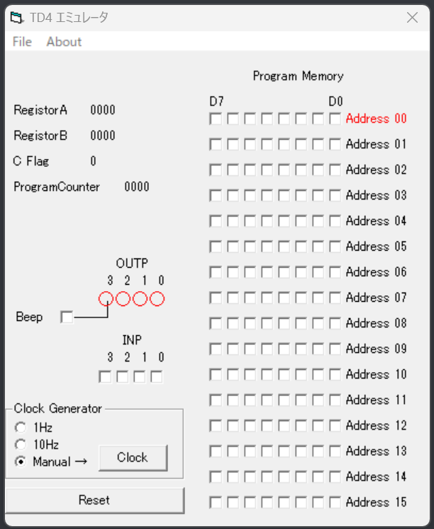

　この記事は [OUCC Advent Calendar 2023](https://adventar.org/calendars/9315) の18日目の記事です。前回はみやじさんによる [c# のjsonシリアライズの速度比較](https://oucc.org/blog/articles/1001/) でした。

この日までにTD4を完成させてそれを記事にしようと思っていましたが、まったく間に合わなかったのでエミュレータで遊ぶことにしました。(この記事も間に合いませんでしたごめんなさい) 


### TD4とは？
まず、**TD4**とは何か?ということですが、渡波 郁さんが書かれた 「CPUの創りかた」 という本で設計・制作する**4bit CPU**の名前です。

この本は、CPUの基本的な原理から設計までをとても分かりやすく解説している本です。CPUに興味があってオームの法則くらいが分かっていれば読むことができます。道具や部品があれば実際に制作して動かすこともできます!「CPUの創りかた」の紹介ページは[こちら](https://book.mynavi.jp/ec/products/detail/id=22065)です。阪大の総合図書館と理工学図書館にもおいてあります。

TD4はとても簡易なCPUなので現代で使われているPCのCPUには全く歯が立ちません。「じゃあなぜ作る？」ロマンのために作るのです。

仕様を引用します。出版当時のPC用CPUと比較されています。(分からないところや詳しいことはぜひ読んでみてね!!)

> 
> | | Intel Pentium4 | TD4 |
> |:-:|:-:|:-:|
> | 汎用レジスタ | 32bit×8 | 4bit×2 |
> | アドレス空間 | 32bit(4.3Gバイト)*2 | 4bit（16バイト） |
> | プログラムカウンタ(Pentium4ではEIP) | 32bit | 4bit |
> | フラグレジスタ | 32bit | 1bit |
> | 算術演算 | 浮動小数点演算が可能 | 4bitの加算のみ |
> | 動作クロック | 1.4GHz以上 | 3MHz程度 |
> | トランジスタ数 | 4200万以上 | 約1500（推定） |
> (渡波 郁(2003) 「CPUの創りかた」p140)


### 命令一覧
本書のTD4では12個の命令が定義されています。
命令サイズは8bitで上位4bitがオペレーションコード、下位4bitがイミディエイトデータ(Im)です。Imを入れる部分は「-----」で表しています。


|アセンブラ|機械語|説明|
|:-------|:------:|:-:|
|MOV A,Im|0011-----|AレジスタにImを転送|
|MOV B,Im|0111-----|BレジスタにImを転送|
|MOV A,B |00010000|AレジスタにBレジスタを転送|
|MOV B,A |01000000|BレジスタにAレジスタを転送|
|ADD A,Im|0000-----|AレジスタにImを加算|
|ADD B,Im|0101-----|BレジスタにImを加算|
|IN A    |00100000|入力をAレジスタに転送|
|IN B    |01100000|入力をBレジスタに転送|
|OUT Im  |1011-----|出力にImを転送|
|OUT B   |10010000|出力にBレジスタを転送|
|JMP Im  |1111-----|Im番地へジャンプ|
|JNC Im  |1110-----|Cフラグがでないときにジャンプ|

### TD4エミュレータ
今回遊んだTD4エミュレータというのは、「CPUの創りかた」で用意されているwindows上でTD4の動作を試すことができるソフトウェアです。機械語でプログラムを書き込んで実行することができます。



### 実際に遊んでみた
TD4エミュレータに紹介した命令を組み合わせたプログラムを入力してCPUの動作をみてみます!!といっても今回は私が作成したプログラム例を紹介して終わりたいと思います。

#### ラーメンタイマー
3分を計るタイマーのプログラムです。初めの1分は0111,2分までは0110,3分までは0100と0000が交互に出力されます。3分経つと1000が出力されます。

プログラムが下記のとおりです。
```
10110111
00000001
11100001
00000001
11100011
10110110
00000001
11100110
00000001
11101000
10110000
10110100
00000001
11101010
10111000
11111111
```
これをプログラムメモリに書き込むのですが、分かりにくいのでアセンブラに変換しました。
```
OUT 0111
ADD A,0001
JNC 0001
ADD A,0001
JNC 0011
OUT 0110
ADD A,0001
JNC 0110
ADD A,0001
JNC 1000
OUT 0000
OUT 0100
ADD 0001
JNC 1010
OUT 1000
JMP 1111
```

##### 3bit加算器
3bit＋3bitの計算ができます。入力の下位3bitに数字を入力し、上位1bitを1にして、下位3bitに足したい数を入力して上位1bitを0にすると和を出力します。

プログラムは下記のとおりです。
```
00100000
00001000
11100000
01100000
01011000
11100111
11110011
01011000
00001111
11101100
01010001
11111000
10010000
11110000

```
同じようにアセンブラで表すと下のようになります。
```
IN A
ADD A,1000
JNC 0000
IN B
ADD B,1000
JNC 0111
JMP 0011
ADD B,1000
ADD A,1111
JNC 1100
ADD B,0001
JMP 1000
OUT B
JMP 0000
```