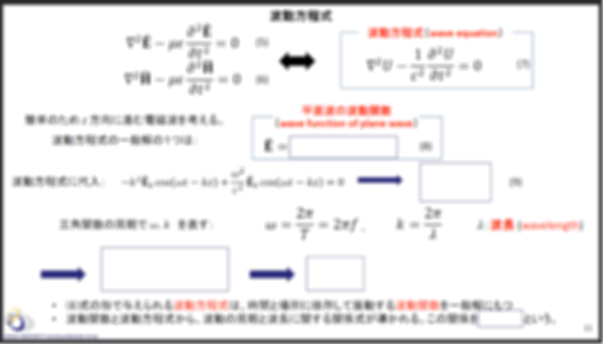
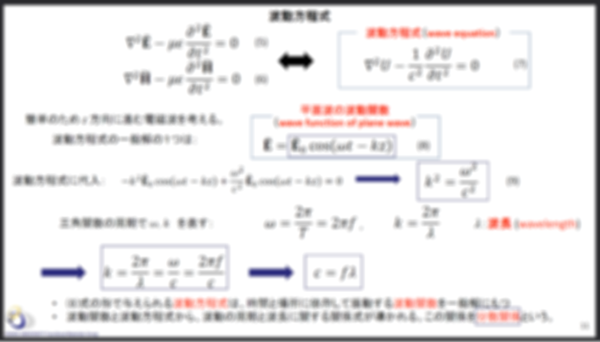

2024/1/25に行われたLT会での発表資料。

## これまで
去年の春のLT会にて、「PDFを編集したかった」と題して 
hello world と書かれたPDFの生文字を編集して helol world と書き換えるという内容を発表した。
このときはなんかフォントがおかしくなった。

冬前のLT会では「Siv3DでPDFを表示したかった」という内容で発表した。

[アドベントカレンダー](https://qiita.com/MrMocchy/items/f541028434a440b54c21)では結局表示できなかったという内容だった。

そして今回、一年近くの時を経て、PDFを編集することに成功したのでその内容を発表する。


## 動機
授業で配布されるPDF資料に散見される誤字を修正したかった。
また、授業に参加させるためか重要なところを隠したファイルを配布することが多いが、
そのくせ授業中に十分な書き込み時間を取らない人もいる（式とか特に）。
この白い四角いやつを消したかった。

## PyMuPDF
PyMuPDFというライブラリを使った。
`pip install PyMuPDF` でインストールできるが、使用は `import fitz` で行う。

VSCodeで候補に出ないが使えるメソッドが存在するので、[ドキュメント](https://pymupdf.readthedocs.io/en/latest/)を見ながら使う。

## PDFの編集

**ご利用は自己責任で。**

前提として
```python
import fitz
# PDFの読み込み
doc : fitz.Document = fitz.open("input.pdf")
# 編集するページ
page = doc[0]
```
としておく。
ここで、`page`は`doc[n]`のコピーではなく参照のようで、
`page`を編集すると`doc`も編集されることに留意（自分は初め混乱した）。


### テキストの誤字修正

誤字を削除して、正しい文字を書き込む。
なので字幅が異なる場合は文字が重なったりするが、変換ミスの修正では問題にならないことが多い。

```python
# テキストの場所検索 (hits は該当箇所の四角形範囲(Rect)のリスト)
# PyMuPDFのRectは、x0, y0 が左上の座標、x1, y1 が右下の座標、左上原点の座標系
# ちなみに、PDFの座標系は左下が原点
hits = page.search_for("Exanpul")

for hit in hits:
    # テキストを消去するようマーク
    page.add_redact_annot(quad=hit)
    
# テキストの消去を実行
# これをしない場合、該当箇所が赤いバツ四角で囲まれるので、
# 余計な部分を削除していないか確認できる
page.apply_redactions()

# 確認するだけ用
# doc.save("PDF/LT_TextEdit_Edited.pdf")
# exit()

# テキストを書き込む先、TextWriterを作成
# ここに書き込んだあと、pageに適用する。
tw = fitz.TextWriter(page.rect)

# テキストの書き込むフォントを指定
# そのページに使われているフォントを知るには
print(page.get_fonts())
# この一覧からフォント該当のフォントを探す。
# ページに使われているフォントから使用するフォントを "/F5" とかで指定できるはずが、
# なんかうまくいかないのでPCにある同じフォントを指定する。
font = fitz.Font(fontfile="C:/Windows/Fonts/times.ttf")

tw = fitz.TextWriter(page.rect)
for hit in hits:
    # テキストをTextWriterに書き込む
    tw.append(
        (hit.x0, hit.y0+(hit.y1-hit.y0)*font.ascender - 1), #位置が微妙に合わなかったので-1で微調整
        "Example", #書き込む文字列
        font=font,
        fontsize=11
        )

# TextWriterに書き込んだテキストをページに適用
tw.write_text(page)

# 保存
doc.save("output.pdf")
```

`font.ascender` に関してのわかりやすい図
https://github.com/pymupdf/PyMuPDF/discussions/1674#discussioncomment-2607617


### 四角いやつの削除

複数の授業の資料で確認したわけではないので、授業資料を作成したPowerPointのバージョンによって異なるかもしれない。

四角形の座標を取得して、コンテントストリーム(PDFの中身の文字列)から該当の四角形を探し、その四角形のデータを直接編集して消している。明らかに邪道。

`editor.py`
```python
import re
import math

# PyMuPDFの四角形の座標を、PDFファイルでの四角形の座標を表す文字列にヒットさせる正規表現に変換する
def muRect_to_pdfRectStrRe(muRect, pageSize):
    strs = [str(math.floor(f)) for f in
        [muRect[0],
        pageSize[3]-muRect[3],
        muRect[2]-muRect[0],
        muRect[3]-muRect[1]]]
    reg = ""
    for s in strs:
        reg += fr"{s}\S* "
    reg += "re"
    return reg

# 四角を消す
def deleteRectInByteStream(byteStream, muRect, pageSize):
    pdfRectStr = muRect_to_pdfRectStrRe(muRect, pageSize)
    # 正確には四角形のサイズを0にする
    return re.sub(pdfRectStr, "0 0 0 0 re", byteStream.decode()).encode()

# 四角を塗りつぶしなしにする
def transparantRectInByteStream(byteStream, muRect, pageSize):
    pdfRectStr = muRect_to_pdfRectStrRe(muRect, pageSize)
    # 四角形のオペレーターをf*(塗りつぶしと枠線)からs(枠線のみ)に変更する
    # パワポ作成者によってはそもそも枠線なしかもしれない
    return re.sub(f"({pdfRectStr}[.\r\n]*?)f\*", "\\1s", byteStream.decode()).encode()
```

`main.py`
```python
import editor

# すべての図形を取得
drawings = page.get_drawings()

# すべての塗りつぶしありrectを挙げる
# この出力を見て、座標などから消したいrectを探す
# パワポで画像を作成した順だと思われるので、消したいrectは最後の方にあるはず
[   print(i, d["items"][0][1])
    for i, d in enumerate(drawings)
    if d["items"][0][0] == "re" == and d["type"] == "fs"]

# 消したいrectを指定
index = 42

# 消したい四角形のRect
rect = drawings[index]["items"][0][1]

# rectの場所に赤いバツ四角を追加。
# 指定したrectが消したいものかを確認するときに使う
# page.add_redact_annot(quad=rect)

# ここから該当のrectを消す
pageContentXref = page.get_contents()[0]
bytestream = doc.xref_stream(pageContentXref)
# 四角を完全に消す場合
# bytestream = editor.deleteRectInByteStream(bytestream, rect, page.rect)
# 四角を塗りつぶしなしにする場合（枠線が残る）
bytestream = editor.transparantRectInByteStream(bytestream, rect, page.rect)
doc.update_stream(pageContentXref, bytestream)

# 保存
doc.save("output.pdf")
```

### 完成品

FletがPDF表示(WebView)をwindowsでサポートしてくれたら、GUIアプリを作るかもしれない。

#### 使い方
`ENUMPAGE=True`,
`ANNOT=True`
で結果を見ながらddictを作成。
消したい四角形のddictができたら
`ANNOT=False`
で削除。
`FRAME`
はお好みで。

#### `SpecialisRevelio.py`
```python
import fitz
from editor import *

filename = "暴きたい授業資料.pdf"

# 削除印をつけるか
ANNOT = False
# 枠線を戻すか
FRAME = True
# なにもせず元のまま(コピー用)
PASS = False
# 隠してる図形を列挙する
ENUMPAGE = True
# 保存する
SAVE = True

# drawingdict
# key: ページ番号(0始まり)
# value: 各ページの消したい四角の図形インデックスのリスト
ddict = {
    #.pdfの場合
    9: [42],
    10: [35,36,37,38,39],
    14: [22],
    15: [20,21,22,23],
    16: [18],
    17: [27,28,29],
    18: [41,42],
    19: [14,35,36],
    20: [3,4,5],
    22: [40,41],
    23: [20,21],
    24: [1],
    27: [64],
    28: [3,4],
    29: [8],
    30: [2],
    31: [5],
    37: [56,57,58],
    39: [250,251],
    40: [7,8],
    43: [86],
    45: [3,4,5],
    49: [46],
    51: [54,55],
    52: [142],
}

doc: fitz.Document = fitz.open(filename)

# 隠してる図形を列挙する
if ENUMPAGE:
    for p in range(doc.page_count):
        print(p,"page")
        [print("  ",i, d["items"][0][1])
            for i, d in enumerate(doc[p].get_drawings())
            if d["items"][0][0] == "re" and d["type"] == "fs"]

for pageI, drawingIs in ddict.items():
    if PASS:
        continue
    page = doc[pageI]
    pageContentXref = page.get_contents()[0]
    drawings = page.get_drawings()
    for drawingI in drawingIs:
        rect = drawings[drawingI]["items"][0][1]
        if ANNOT:
            page.add_redact_annot(quad=rect)
            continue

        bytestream = doc.xref_stream(pageContentXref)
        
        if FRAME:
            bytestream = transparantRectInByteStream(bytestream, rect, page.rect)
        else:
            bytestream = deleteRectInByteStream(bytestream, rect, page.rect)
        doc.update_stream(pageContentXref, bytestream)

if SAVE:
    doc.save(filename.replace(".pdf", "_revealed.pdf"))
```

ファイル名 Specialis Revelio - 化けの皮 剝がれよ! : ハリポタの隠しているものを暴く呪文。

### 結果
授業資料なので著作権を考えてぼかしている。

Before

After


## 以上

見ていただきありがとうございました。
何か質問あればDiscordなどで聞いてください。


