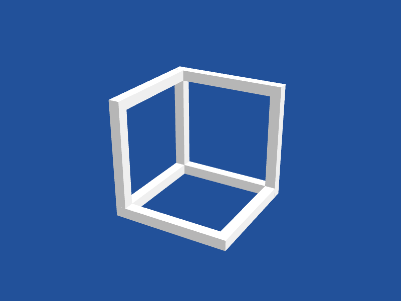
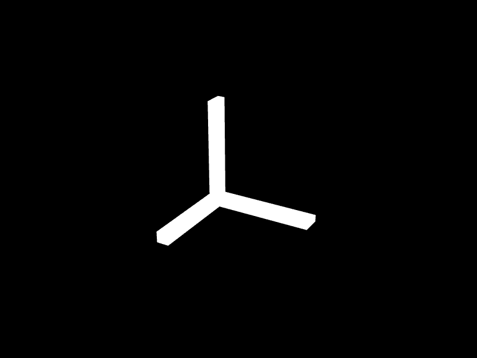
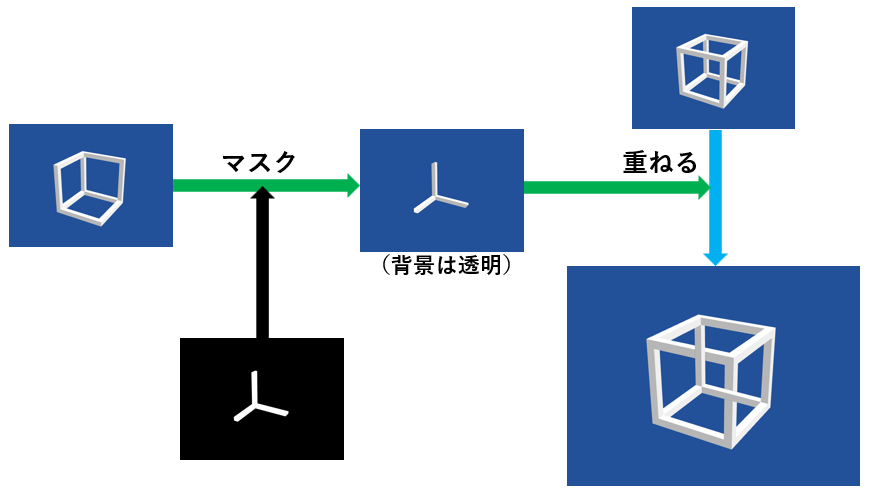
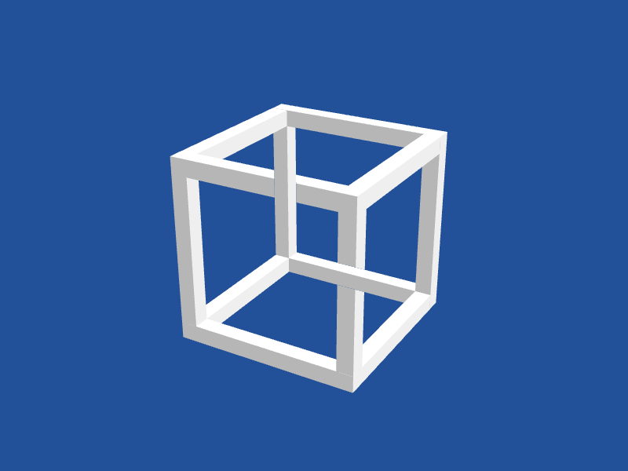
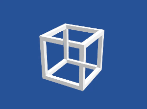

## 不可能図形とは

こういうやつ。


https://ja.wikipedia.org/wiki/不可能図形

エッシャーの作品などで有名。

今回は最初の画像のネッカーの立方体を描画してみる。

## ツール

Siv3D v0.6.15 を使用。
（今回使用した機能はプラットフォームに依存しないから書かなくていいかもしれないけど、Windowsで Visual Studio Community 2022 を使用。）

主に使用したSiv3Dの機能は、
- 3D描画
- レンダーテクスチャ
- 2Dカスタムシェーダ
の3つ。

## 不可能図形の描画

ここが本題。

不可能図形を描画するには、奥の辺と手前の辺の前後を逆転させる必要がある。
最初これをどうしようかと悩んだ。触ったことないシェーダで深度とかをいじるのか、いやシェーダってポリゴンをどうこうするものでその重ね方をいじるれるもんなのか、とか。

そして色々考えてるうちに、思いついた。

手前と奥とを入れ替えられないなら、全部描画した後に手前の辺の上に奥の辺だけをもう一回描画すればいいじゃないか。

で、それに使うのがレンダーテクスチャとマスク。
奥の辺だけを切り抜くマスク用のレンダーテクスチャを描画して、
全体を描画したレンダーテクスチャに、手前の辺を抜いた奥の辺だけをマスクかけて描画する。

といっても言葉じゃ分かりにくいので、次の節の画像を見てもらいたい。

## 各種レンダーテクスチャ

3D空間に立方体のフレームを全て普通に描画したレンダーテクスチャ。


手前の辺以外のフレームを普通に描画したレンダーテクスチャ。



そして、肝心のマスクのレンダーテクスチャ。
描画方法はほとんど同じで、各部の色だけを、背景を黒、環境光を白、日光を黒（なし）、奥の辺を白、間の辺を黒に設定したもの。
これも手前の辺は描画しない。



そしてこれらをこのように合成する。



すると不可能図形が描画されるのだ！



まあこれは見たことあるだろうけど、こう視点を動かして見るのは新鮮だったりしないだろうか。
ただ見ていると少し気分が悪くなるかもしれない。



## コード

一つ目は説明/スクショ/デバッグ用に、すべてのレンダーテクスチャを表示するコード。

二つ目は不可能図形を描画するだけの、Main()を最小にしたもの。コメントなし。

両方ともMITライセンスで公開とする。

```cpp
# include <Siv3D.hpp> // Siv3D v0.6.15

enum class DrawState
{
	Mask,
	Back,
	Whole,
};

// 立方体の辺を描画する関数。DrawStateによって描画する辺/色を変える。
void DrawCubeFrame(double size, double width, DrawState state, Vec3 cameraPos = Vec3{ 0,0,0 })
{
	double s = size / 2;
	double w = width / 2;
	double l = size + w;

	struct Edge {
		Edge(Vec3 pos, Vec3 size) : pos(pos), size(size) {}
		Vec3 pos;
		Vec3 size;
	};

	// 立方体の12本の辺
	Array<Edge> edges = {
		{{s,s,0},{w,w,l}},
		{{s,-s,0},{w,w,l}},
		{{-s,s,0},{w,w,l}},
		{{-s,-s,0},{w,w,l}},
		{{s,0,s},{w,l,w}},
		{{s,0,-s},{w,l,w}},
		{{-s,0,s},{w,l,w}},
		{{-s,0,-s},{w,l,w}},
		{{0,s,s},{l,w,w}},
		{{0,s,-s},{l,w,w}},
		{{0,-s,s},{l,w,w}},
		{{0,-s,-s},{l,w,w}},
	};

	if(state == DrawState::Whole)
	{
		for (const auto& e : edges)
		{
			Box{ e.pos, e.size }.draw();
		}
		return;
	}

	// 以下、DrawState::Mask, DrawState::Back の場合、つまり手前の辺がない場合の処理

	Array<Edge> farEdges;
	Array<Edge> middleEdges;

	// カメラから最も近い頂点/最も遠い頂点。これらに繋がる辺を手前の辺/奥の辺とする。
	Vec3 closestVertex{ cameraPos.x > 0 ? s : -s, cameraPos.y > 0 ? s : -s, cameraPos.z > 0 ? s : -s };
	Vec3 farthestVertex{ cameraPos.x > 0 ? -s : s, cameraPos.y > 0 ? -s : s, cameraPos.z > 0 ? -s : s };

	// 奥の辺
	farEdges = edges.filter([&](const Edge& e) {
		return e.pos.xy() == farthestVertex.xy() || e.pos.xz() == farthestVertex.xz() || e.pos.yz() == farthestVertex.yz();
	});

	// 間の辺
	middleEdges = edges.filter([&](const Edge& e) {
		return not (e.pos.xy() == closestVertex.xy() || e.pos.xz() == closestVertex.xz() || e.pos.yz() == closestVertex.yz());
	}).filter([&](const Edge& e) {
		return not (e.pos.xy() == farthestVertex.xy() || e.pos.xz() == farthestVertex.xz() || e.pos.yz() == farthestVertex.yz());
	});

	// 描画
	for (const auto& e : farEdges)
	{
		Box{ e.pos, e.size }.draw();
	}
	for (const auto& e : middleEdges)
	{
		Box{ e.pos, e.size }.draw(state == DrawState::Mask? Palette::Black : Palette::White);
	}
}

void Main()
{
	const ColorF backgroundColor = ColorF{ 0.4, 0.6, 0.8 }.removeSRGBCurve();

	// マスク処理するピクセルシェーダ
	const PixelShader ps = HLSL{ U"example/shader/hlsl/multi_texture_mask.hlsl", U"PS" }
	| GLSL{ U"example/shader/glsl/multi_texture_mask.frag", {{U"PSConstants2D", 0}} };

	const Size size = Scene::Size();

	// レンダーテクスチャの作成。TextureFormatはこれでいいのか分かってない。
	const MSRenderTexture maskTexture(size, TextureFormat::R8G8B8A8_Unorm_SRGB, HasDepth::Yes);
	const MSRenderTexture backTexture(size, TextureFormat::R8G8B8A8_Unorm_SRGB, HasDepth::Yes);
	const MSRenderTexture wholeTexture(size, TextureFormat::R8G8B8A8_Unorm_SRGB, HasDepth::Yes);
	const MSRenderTexture maskedTexture(size, TextureFormat::R8G8B8A8_Unorm);
	const MSRenderTexture resultTexture(size, TextureFormat::R8G8B8A8_Unorm);

	// カメラの設定
	BasicCamera3D camera{ size, 30_deg };
	double cameraPhi = 30.0_deg;
	double cameraTheta = 65.0_deg;
	double cameraPhiSpeed = 1.0;
	double cameraThetaSpeed = 1.0;

	// どのレンダーテクスチャを表示するかの切り替え。tabでラジオボタンの表示を切り替える
	// 0: Mask, 1: Back, 2: Masked, 3: Whole, 4: Result, 5: Grid
	bool tab = true;
	size_t mode = 4;

	Graphics3D::SetSunDirection(Vec3{ 0.5,2,1 }.normalized());

	ScreenCapture::SetShortcutKeys({ KeyP });

	while (System::Update())
	{
		// カメラ操作 (WASDで視点移動)
		if (KeyA.pressed()) cameraPhi += cameraPhiSpeed * Scene::DeltaTime();
		if (KeyD.pressed()) cameraPhi -= cameraPhiSpeed * Scene::DeltaTime();
		if (KeyW.pressed()) cameraTheta += cameraThetaSpeed * Scene::DeltaTime();
		if (KeyS.pressed()) cameraTheta -= cameraThetaSpeed * Scene::DeltaTime();
		cameraTheta = Clamp(cameraTheta, 0.1_deg, 179.9_deg);
		camera.setView(Spherical{ 5, cameraTheta, cameraPhi }, Vec3{ 0,0,0 });
		Graphics3D::SetCameraTransform(camera);

		// Render Mask / マスク用のレンダーテクスチャに描画
		{
			const ScopedRenderTarget3D target(maskTexture.clear(ColorF{ 0 }));
			// マスク用に環境光と太陽光の設定を変更
			Graphics3D::SetGlobalAmbientColor(ColorF{ 1 });
			Graphics3D::SetSunColor(Graphics3D::DefaultSunColor);

			DrawCubeFrame(1, 0.2, DrawState::Mask, camera.getEyePosition());
		}
		Graphics3D::Flush();
		maskTexture.resolve();

		// 環境光と太陽光の設定を元に戻す
		Graphics3D::SetGlobalAmbientColor(Graphics3D::DefaultGlobalAmbientColor);
		Graphics3D::SetSunColor(Graphics3D::DefaultSunColor);

		// Render Back / 手前の辺を除いた立方体を描画
		{
			const ScopedRenderTarget3D target(backTexture.clear(backgroundColor));

			DrawCubeFrame(1, 0.2, DrawState::Back, camera.getEyePosition());
		}
		Graphics3D::Flush();
		backTexture.resolve();

		// Render Whole / 全ての辺を描画
		{
			const ScopedRenderTarget3D target(wholeTexture.clear(backgroundColor));

			DrawCubeFrame(1, 0.2, DrawState::Whole);
		}
		Graphics3D::Flush();
		wholeTexture.resolve();

		// Render Masked / マスク処理されたbackTextureを描画
		Graphics2D::SetPSTexture(1, maskTexture);
		{
			const ScopedCustomShader2D shader{ ps };
			const ScopedRenderTarget2D target(maskedTexture.clear(backgroundColor));

			backTexture.draw();
		}
		Graphics2D::Flush();
		maskedTexture.resolve();

		// Render Result / マスク処理されたbackTextureとwholeTextureを合成、これが完成形
		Graphics2D::SetPSTexture(1, maskTexture); // もう一度これをしないと描画されなかった。Graphics2D::Flush()とかでリセットされている？
		Shader::Copy(wholeTexture, resultTexture);
		{
			const ScopedCustomShader2D shader{ ps };
			const ScopedRenderTarget2D target(resultTexture);

			backTexture.draw();
		}
		Graphics2D::Flush();
		resultTexture.resolve();

		// 表示モードに従ってレンダーテクスチャをシーンに描画
		switch (mode)
		{
		case 0: // Mask
			maskTexture.draw();
			break;
		case 1: // Back
			backTexture.draw();
			break;
		case 2: // Masked
			maskedTexture.draw();
			break;
		case 3: // Whole
			wholeTexture.draw();
			break;
		case 4: // Result
			resultTexture.draw();
			break;
		case 5: // Grid
			const Size halfSize = size / 2;
			maskTexture.resized(halfSize).draw(Vec2{ 0, 0 });
			backTexture.resized(halfSize).draw(Vec2{ halfSize.x, 0 });
			wholeTexture.resized(halfSize).draw(Vec2{ 0, halfSize.y });
			resultTexture.resized(halfSize).draw(halfSize);
			break;
		}

		// Tab でラジオボタンの表示の切り替え
		tab ^= KeyTab.down();
		if (tab)
		{
			SimpleGUI::RadioButtons(mode, { U"Mask", U"Back", U"Masked Back", U"Whole", U"Result", U"Grid" }, Vec2{ 10,10 });
		}
	}
}
```

諸々の機能を排除すると、Main()はここまで短くできる。

```cpp

// DrawState と DrawCubeFrame は上のコードと同じなので省略

void Main()
{
	const ColorF backgroundColor = ColorF{ 0.4, 0.6, 0.8 }.removeSRGBCurve();

	const PixelShader ps = HLSL{ U"example/shader/hlsl/multi_texture_mask.hlsl", U"PS" }
	| GLSL{ U"example/shader/glsl/multi_texture_mask.frag", {{U"PSConstants2D", 0}} };

	const Size size = Scene::Size();

	const MSRenderTexture maskTexture(size, TextureFormat::R8G8B8A8_Unorm_SRGB, HasDepth::Yes);
	const MSRenderTexture renderTexture(size, TextureFormat::R8G8B8A8_Unorm_SRGB, HasDepth::Yes);

	BasicCamera3D camera{ size, 30_deg };
	double cameraPhi = 30.0_deg;
	double cameraTheta = 65.0_deg;
	double cameraPhiSpeed = 1.0;
	double cameraThetaSpeed = 1.0;

	Graphics3D::SetSunDirection(Vec3{ 0.5,2,1 }.normalized());

	while (System::Update())
	{
		if (KeyA.pressed()) cameraPhi += cameraPhiSpeed * Scene::DeltaTime();
		if (KeyD.pressed()) cameraPhi -= cameraPhiSpeed * Scene::DeltaTime();
		if (KeyW.pressed()) cameraTheta += cameraThetaSpeed * Scene::DeltaTime();
		if (KeyS.pressed()) cameraTheta -= cameraThetaSpeed * Scene::DeltaTime();
		cameraTheta = Clamp(cameraTheta, 0.1_deg, 179.9_deg);
		camera.setView(Spherical{ 5, cameraTheta, cameraPhi }, Vec3{ 0,0,0 });
		Graphics3D::SetCameraTransform(camera);

		Graphics3D::SetGlobalAmbientColor(ColorF{ 1 });
		Graphics3D::SetSunColor(Graphics3D::DefaultSunColor);
		{
			const ScopedRenderTarget3D target(maskTexture.clear(ColorF{ 0 }));
			DrawCubeFrame(1, 0.2, DrawState::Mask, camera.getEyePosition());
		}
		Graphics3D::Flush();
		maskTexture.resolve();

		Graphics3D::SetGlobalAmbientColor(Graphics3D::DefaultGlobalAmbientColor);
		Graphics3D::SetSunColor(Graphics3D::DefaultSunColor);

		{
			const ScopedRenderTarget3D target(renderTexture.clear(backgroundColor));
			DrawCubeFrame(1, 0.2, DrawState::Whole);
		}
		Graphics3D::Flush();
		renderTexture.resolve();
		renderTexture.draw();
		Graphics2D::Flush();

		{
			const ScopedRenderTarget3D target(renderTexture.clear(backgroundColor));
			DrawCubeFrame(1, 0.2, DrawState::Back, camera.getEyePosition());
		}
		Graphics3D::Flush();
		renderTexture.resolve();

		Graphics2D::SetPSTexture(1, maskTexture);
		{
			const ScopedCustomShader2D shader{ ps };
			renderTexture.draw();
		}
	}
}
```

## 以上

ご読了ありがとうございました。

## 参考

[不可能図形 - Wikipedia](https://ja.wikipedia.org/wiki/%E4%B8%8D%E5%8F%AF%E8%83%BD%E5%9B%B3%E5%BD%A2)

[Siv3D リファレンス v0.6.10](https://zenn.dev/reputeless/books/siv3d-documentation)

（特に、[チュートリアル 35 | 2D カスタムシェーダ](https://zenn.dev/reputeless/books/siv3d-documentation/viewer/tutorial-shader2d)、[チュートリアル 36 | 3D 形状を描く](https://zenn.dev/reputeless/books/siv3d-documentation/viewer/tutorial-3d)）

[3D 描画のサンプル - Siv3D](https://siv3d.github.io/ja-jp/samples/3d/)


（[GIFメーカー (動画や画像からアニメーションを作ろう！)](https://syncer.jp/gif-maker)：gifの作成に使用）
