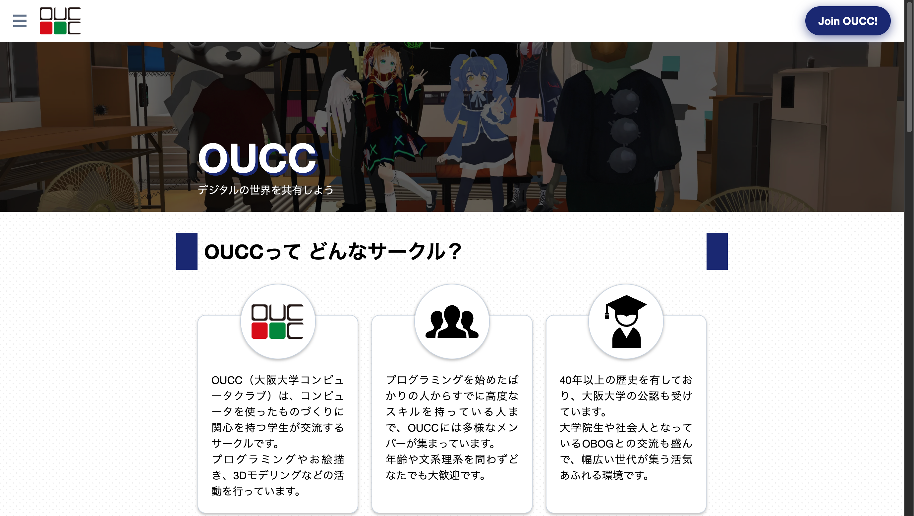
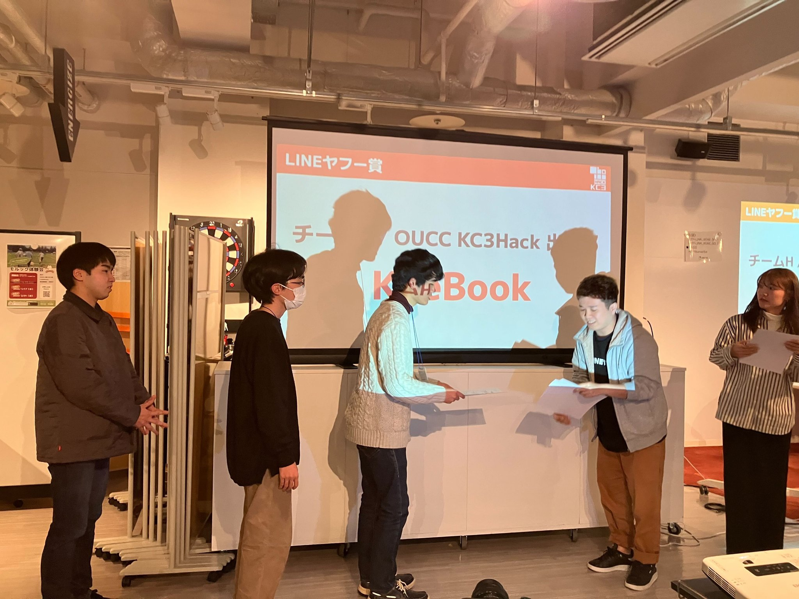

この記事は [OUCC Advent Calendar 2024](https://adventar.org/calendars/10655) の 3 日目の記事です。用途不明と語られることの多い SSH の remote forward 機能の知られざる利用方法を解説します。

お久しぶりです。前回の投稿は（既存記事の更新を除くと）[2022 年の advent calendar](https://adventar.org/calendars/5546) 以来で、当時 OUCC 運営の振り返りと場所埋めの Arduino 記事を書きました。その年度を以って大学院への飛び級進学に伴い OUCC は引退して OB となり、運営からは完全に手を引いています。この 2 年間を眺めていると、外から見える部分では [Web サイト](https://oucc.org/)のリニューアルがなされたり、[TOAGI HOUSE](https://x.com/TOAGI_HOUSE) などの新規プロジェクトが始動したり、部員が[各種開発イベントで受賞](https://x.com/kc3_official/status/1761672670918390204)したりと活動が活発化しています。また運営面でも円滑に引き継げたようで、また優秀なリーダーにも恵まれ、円滑に運営されているように見えます（もちろん、小さいミスは散見されるものの、それが学生主導の団体というもので、味でもあります）。私の入部時には潰れる寸前だったわけですが、この調子だとまだまだやれそうですね。今後とも応援よろしくお願いします（私も既に応援する側です）。

閑話休題。私は今では大学院にいるわけですが、そうなるともちろん研究室に所属しています。で、研究室って、膨大な量の研究関連データがあり、しかも性質上あまり外には出せないので、割とオンプレでサーバを持っています。そして、その管理は研究室によるものの、学生が管理していることも多いです。さらに、うちの大学は[歴史的経緯](https://pentan.info/doc/ip133_list.html)で IPv4 アドレスを大量に持っている（`133.1.0.0/16`）ので、研究室ごとに複数の IPv4 アドレスを持っている極めて特異な環境です（つまり、サーバとルータの両方に global アドレスを振れる）。例に漏れず私は研究室のサーバを管理する担当になり、また丁度筐体の入れ替え時期だったこともあり、現在の基幹サーバ（`sel.ist.osaka-u.ac.jp`）をフルスクラッチで構築しました。外から見えるのは [Web サイト](https://sel.ist.osaka-u.ac.jp/)ぐらいかもしれませんが（これも PHP やら CGI やら VirtualHost やら色々動いているので結構大規模）、それ以外にも色々と動いています。その過程で色々と得た知見があるので、それを少し出してみます。まずは、SSH の話題。

SSH を使うと、暗号通信を使って安全にリモートコンピュータに接続できます。断じて科学教育に注力する高校 (Super Science High-school) のことではありません。そんな SSH ですが、その機能は Shell だけではなく、リモートコンピュータとの通信路（トンネル）を形成し、SSH 以外のサービスについてもリモートアクセスを提供することができます。**なお、この記事は SSH やネットワークについて一定の知識を持っている人を対象としています。環境や設定によってはセキュリティ上の懸念が生じるので、内容を理解できる方のみ自己責任で試してください。**

## Port forwarding

大きく 3 つの方式が存在します。

- **Dynamic forward** (`-D port`)
  - 接続先サーバへの通信路を張り、そのサーバ経由で通信するための SOCKS proxy として自分側のポート `port` で待ち受ける
  - VPN の代用として使える
- **Local forward** (`-L port:host:hostport`)
  - 接続先サーバへの通信路を張り、そのサーバから見えるホスト `host`（そのサーバ自身 `localhost` でもいい）のポート `hostport` に対して、自分側の `port` から通信できるようにする
  - 直接接続できないリモートサーバのサービス（SMB や FTP や RDP など）を利用するのに使える
- **Remote forward**（`-R :port:host:hostport`）
  - 接続先サーバへの通信路を張り、自分から見えるホスト `host`（自分自身 `localhost` でもいい）のポート `hostport` に対して、接続先サーバの `port` から通信できるようにする
  - ？？？

インターネットを探せばわかりやすく図解した記事がたくさん出てくるので、字面では理解できなかった場合はそちらを参照してください。ここで、`-D` と `-L` については利用例がたくさん出てくる一方、**`-R` に関してはほとんど出てきません**。しかし、外から SSH 接続できるサーバがあれば、これを**家のマシンにそのサーバが所属する LAN から接続する**ために使えます。

## 家のマシンに別の LAN から接続する

まず、家に global アドレスが割り当たっていて、ルータ側で port forwarding 設定を直接いじったり目的のマシンに global アドレスを直接割り振ったりできるのであれば、この手順は必要ありません（尤も、これはセキュリティ面の考慮が大変ですが）。ルータの設定を触れない、集合住宅や CG-NAT になっているといった事情で目的のマシンが NAT 下から脱せない場合に使うものです。

こういうとき、Cloudflare などの外部サービスでマシンと当該サービスの間にトンネルを形成して、当該サービス経由でアクセスできるようにするのが一般的です。しかし、SSH サーバへの remote forward を使えば外部サービスを使わずに実現できます。

やり方は至って簡単。ここでは例として remote desktop (3389 番ポート) を転送していますが、HTTP (80), HTTPS (443), SMB (445), 開発環境でよく見る 8080 など他のポートでも同様です。

1. 家のマシンで `ssh -R:43234:localhost:3389 SSHサーバアドレス`
   - Shell に繋がるのが嫌なら `fN` オプションを付ける
   - `-R` の直後の `:` を忘れない（これがないと SSH サーバ上のローカルプロセスからしか繋がらなくなる）
     - SSH server のデフォルトでは無効なので `GatewayPorts clientspecified` を `sshd_config` に書く必要がある
     - **SSH サーバ側に適切に firewall を設定しておくこと**（設定が誤っていると家のマシンのサービスが意図せず全世界に公開されてしまう）
   - 左側のポート番号は適当（小さい数字の well-known ポートは root 専用なのでデカい数字にする）
1. 接続が保たれた状態で、別の LAN から `SSHサーバアドレス:43234` に Remote Desktop を繋ぐ
1. Profit!

## おわりに

本記事では、あまり知られていない SSH の remote forward 機能の使い方の一例について説明しました。SSH はよく使うツールですが、実はかなり高機能で Shell 接続とは無関係なものを含め、多様な機能を備えています。もちろん、ネットワークツールなのでセキュリティ面には十分気を配る必要がありますが、その辺りを十分理解した上で色々と試してみると面白いと思います。
