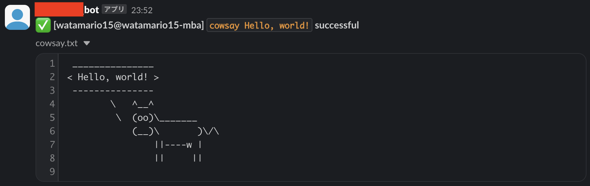

この記事は [OUCC Advent Calendar 2024](https://adventar.org/calendars/10655) の 4 日目の記事です。昨日は [SSH の remote forward の知られざる利用方法](../2024-12-03-ssh/)を解説しました。本日は、Slack の仕様変更により難易度が上がったファイル投稿を、shell script から行う方法を解説します。

普通に Slack を使っている範囲では、ファイルアップロードはドラッグ&ドロップで以上ですが、プログラムからファイル添付となると Slack API を使うことになります。JavaScript や Python などで開発しているシステムの機能の一部として Slack との連携機能を組むのであれば、ライブラリを使えば特に難なくできるのですが、Cronjob のようにちょっとした shell script から Slack に投稿したい場合、そのためだけに仮想環境や各種依存関係を構築するのは手間がかかります（その依存関係の管理という余計な保守業務も増えます）。

そもそも、Slack API は単なる HTTPS API なので `curl` コマンドからでも使用できます。かつては単に [`files.upload`](https://api.slack.com/methods/files.upload) API に `POST` すればファイル添付できたので、これを使って shell script を組んでいた人は多いのではないでしょうか（Web 上でもたくさん出てきます）。しかし、この API は非推奨となり、[2025 年 5 月 11 日をもって廃止](https://api.slack.com/changelog/2024-04-a-better-way-to-upload-files-is-here-to-stay)されることになってしまいました。

これに代わる新 API として [`files.getUploadURLExternal`](https://api.slack.com/methods/files.getUploadURLExternal) と [`files.completeUploadExternal`](https://api.slack.com/methods/files.completeUploadExternal) が提供され、これらを組み合わせて使用する形になりました。しかし、これは旧 API と比べるとかなり複雑で、Web 上でも全く出てこないほか、現時点では ChatGPT も知らないらしい（旧 API を使ったコードを出してきて、それを指摘すると架空の新 API をでっち上げて大嘘コードを吐き出す）ので、ここで解説します。

## 流れ

[Slack の中の人が書いている記事](https://zenn.dev/slack/articles/7ce5065cc4daa7)と各 API のリファレンスを睨めっこしながら、`curl` コマンドに落とし込んでいきます。なお、Slack API は JSON で結果を返してくるので、それを解析するために `jq` コマンドも必要です（普通は OS のパッケージマネージャにあります）。

手順としては以下の通りです。なお、各 API の全ての引数や機能を説明しているわけではないので、公式リファレンスも併せて確認してください。

1. アップロードに使う bot アカウントの token を用意する
   - Webhook と異なり channel への参加と `files:write` 権限が必要なことに注意
1. [`files.getUploadURLExternal`](https://api.slack.com/methods/files.getUploadURLExternal) に `GET` で以下の情報を送る
   - Bot token (HTTP Header `Authorization: Bearer xxxx`)
   - 投稿時のファイル名 (HTTP Form `filename`)
   - **ファイルサイズ** (HTTP Form `length`)
   - テキストファイルなら `text` などのスニペット形式 (HTTP Form `snippet_type`)
   - 任意で代替テキスト (HTTP Form `alt_txt`)
1. 返ってきた JSON を解析して `upload_url` と `file_id` を得る
1. `upload_url` に対して `POST` でファイルを送る
1. [`files.completeUploadExternal`](https://api.slack.com/methods/files.completeUploadExternal) に `POST` で以下の情報を送る
   - Bot token (HTTP Header `Authorization: Bearer`)
   - `file_id` (HTTP Body JSON `files` list)（複数可）
   - 送信先 channel の ID (HTTP Body JSON `channel_id`)
   - 本文の内容 (HTTP Body JSON `initial_comment`)

複数のファイルを 1 メッセージで送信する場合は、4 までの手順を繰り返したのちに、それら全ての `file_id` を [`files.completeUploadExternal`](https://api.slack.com/methods/files.completeUploadExternal) で渡します（ここでは扱いません）。

## スクリプト

具体的なコードは以下の通りです。使用にあたっては、各スクリプトの上部にある環境変数をあらかじめ設定してください。`TOKEN` が bot token、`CHANNEL` が送信先 channel の ID、`MESSAGE` が本文の内容（`slackattach.sh` のみ）、`TYPE` がスニペット形式です。セキュリティ的には、`TOKEN` は直接記述するよりも別で定義して渡したほうが良いかと思います。

**`slackattach.sh`** が 1 ステップずつ確認しながらコマンドラインで指定したファイルを Slack に投稿するもので、動作テスト用に最適です（`read` や `echo` を外せば自動処理でも使えます）。**`slackattachcmd.sh`** が指定したコマンドを実行し、その実行結果（終了ステータス）を本文に、標準出力と標準エラー出力を統合したものを添付ファイルにして Slack に投稿するもので、長い出力をする Cronjob への組み込みに最適です（`sudo` コマンドのような感覚で `./slackattachcmd.sh cat test.txt` みたいに使います）。

`slackattachcmd.sh` は出力がない場合に Slack 投稿をしないようにしていたり、Slack 投稿でエラーが起きた場合は標準エラーに出力して Cron が拾えるようにしたりと、実運用まで考えた設計になっています。ほとんどの環境では問題ないはずですが、一応 `slackattachcmd.sh` では POSIX に入っていない `mktemp` コマンドを使っているので、限界まで切り詰めた環境だと注意してください（限界環境で使う場合でも [POSIX 範囲での mktemp 代替実装](https://qiita.com/ko1nksm/items/45574a24ecd5f15a731e)に置き換えれば使えるはず）。要するに、POSIX 外の依存関係としては、`slackattach.sh` では `curl`, `jq` で、`slackattachcmd.sh` では `curl`, `jq`, `mktemp` です。

`./slackattachcmd.sh cowsay Hello, world!` を実行してみた例が以下の通りです。

## おわりに

本記事では、shell script で Slack にファイル投稿する方法を解説しました。エラー処理も含めると「ファイル添付」にしてはかなり複雑な処理になりますが、Slack を使う以上 Slack API の仕様変更には大人しく従うしかありません。サーバ上の自動実行タスクの実行結果を Slack 通知したいなどの場面で便利かと思います。
