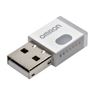
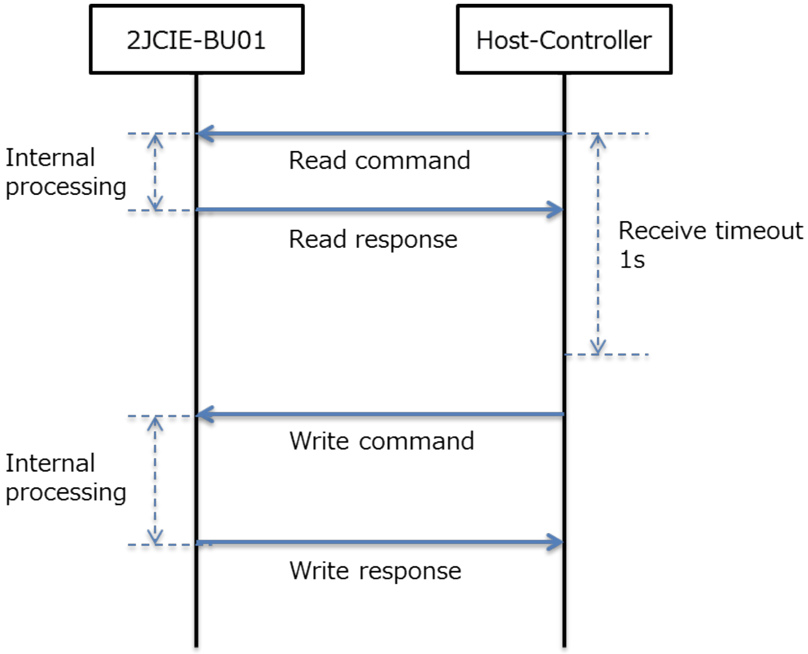
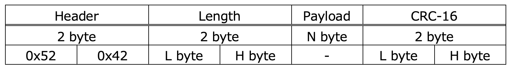
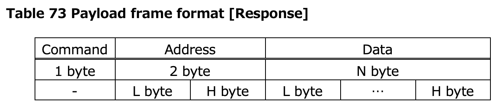
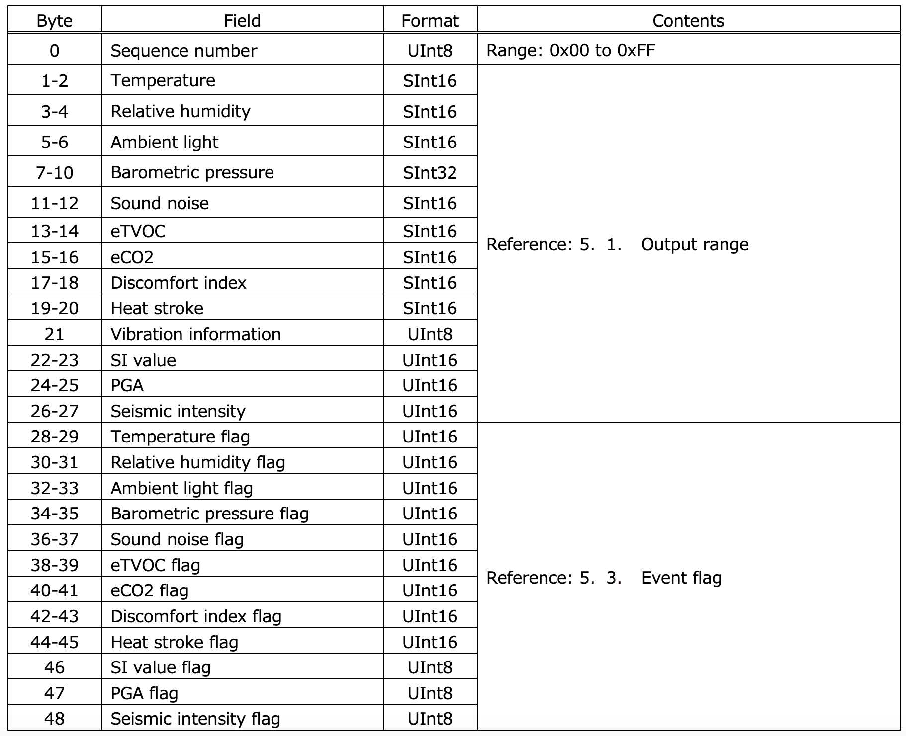
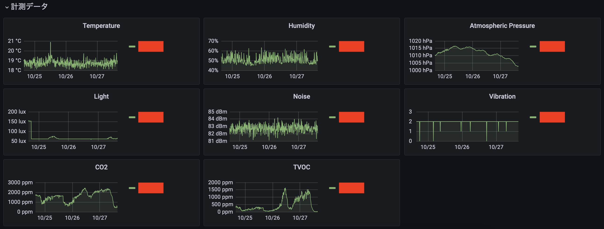

この記事は [OUCC Advent Calendar 2024](https://adventar.org/calendars/10655) の 5 日目の記事です。昨日は [Shell Script から新 API で Slack にファイル投稿する](../2024-12-04-slack/)方法を解説しました。本日は、OMRON 社製環境センサ [2JCIE-BU](https://www.fa.omron.co.jp/products/family/3724/feature.html) を Prometheus で使う方法を解説します。

まず、この機器について軽く説明しておくと、身の回りの様々な環境情報をセンシングできるデバイスで、以下が特徴に挙げられています。

- USB または Bluetooth® 通信を介してネットワークに接続し、測定データの送信が可能
- 革新的なオムロン独自のアルゴリズムにより、加速度振動から高精度な地震判定が可能
- VOC センサにより、室内の空気質を継続的にモニタリングする事が可能

USB メモリに似た小さなデバイスで、色々なデータを USB シリアル通信でリアルタイムに取得できます。



ここでは、Prometheus で使うために必要な exporter を用意し、それを Ubuntu から使えるようにします。

## udev

初期状態では Linux kernel に環境センサの情報が登録されていないため、接続しても認識されません。そこで udev rule を設定します。設定するといっても、やることは以下の内容のテキストファイルを `/etc/udev/rules.d/99-omron.rules` みたいな名前で作成するだけです。

```
ACTION=="add", \
SUBSYSTEM=="usb", \
ATTRS{idVendor}=="0590", \
ATTRS{idProduct}=="00d4", \
RUN+="/sbin/modprobe ftdi_sio", \
RUN+="/bin/sh -c 'echo 0590 00d4 > /sys/bus/usb-serial/drivers/ftdi_sio/new_id'"
```

この状態で環境センサを接続すれば、`/dev/ttyUSB*` で表されるファイル（大抵は `/dev/ttyUSB0`）が現れるはずです。

## Exporter

[Raspberry Pi でデータ取得する公式サンプル](https://github.com/omron-devhub/2jciebu-usb-raspberrypi)があるので、これを参考に作成します。環境センサとは USB シリアル通信を使うので、`pyserial` ライブラリを用いてバイナリデータを送受信し、それに基づき `prometheus_client` ライブラリで Prometheus 用に export します。

バイナリインタフェースについては [2JCIE-BU ユーザーズマニュアル](https://components.omron.com/jp-ja/ds_related_pdf/CDSC-016.pdf)に記載があります。Data frame を送信するとそれに対する応答が 1 秒以内に返ってくる、という流れで通信します。



Data frame の形式は以下の通りで、frame 開始を告げる Frame header (`0x4252`)、Payload から frame 末端までのデータ長、コマンドに応じた Payload、Header から Payload までの CRC-16 を 1 塊にしてやりとりします。複数バイトで構成される値については little endian で通信する点に注意してください。つまり、`0x4252` という値は `0x52 0x42` というバイト列で送受信します。



一例として、最新データをフルで取得する Latest data long コマンドの使い方を説明します。

1. ホストからセンサに Latest data long を要求する
   ```py
   command = bytearray(
      [
          0x52, 0x42,  # Frame header
          0x05, 0x00,  # Frame length (Payload 3 + CRC 2 = 5 = 0x0005)
          0x01,        # Payload: Command (Read)
          0x21, 0x50   # Payload: Address (Latest data Long)
      ]
   )
   ser.write(command + crc16(command))
   ```
   - データの読み出しなので Read コマンド (`0x01`) で、さらにアドレスとして実際のコマンド Latest data long (`0x5021`) を指定する
1. 1 秒待つ
1. 結果を受信する

ここで、受信 frame の Payload は以下の形式になります。



そして、受信する結果は以下のフォーマットです。ここでいう Byte 0 は Payload の Data における先頭を表すことに注意します。つまり、Data frame 全体として見ると Byte 7-55 になります。例えば、気温データ Temperature は Data frame 全体における Byte 8 と Byte 9 を little endian でくっつければ得られます。



以上が基本的な環境センサとの通信方法です。Prometheus に export する方法としては、デフォルトの `PROCESS_COLLECTOR` などを外す点を除いては素直に使うだけなので、実際にコードを見た方が早いと思います。ということで、具体的なコードは以下の通りです。`/dev/ttyUSB*` で表される場所にシリアルが存在することを前提とし、また Prometheus への export には HTTP Port `8000` を使用します。また、`sudo apt install python3-prometheus-client python3-serial` で依存パッケージを導入しておく必要があります。

<script src="https://gist.github.com/watamario15/4ab1939803ec8a0e08ecf6a8d47369fc.js"></script>

起動時と終了時に LED を点灯・消灯する処理が入っているほか、エラー処理も豊富に追加しています。情報の更新周期は約 5 秒程度です。`time.sleep()` を使っているのでブレますが、用途的にこれでも問題ないので実装を単純化するためにこうしてあります。

なお、exporter を自動起動させるには systemd の service として登録します。まず、`/etc/systemd/system/omron-exporter.service` を以下の内容で作成します。`/path/to/omron-exporter.py` は実際の exporter のパスに置き換えてください（exporter には `chmod +x` で実行権限を付与しておく必要があります）。

```ini
[Unit]
Description=Prometheus exporter for OMRON environment sensor 2JCIE-BU.

[Service]
Type=simple
ExecStart=/path/to/omron-exporter.py

[Install]
WantedBy=default.target
```

そして、サービスを有効化します。

```sh
sudo systemctl enable omron-exporter.service
sudo systemctl start omron-exporter.service
```

## Prometheus

Exporter が準備できたら Prometheus に登録します。ここは普通に Prometheus の使い方になるので、他の記事を参考にしてください。

## 動作の様子

正しく設定できると、HTTP Port 8000 (<http://localhost:8000/>) から以下のような情報が取得できます。

```
# HELP omron_temperature Current temperature
# TYPE omron_temperature gauge
omron_temperature{device="Sample"} 19.5
# HELP omron_humidity Current humidity
# TYPE omron_humidity gauge
omron_humidity{device="Sample"} 58.21
# HELP omron_light Current blightness
# TYPE omron_light gauge
omron_light{device="Sample"} 63.0
# HELP omron_pressure Current atmospheric pressure
# TYPE omron_pressure gauge
omron_pressure{device="Sample"} 1003.426
# HELP omron_noise Current noise
# TYPE omron_noise gauge
omron_noise{device="Sample"} 82.78
# HELP omron_eco2 Current equivalent CO2
# TYPE omron_eco2 gauge
omron_eco2{device="Sample"} 427.0
# HELP omron_etvoc Current equivalent Total Volatile Organic Compound
# TYPE omron_etvoc gauge
omron_etvoc{device="Sample"} 4.0
# HELP omron_vibration Current vibration
# TYPE omron_vibration gauge
omron_vibration{device="Sample"} 2.0
```

また、Grafana と連携させると以下のようなグラフを出すこともできます。



## おわりに

本記事では、OMRON 環境センサ 2JCIE-BU を Prometheus で使う方法を解説しました。結構ゴリゴリのバイナリ通信になりますが、この小さいデバイスで数々の環境情報を可視化できるのは便利ですね。
