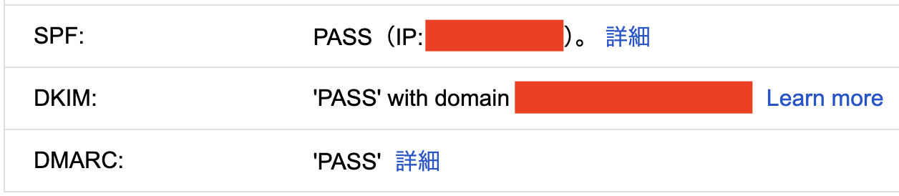
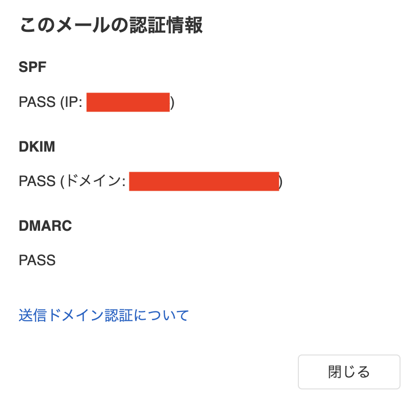

この記事は [OUCC Advent Calendar 2024](https://adventar.org/calendars/10655) の 6 日目の記事です。昨日は [OMRON 環境センサ 2JCIE-BU を Prometheus で使う](../2024-12-05-omron/)方法を解説しました。本日は、メールサーバを送信側として SPF/DKIM/DMARC 対応させる方法を説明します。受信側は結構ややこしいことと、完全に自衛目的となり他人にとっては関係ないのでここでは扱いません。

メールというものは容易に偽装が可能なプロトコルだという点はご存知でしょうか。顕著な例として、差出人欄にはどんな文字列でも書き込むことができます。これはつまり、**誰でも政府機関、著名企業、著名人を名乗ってメールを送信できる**ということを表します。また、**途中の中継サーバで内容を勝手に書き換えることも可能です**。どうしてそんなひどいプロトコルなのかというと、当初は研究者間でメッセージをやり取りするだけの簡易的な仕組みだった（SMTP は **Simple** Mail Transfer Protocol の略）というのがあると思いますが、仕様的には郵便に似せた面も大きいのではないかと思います。例えば、差出人は SMTP では Envelope From と Header From がありますが、これらは郵便における「封筒に書く差出人」と「封筒の中の手紙に書いた差出人」に対応します。よくよく考えてみると、郵便であっても差出人に嘘を書くことは容易です（改竄は微妙ですが...）。そうした点からも、こういうプロトコル仕様になっているのではないかと思います。

しかし、時代は進み、メールはもはや研究者間のものではなく、社会において公式的な重要な情報連絡手段となりました。金銭や個人情報が絡む場面で使われることも多くなり、当初のようなザルプロトコルのまま使うわけにはいかなくなりました。そうした事情から SPF/DKIM/DMARC をはじめとする数多の認証技術が開発され、実際に [Gmail が SPF/DKIM いずれかの認証通過を必須化した](https://support.google.com/a/answer/81126)ことが話題となりました。

前提として、これらの技術を簡単に説明しておきます。今回は扱いませんが、ARC もおまけで説明しておきます。

- **SPF (Sender Policy Framework): 受信者がメールが正しいサーバから届いているかを検証（なりすまし対策）**
  - 「このドメインのメールは必ずこのサーバから送る」という情報を、送信者が予め DNS の TXT レコードに置いておく
- **DKIM (DomainKeys Identified Mail): 送信者がメールに署名し、受信者が改竄の有無を検証（改竄対策）**
  - 署名用秘密鍵に対応する公開鍵を、送信者が予め DNS の TXT レコードに置いておく
- **DMARC (Domain-based Message Authentication, Reporting, and Conformance): SPF/DKIM の検証失敗時に受信者が取るべき対応を送信者が指定**
  - 検証失敗メールを「何もしない／隔離／拒否」のうちどう扱うべきか、誰に対してその事実を報告すべきかを、送信者が予め DNS の TXT レコードに置いておく
- **ARC (Authenticated Received Chain): SPF/DKIM/DMARC の検証結果をメール中継地点毎にメールヘッダに追記する**
  - メーリングリストやメール転送によりメールの一部が書き換わっても改竄扱いにしないための仕組み
  - Ubuntu には執筆時点で OpenARC のパッケージがない

SPF/DKIM/DMARC について以上から、

- **SPF と DMARC は DNS エントリの登録だけで完了**
- **DKIM は DNS エントリの登録とサーバ側での署名機能の構築が必要**

ということがわかります。よって、サーバに導入するのは DKIM 署名を担う機能（[OpenDKIM](http://www.opendkim.org/)）だけで十分です。ここでは扱いませんが、受信時の認証機能を構築する場合は、加えて [OpenDMARC](http://www.trusteddomain.org/opendmarc/) があれば SPF/DMARC 認証がカバーされます。環境は Ubuntu 上の Postfix を想定しますが、他の OS や Sendmail などでもパッケージマネージャや各種パスの違いを除き概ね同様の手順で導入できるはずです。なお、以下の設定はあくまで参考例なので、細かい内容は運用方針に合わせるようにしてください。

## OpenDKIM

まず、OpenDKIM をインストールします。

```sh
sudo apt install opendkim
```

DKIM 署名の鍵ファイルをセレクタ `default` で `/etc/opendkim/keys` に生成します。`default.private` が秘密鍵、`default.txt` が DNS 登録形式の公開鍵となります。セレクタは他の文字列でも構いませんが、ファイル名や随所で指定する文字列がこのセレクタになるので、以降の説明はそれに合わせて読み替えてください。秘密鍵はその名の通り秘密にすべき鍵で、これが流出すると誰でも嘘の DKIM 署名ができるようになってしまうので安全に保管してください。複数のドメインを持っている場合でも、この 1 つの鍵を全てのドメインに使用できます。

```sh
sudo opendkim-genkey -D /etc/opendkim/keys -s default
```

Ubuntu を含む Debian 系 OS では Postfix はセキュリティ上 chroot 環境で動作するため、Postfix からは `/var/spool/postfix` 以下だけが見えています。その対応として Postfix と OpenDKIM が通信するための UNIX domain socket を `/var/spool/postfix/opendkim` に作成させるため、`postfix` ユーザを `opendkim` グループに追加して整地します。代わりに TCP socket を作成しても構いませんが、単一コンピュータ内なので UNIX domain socket のほうが効率が良くポート番号を消費しません。

```sh
sudo gpasswd -a postfix opendkim
sudo mkdir /var/spool/postfix/opendkim
sudo chown opendkim:opendkim /var/spool/postfix/opendkim
```

`/etc/opendkim/InternalHosts` に、検証対象から除外して逆に署名する対象を以下のように記載します。LAN 内の他のマシンからのメール送信を中継する場合は、そのサーバのアドレスも記載します。`192.168.0.0/16` のような CIDR 記法や `*.example.com` のようなホスト名も使えます。

```text
127.0.0.1
```

`/etc/opendkim.conf` を以下の内容に書き換えます。OpenDKIM は受信時の DKIM 検証も実施しますが、それに失敗してもヘッダにその旨を記録するだけで特に拒否しないようにしておきます。

```ini
Syslog yes
SyslogSuccess yes
PidFile	/run/opendkim/opendkim.pid

# Allow small modifications on the header and body
Canonicalization relaxed/relaxed

Domain *
Selector default
KeyFile /etc/opendkim/keys/default.private

# Socket for the MTA connection (Postfix is chroot-ed on Debian-based)
Socket local:/var/spool/postfix/opendkim/opendkim.sock
UserID opendkim
UMask 007

# Mail from these hosts should be signed rather than verified
ExternalIgnoreList /etc/opendkim/InternalHosts
InternalHosts /etc/opendkim/InternalHosts

# Add "Message-ID" header to be signed
SignHeaders *, +Message-ID

# Ensure that no one adds another "From" header
OversignHeaders From
```

`/etc/postfix/main.cf` に以下を追記します。既に他の milter を使用している場合は、`smtpd_milters` の内容は既にある項目に追加するようにします。このとき、記載順に実行されるので、機能を考慮して適切な順となるようにしてください。また、milter の不具合時には milter が存在しないものとしてメール受信するように設定していますが、この辺りは運用に合わせて適切に設定してください。

```ini
# Proceed as if the milter was not present when it is not working
milter_default_action = accept

# Use same milter for submissions as smtpd
non_smtpd_milters = $smtpd_milters

# Enable OpenDKIM for smtpd
smtpd_milters = local:opendkim/opendkim.sock
```

ちなみに、Sendmail の場合は `.mc` ファイルと `.submit.mc` ファイルの両方に以下のように記述します（パスは環境に合わせて変更）。

```m4
INPUT_MAIL_FILTER(`opendkim', `S=local:/var/run/opendkim/opendkim.sock, T=R:30s')
```

以下を実行して設定を反映させます。`sudo journalctl -fu opendkim`, `sudo journalctl -fu postfix`, `/var/log/mail.log`, `/var/log/mail.err` などにエラーが記録されていなければ、これでサーバ側の対応は完了です。

```sh
sudo systemctl restart opendkim postfix
```

## DNS

ドメインが `mail.sample.com` であると仮定すると、以下の情報を登録することになります。公開鍵 `default.txt` が 3 行になっているのは DNS ソフトウェアの BIND 9 が 255 文字を超える文字列を扱えないためなので、そのままの形で登録してください。

```
mail.sample.com                     IN	TXT	"v=spf1 ip4:メール送信元IPアドレス範囲 ~all"
default._domainkey.mail.sample.com  IN	TXT	( "v=DKIM1; h=sha256; k=rsa; "  <- default.txt の公開鍵の内容 3 行をそのまま書く
	  "p=..."
	  "..." )
_dmarc.mail.sample.com              IN	TXT	"v=DMARC1; p=none"
```

なお、組織によっては `sample.com` のサブドメインを管轄する DNS を使っている場合もあるかと思いますが、その場合は以下のようになります。DKIM のドメイン部分が `default.txt` の書き方とは若干変わる形になるので注意してください。

```
mail                     IN	TXT	"v=spf1 ip4:メール送信元IPアドレス範囲 ~all"
default._domainkey.mail  IN	TXT	( "v=DKIM1; h=sha256; k=rsa; "  <- default.txt の公開鍵の内容 3 行をそのまま書く
	  "p=..."
	  "..." )
_dmarc.mail              IN	TXT	"v=DMARC1; p=none"
```

なお、複数ドメインを持っていて、それらが CNAME である場合は以下のように対応します。

- **SPF: 何も書かなくて OK**
  - CNAME に TXT レコードを書くとエラーになるので、逆に何も書いてはいけない
- **DKIM/DMARC: DKIM と DMARC の CNAME を書く**
  - CNAME 先と書く内容を変えたい場合は普通に TXT レコードを置いてもよい

最初の例で言うと、`smtp.sample.com` という CNAME を持っている場合は以下の内容を記載します。

```
default._domainkey.smtp.sample.com IN	CNAME	default._domainkey.mail.sample.com.
_dmarc.smtp.sample.com             IN	CNAME	_dmarc.mail.sample.com.
```

各エントリの意味は以下のとおりです。

- SPF
  - ホスト自体に対する `TXT` レコードとして設定する
  - `ip4:メール送信元IPアドレス範囲`: `mail.sample.com` の名でメールを送れる IPv4 アドレスは `メール送信元IPアドレス範囲`（CIDR 記法）だと受信者に公示
  - `~all`: 上記のルールを破るメールは「怪しい」と見做すよう受信者に指示
    - 諸々の要因で正当なメールで検証失敗することがあるので、詐称と断定（`-all`）はさせないのが普通
- DKIM
  - `セレクタ._domainkey.ドメイン` に対する `TXT` レコードとして設定する
- DMARC
  - `_dmarc.ドメイン` に対する `TXT` レコードとして設定する
  - `p=none`: 検証失敗メールも通常通り受け付けるよう受信者に指示
    - しばらく様子を見て問題なさそうなら `p=quarantine`（迷惑メールに振り分け）に変更するとよい

DMARC レコードに以下の内容を記述すると、一部のサービスから SPF/DKIM/DMARC 検証の成否具合を毎日受けられます（人間には優しくない XML 形式で送られてくるので [DMARC Report Analyzer](https://mxtoolbox.com/DmarcReportAnalyzer.aspx) などのサービスを使うと良い）。執筆時点では Gmail と Outlook で確認しています。

- `rua=mailto:xxx@mail.example.com`: 検証状況日次レポートの返送先を `xxx@mail.example.com` にする
  - 返送先を DMARC レコードと同じドメインにしないと返してくれないので、`CNAME` ではなく個別に設定する必要がある

これを付けると `"v=DMARC1; p=none; rua=mailto:xxx@mail.example.com"` のようになります。

設定したら、各ドメインについて `nslookup -type=txt` や `dig txt` などで正しく登録されていることを確認するとともに、<https://mxtoolbox.com/> のような web サービスを使ってレコードが正しいことを確認します。問題なければ、これで DNS 側の対応は完了です。

## 動作確認

少なくとも Gmail、Yahoo! メール、Outlook は SPF/DKIM/DMARC 検証を全て行うので、これら宛にメールを飛ばすことで、適切に設定できているかを確認できます。

Gmail はデスクトップ版 Web クライアントでメールを開き、右上の 3 点リーダーで「メッセージのソースを表示」を押して出た画面で、SPF/DKIM/DMARC が全て PASS になっていることを確認します。



Yahoo! メールでは、同じくデスクトップ版 Web クライアントでメールを開き、「認証」の横の「このメールの認証情報」を押して出たポップアップで同様に確認します。



Outlook では上記サービスのような UI は用意されていないので（なぜ？）、直接ソースを見ます。他のサービスでもこの方法は有効です。Web UI なら 3 点リーダーから、その他のクライアントならそれぞれの方法でメールソースを表示させ、`Authentication-Results:` から始まる行を探します。そこに `spf=pass` と `dkim=pass` と `dmarc=pass` が全てこの通りに書かれていれば OK です。

## おわりに

本日は、メールサーバを送信側として SPF/DKIM/DMARC 対応させる方法を説明しました。面倒ではありますが、これだけで自身が発するメールを偽物ではない正当なものだと示せると考えると、やる価値はあると思います。世のメールの SPF/DKIM/DMARC 対応化が進み、なりすましメールの被害が少なくなると良いですね。
