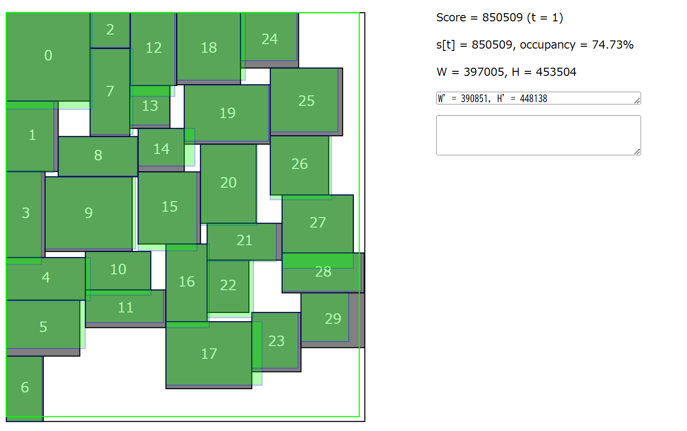

## AHCとは

AtCoderにて新たに定期的に開催されるプログラミングコンテストです。ABC/ARC/AGCなどのアルゴリズムコンテストと異なり、最適解を出すのが難しい問題に対し、出来るだけ良い解を作成するコンテストとなります。(公式より抜粋)

## 問題概要

長方形がたくさん与えられるので、それをできるだけコストの小さい長方形の箱に詰めるためにはどうするかを考える問題です。コストは長方形の縦の長さ+横の長さです

## 考えたこと

貪欲+乱択で考えました。

### 1日目

-問題文が理解できない(0がそこそこ強いと考える)
-252人(正の得点を得ている人数)中246位
最悪のスタートを切りました

### 2日目

余りにも順位が低かったので再度問題文を読み直しました。その結果
-0が非常に弱いことに気づく
-サンプルコードの存在に気づく
という進捗が得られ、サンプルコードいじったり、左詰めを行ったりした

### 4日目

三日目はなぜかはわからんが考えてい無かったので4日目です。**正方形に近いと点数がよくなる**ので、左詰めをするときに横幅を単調減少させると縦幅は単調増加しそうだと思ったので縦幅と横幅の小さい方を横幅とし、それを超えるまで並べるという貪欲で考えた。結構いい点数が出たのでこれで行こうと決意

### 5日目~9日目まで

とにかくいろいろな乱拓を考えた。
-左から順ではなくたまに段を変える
-最後の列は左詰めではなく、ランダムに並べる
-左詰めを上詰めに変えたり、全ての長方形の向きを変えた
ちょっとはスコアの改善はあったが大きなものではなかった。

### 最終日

個々の向きを変えることを試していなかったので、一番下の段においてなるべく平たいようにして、残りはランダムに向きを決めるとかやると、スコアの改善が多少見られ、**乱拓なら向きだと**気づいたが大きな改善は得られず終了。

## さいごに

最終日より前に個々の向きの変更に気づいて向きに関する焼きなましとか出来たらもうちょいスコアが伸びたと思う。ローカルでの点数計算の方が分からなかったせいで計算時間が結構余ったのも反省点かな。現状のスコアが45Gの暫定471位なので入緑はできませんでしたが、一応色は変わったし楽しめたので満足です。長期コンテストは苦しかったですが結構盛り上がれるし、楽しいのでやってみてはいかがでしょうか。
