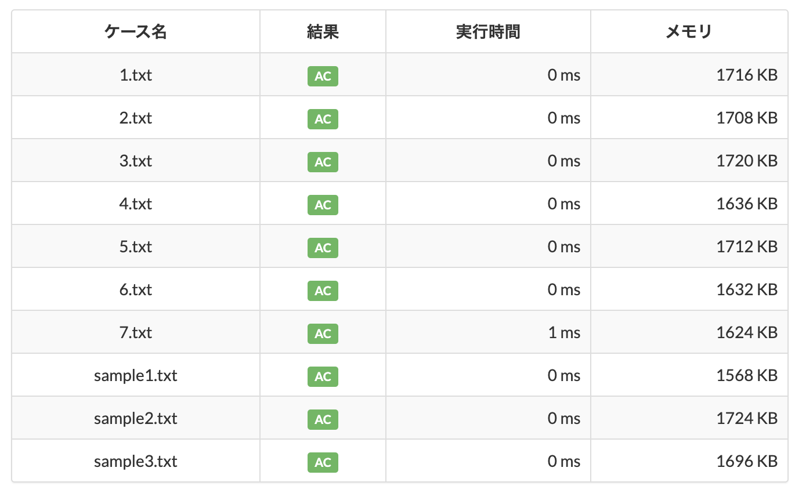

この記事は [OUCC Advent Calendar 2024](https://adventar.org/calendars/10655) の 14 日目の記事です。昨日は [GPT/UEFI/Secure Boot 環境で無料ツールだけで Windows をクローン](../2024-12-13-diskclone/)する方法を説明しました。本日は、[AtCoder Beginners Selection](https://atcoder.jp/contests/abs) の [Shift only](https://atcoder.jp/contests/abs/tasks/abc081_b) を x86 の `bsf` 命令で解く方法を説明します。

## Shift only

まず、[AtCoder Beginners Selection](https://atcoder.jp/contests/abs) は

> 「AtCoderに登録したけど何をしていいか分からない・・・！」という人に向けて作られた、初心者向け問題集です。

と説明されている通り、極めて簡単な問題から少し捻った問題までを網羅した初心者向けの精選過去問集で、常設コンテストという形でいつでも~~遊べる~~使えるように用意されているものです。[Shift only](https://atcoder.jp/contests/abs/tasks/abc081_b) はそのうち 4 問目にあたり、[AtCoder Beginner Contest 081](https://atcoder.jp/contests/abc081) の[問題 B](https://atcoder.jp/contests/abc081/tasks/abc081_b) を抽出してきたものです。直接サイトを見に行くのが早いと思いますが、一応問題文は以下の通りです。

> 黒板に N 個の正の整数 A<sub>1</sub>,..., A<sub>N</sub> が書かれています．
>
> すぬけ君は，黒板に書かれている整数がすべて偶数であるとき，次の操作を行うことができます．
>
> - 黒板に書かれている整数すべてを，2 で割ったものに置き換える．
>
> すぬけ君は最大で何回操作を行うことができるかを求めてください．

制約は 1 ≤ N ≤ 200 かつ 1 ≤ A<sub>i</sub> ≤ 10<sup>9</sup> と、初心者向け問題らしく特に何も考慮不要な親切なものとなっています。結局のところ問題の趣旨は「**与えられた数のうち、2 で割れる回数が最も少ないものは何回割れるのかを答える**」という、ただそれだけです。制約も大したことないので素朴に for/while 文でひたすら 2 で割っていけば良く、[公式解説](https://qiita.com/drken/items/fd4e5e3630d0f5859067)もそうなっています（以下にコードを転載）。

```cpp
#include <iostream>
using namespace std;

int N;
int A[210];			// 最大 200 個なので余裕を持って 210 に --- 200 以上ならなんでもよいです

int main() {
	cin >> N;
	for (int i = 0; i < N; ++i) cin >> A[i];

	int res = 0;

	// 操作が行える限り操作を繰り返す
	while (true) {
		bool exist_odd = false;  // A[i] がすべて偶数かどうかを判定するフラグ
		for (int i = 0; i < N; ++i) {
			if (A[i] % 2 != 0) exist_odd = true;  // 奇数があったらフラグを立てる
		}

		if (exist_odd) break;  // 奇数があったら break

		// 操作を行えるなら操作を実際に行う
		for (int i = 0; i < N; ++i) {
			A[i] /= 2;
		}
		++res;  // 操作回数をインクリメント
	}

	cout << res << endl;
}
```

しかし、「**2 で割る**」「**Shift** only」... 何か、ありそうな気がしませんか？

## コンピュータの数値表現

現在のコンピュータでは、全てのデータを 0 と 1 の 2 通りの状態をもつ「ビット」の組み合わせにより表現しています。プログラム上で数値を扱うときには特に何も気にせず 10 進数で書きますが、内部では処理系や入出力関数が全て 2 進数のビット列に変換しています。

ここで、**「2 で割る」というのは 2 進数において極めて単純な計算になります**。簡単な話で、10 進数において「4536274000000 は 10 で何回割れる？」と聞かれれば、誰でも「6 回！」と即答するでしょう。これは、単に末尾の 0 の個数を数えるだけで分かるからです。なぜそれで分かるのかと言われれば、「**10 で割れば一番右の 0 が 1 つ消える**」ということを知っているからでしょう。これは、**2 進数でも同じこと**です。「1101011000000<sub>(2)</sub> は 10<sub>(2)</sub> で何回割れる？」の答えは、10 進数のときと同じように 6 回です。そして、10<sub>(2)</sub> = 2 です。つまり、**n 進数表現において「10<sub>(n)</sub>」となる値、すなわち n で割る操作は必ず末端の 0 を 1 つ消す操作になり、n で割れる回数は末尾の 0 の数に一致します**（逆に 10 を掛ける操作は必ず末尾に 0 を追加する操作になります）。

ここまでこれば、問題文の「Shift only」の意味が理解できたのではないでしょうか。つまり、この問題は数値のビット表現を左右にずらすシフト演算でも解くことができます（尤も、コンパイラによる最適化で普通に割り算で書いても内部的にはそうなっているはずですが）。しかし、それでも愚直な実装に変わりはありません。**数値のビット列の末尾の 0 の個数を数えて最小のものを出力するだけ。こんなにコンピュータにとって都合のいい問題を、もっとサクっと解く方法はないものでしょうか。**

## `popcnt` 命令との出会い

そんなある日、こんなニュースを見つけました。

<https://forest.watch.impress.co.jp/docs/serial/yajiuma/1568276.html>

どうやら、Windows 11 24H2 以降では `popcnt` 命令とやらが必須化されるそうです。尤も、これは Windows 11 の最低要件を 10 年近く下回る極めて古い CPU で諸々のチェックをバイパスして無理矢理 Windows 11 をブチ込んでいた人だけが影響を受けるもので、大半の人にとってはどうでもいいニュースです。そもそも、そんな古い CPU で現在の激重~~クソ~~ Windows 11 を動かすのは性能的にかなり無理があります。

しかし、何となく興味があったので、この `popcnt` 命令とは何なのかを調べてみました。すると、Population Count の略で、「**[数値の 2 進数表現において 1 を数えるための命令](https://www.felixcloutier.com/x86/popcnt)**」だと判明しました（後述の公式リファレンスでは 1629 ページ目）。これを見て確信しました。ただでさえ意味不明な謎命令が大量に実装されていることで有名な x86 において「**1 を数える命令があるのに、末尾の 0 を数える命令がないわけがない**」と（注：AtCoder のジャッジシステムは 64-bit モードの x86[^1] で動いている）。

## `bsf` 命令

Intel の[公式リファレンス](https://software.intel.com/en-us/download/intel-64-and-ia-32-architectures-sdm-combined-volumes-1-2a-2b-2c-2d-3a-3b-3c-3d-and-4)[^2]の 717 ページ目に `bsf` 命令の説明があります（[ここ](https://www.felixcloutier.com/x86/bsf)の非公式サイトならデカい PDF を扱わずに済みます）。Description を適当に訳すと以下の通りです。

> **演算元オペランド（第 2 オペランド）から最小の立っているビット（1 のビット）を探す**。最小の 1 のビットが見つかれば、そのインデックスが演算先オペランド（第 1 オペランド）に保存される。演算元オペランドはレジスタかメモリ位置であり、演算先オペランドはレジスタである。**インデックスは演算元オペランドの 0 番目のビットからの符号なしオフセットである**。演算元オペランドが 0 なら演算先オペランドの内容は変更されない。

**ドンピシャ**です。これほどまでに完璧なことがあっていいものでしょうか。入力が 0 のときの動作がイマイチですが、本問では入力は 1 以上であることが保証されているので考慮不要です（`bsf` 命令を使って欲しいとしか思えない完璧な制約条件）。

そんなわけで、早速使っていきましょう。C/C++ ではインラインアセンブラが使えるので、機械語命令の直書きもお手のものです。以下は C 言語のつもりですが C++ でもコンパイルできます。GCC でも Clang でも OK です。当然ながら Arm な環境では動かないので、AtCoder のジャッジシステムやコードテストで試してください。

```c
#include <stdio.h>

int main(void) {
  int N, ans = 100;
  scanf("%d", &N);
  
  for (int i = 0; i < N; ++i) {
    int num, ctz;
    scanf("%d", &num);
    asm("bsf %1, %0" : "=r" (ctz) : "r" (num));
    ans = ans > ctz ? ctz : ans;
  }
  
  printf("%d\n", ans);
  return 0;
}
```

内容は以下の通りです。コンパイラにより差がありますが GCC/Clang ではこの形です。出力オペランド以降で書いた変数に、その順番でアセンブリテンプレートから `%0`, `%1`, `%2`,... として参照できます。注意点として、GCC/Clang ではデフォルトで AT&T 記法になるので、AtCoder 上でも AT&T 記法になります。だから何かというと、**オペランドの記載順が先述の Intel のドキュメントと逆になります**。他にも数多の違いがありますが、今回は単純なので差分はこれくらいです。

- `"bsf %1, %0"`: アセンブリテンプレート
  - `%1` から最小の立っているビットを探し、そのインデックスを `%0` に格納する（`%1` の 2 進数表現の末尾の 0 の個数が `%0` に入る）
- `"=r" (ctz)`: 出力オペランド
  - 変数 `ctz` を `%0` レジスタにマップする
  - 制約文字 `r` でコンパイラに適切なレジスタを選ばせて、制約修飾子 `=` で書き込み専用として設定する
- `"r" (num)`: 入力オペランド
  - 変数 `num` を `%1` レジスタにマップする
  - 制約文字 `r` でコンパイラに適切なレジスタを選ばせる（制約修飾子がないので読み込み専用）

普通にひたすら割っていったりひたすら右シフトしていったりするよりも、はるかに単純な実装になりました。インラインアセンブラで手動最適化すると普通コードは複雑になるものですが、CPU 命令を使ってコードを簡略化できるのは不思議な感じですね。実際に[これで AC を取れます](https://atcoder.jp/contests/abs/submissions/60706517)。CPU 命令なだけあって爆速です。


## その他の方法

実は `bsf` 命令はインラインアセンブラを使わなくても、コンパイラの組み込み関数で呼び出すことができます。以下のコードは共に C/C++ どちらでも、GCC/Clang どちらでも通ることを確認しています。

[ビルトイン関数 `__builtin_ctz()` を使う場合](https://atcoder.jp/contests/abs/submissions/60706580)：

```c
#include <stdio.h>

int main(void) {
  int N, ans = 100;
  scanf("%u", &N);
  
  for (int i = 0; i < N; ++i) {
    int num, ctz;
    scanf("%u", &num);
    ctz = __builtin_ctz(num);
    ans = ans > ctz ? ctz : ans;
  }
  
  printf("%u\n", ans);
  return 0;
}
```



[`x86intrin.h` の `__bsfd()` を使う場合](https://atcoder.jp/contests/abs/submissions/60706598)（`d` は Double Word で 32-bit 版という意味）：

```c
#include <stdio.h>
#include <x86intrin.h>

int main(void) {
  int N, ans = 100;
  scanf("%d", &N);
  
  for (int i = 0; i < N; ++i) {
    int num, ctz;
    scanf("%d", &num);
    ctz = __bsfd(num);
    ans = ans > ctz ? ctz : ans;
  }
  
  printf("%d\n", ans);
  return 0;
}
```


0 ms と 1 ms がありますが、何度か提出してみると変わるので測定誤差だと思います。

## おわりに

本日は、[AtCoder Beginners Selection](https://atcoder.jp/contests/abs) の [Shift only](https://atcoder.jp/contests/abs/tasks/abc081_b) を x86 の `bsf` 命令で解く方法を説明しました。私は競技プログラミングを引退してもう 4 年半になりますが、それでもいろいろな遊び方があって面白いですね。この記事がアセンブラや CPU 命令への誘いになれば幸いです。

[^1]: 歴史的に呼び方が定まっておらず、Intel 側は Intel 64 や EM64T と呼んでいて、しかし最初に x86 の 64-bit 拡張を公式に製品化したのが AMD なので AMD64 と呼ばれていたり（[Intel は Intel 64 を実装した CPU を先に発売していたが、ビジネス的事情で回路レベルで無効化していた](https://www.quora.com/How-was-AMD-able-to-beat-Intel-in-delivering-the-first-x86-64-instruction-set-Was-Intel-too-distracted-by-the-Itanium-project-If-so-why-Shouldn-t-Intel-with-its-vast-resources-have-been-able-to-develop-both)）、Microsoft が x86 をもじって x64 という意味不明な呼び方をしていたり、中立的なプロジェクトでは x86-64 と呼んでいたり、まさにカオスの様相です。そもそも 8086, 80186, 80286 から続く CPU 型番の系譜を総称して 80x86 と呼んだのが始まりなわけで、x64 って一体何がどうなってるんだ...

[^2]: リファレンス中にある IA-32 とは 32-bit モードの x86 を指すレトロニムです。この名付けをしたタイミングに全く流行らなかった Itanium アーキテクチャの IA-64 を出していて、それから取った名前です。Intel 64 を出したタイミングで再レトロニムで Intel 32 とかにしてくれたら良かったのに。
