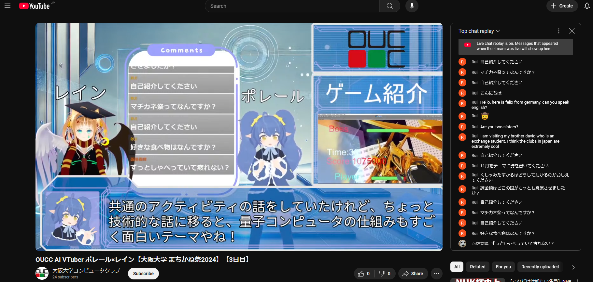
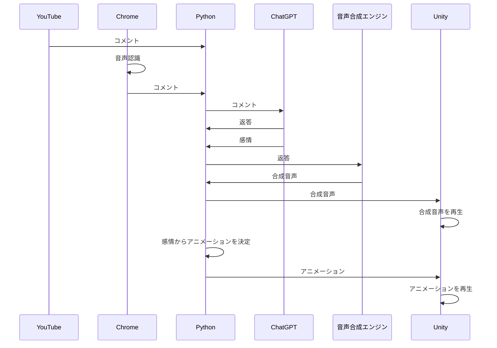
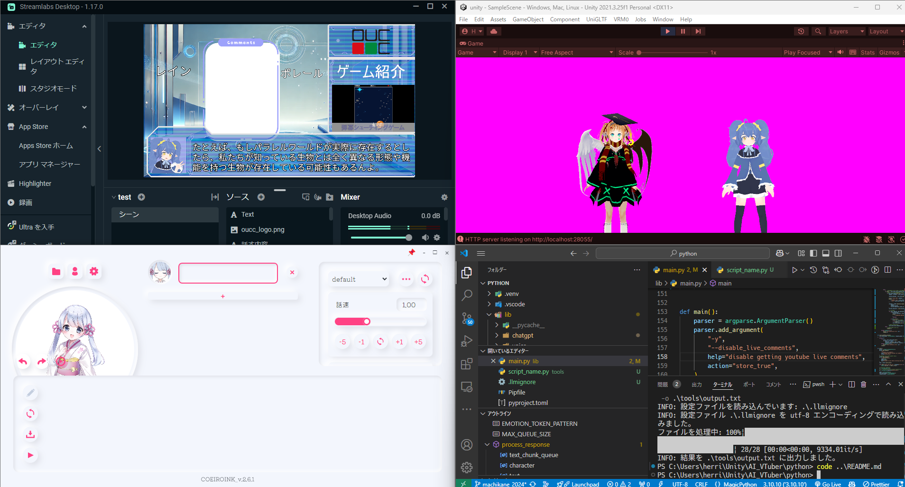
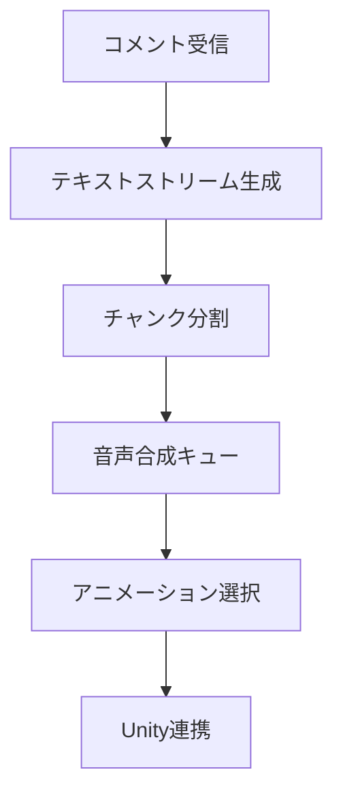
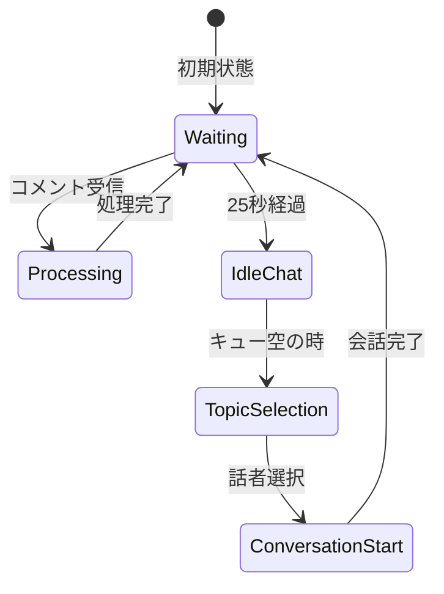

# AI VTuber作ってみた(2023)

この記事は[OUCC Advent Calendar 2024](https://adventar.org/calendars/xxx) の16日目の記事です。

## はじめに

「AIと一緒にゲームをプレイしたい」

これは私が長年抱いていた夢でした。2023年3月、OpenAIがGPT APIを一般公開したというニュースを見たとき、この夢を実現するチャンスが来たと直感しました。そこからの2か月間で取り組んだAI VTuberプロジェクトについて、今回は詳しくご紹介したいと思います。

最近の配信の様子は[まちかね祭2024の配信アーカイブ](https://www.youtube.com/watch?v=YftdGIyWcFE)でご覧いただけます。




## プロジェクトの概要

当初は「AIにゲームを実況させる」というアイデアでスタートしました。強化学習（gym）を使って実装しようと試みたのですが、技術的な課題から断念。代わりに、視聴者と対話するAI VTuberという方向性に切り替えました。

### システムアーキテクチャ

全体の構成は以下のようになっています：





## 技術的な実装

### 1. テキスト処理と感情表現

テキスト処理は以下のような流れで実装されています：

1. ChatGPTからの応答を小さなチャンクに分割
2. 感情タグ（[happy], [sad]など）の解析
3. 7つの感情パラメータ（喜び、怒り、悲しみ、楽しさ、自信、困惑、恐怖）への変換
4. アニメーションと音声の感情付け

実は感情によるアニメーションや音声の変化は、当初想定していたほど充実させることができませんでした。開発期間が実質的には4月末の数日だけだったことが大きな要因です。

### 2. リアルタイムな応答システム



応答の遅延を最小限に抑えるため、テキストの生成から音声合成、アニメーション再生までを段階的に処理しています。しかし、マルチスレッドの扱いが難しく、理想的なパフォーマンスには至っていません。

### 3. 二人のキャラクターによる対話

当初は視聴者との1対1の会話だけでしたが、「AIと話すだけじゃ面白くない」という課題に直面しました。そこで2024年のまちかね祭の直前、わずか3時間ほどで実装したのが2人のキャラクターによる雑談機能です。以下が処理の流れです：



### 4. プロンプトエンジニアリングの工夫

プロンプトの設計には特に気を使いました。以下のような工夫を施しています：

1. **英語でのキャラクター設定**
   - 日本語で設定を書くと「私は〇〇な性格です！」といった不自然な自己紹介を頻繁にしてしまう問題がありました
   - キャラクター設定を英語で記述することで、設定の読み上げを防ぎつつ自然な会話を実現
   - トークン数の削減にも貢献

2. **具体的な発話例の提供**
```python
Example sentences:
- [neutral]こんにちは、私はレインです。あなたは？
- [sad]最近は色々上手く行かなくて、気分が落ち込んじゃう。
  [neutral]でも、あなたと話せてよかったわ。
```
   - 抽象的な性格設定ではなく、具体的な発話例を与えることで一貫した口調を維持
   - 感情タグの使い方も例示することで、自然な感情表現を誘導

3. **文脈管理の実装**
   - 会話履歴を保持し、関連性の高い過去の会話を参照
   - テキストの類似度計算により、適切な文脈を選択
   - 一定ターン数で話題を自然に切り替える機能

4. **OUCCの情報を含めた状況設定**
   - イベントやクラブの情報をプロンプトに組み込み、より自然な会話を実現
   - 現在の日時や場所の情報も含めることで、状況に応じた応答を生成

これらの工夫により、キャラクターの一貫性を保ちつつ、自然な会話を実現することができました。特に英語でのキャラクター設定は、予想以上に効果的でした。

## 運用上の課題

システムの実行には以下のソフトウェアが必要です：

- Unity
- COEIROINK（音声合成）
- Pythonプログラム
- Streamlabs

これらすべてを同時に動かす必要があるため、一般的なノートPCでは負荷が高すぎました。音声認識機能は大阪大学いちょう祭2023でのみ使用し、現在は主にデスクトップPCでの配信に限定しています。

## 開発を通じて気づいたこと

興味深い発見は、このシステムが「あまりに真面目すぎる」という点でした。2022年にGPT-2で作った前バージョンは予測不能な反応で個人的には面白かったのですが、ChatGPTベースの現バージョンは常に適切で真面目な返答をしてしまいます。

VTuberとしては、もう少し予測不能なハチャメチャさがあった方が面白かったかもしれません。この経験は、AIキャラクターの「個性」とは何かという新たな課題を投げかけてくれました。

## 今後の展望

次のプロジェクトでは方向性を大きく変えて、「物語を作って読み上げ、視聴者と感想を共有する」タイプのAI VTuberに挑戦してみたいと考えています。面白くなるかはわかりませんが、また新しい可能性を探っていきたいと思います。

## さいごに

本プロジェクトは2023年3～4月という短期間で開発されました。技術的な課題や運用上の問題は多々ありましたが、それでもAI技術を活用したVTuberシステムを実現できたことは大きな成果でした。今後もAI技術の進化に注目しつつ、新しいプロジェクトに挑戦していきたいと思います。

明日のアドベントカレンダーはSnakerrさんによる「VR開発について」です。お楽しみに！