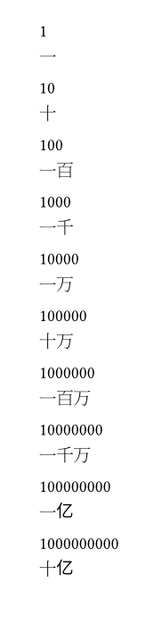

この記事は [OUCC Advent Calendar 2024](https://adventar.org/calendars/10655) の18日目の記事です。本日はTypstの漢数字のナンバリングを行うときの注意点について説明します。

## Typst のナンバリング

Typst では`numbering`でナンバリングを指定することができ、`1`や`a`などのショートハンドがあります。現在サポートされているのは 1, a, A, i, I, 一, 壹, あ, い, ア, イ, א, 가, ㄱ, *, ①, ⓵ です。

この中でも漢数字の`一`は注意が必要です。日本語用ではなく中国語用のライブラリが使われているためです。これにより3つの問題が発生します。

1つ目は、100や1000が一百や一千になってしまうことです。中国語では100や1000に一をつけます。十でもつけることもあるそうですが、Typstでは省略しているようです。

2つ目は、億をナンバリングすると亿になることです。億以上の漢字は中国語と日本語では異なります。しかし、そもそもこれほど大きいかずは基本的に扱わないですし、Typstが数値として処理できるのもint32の範囲までなので問題にはなりません。

3つ目は、101のような間に0が入る数値が一百零一になってしまうことです。これは日本語の漢数字とは異なります。

## 例

以下の例では、10の0乗から10の9乗までを漢数字でナンバリングしています。

```typst
#for i in range(0,10) [
  #let value = calc.pow(10, i)
  
  #value \
  #numbering("一", value)
]
```



## 対応策

対応策は文字列置換で一や零を消すことです。以下のように関数を作成しておくと便利です。

```typst
#let kanji-numbering(value) = {
  return numbering("一", value)
    .replace("一百", "百")
    .replace("一千", "千")
    .replace("零", "")
}
```

## 実装

実際の実装は次のリンク先にあります。

https://github.com/typst/typst/blob/73253d465192454f0dfe3fe9eef46d495b343aef/crates/typst-library/src/model/numbering.rs

一番上に書いてあるようにchines_numberというクレートが使われています。

https://docs.rs/chinese-number/latest/chinese_number/

## まとめ

Typstで漢数字をナンバリングするときは、中国語と日本語の違いをがあることを認識しておく必要があります。また、その違いを吸収するために文字列置換を行う関数を作成すると便利です。

