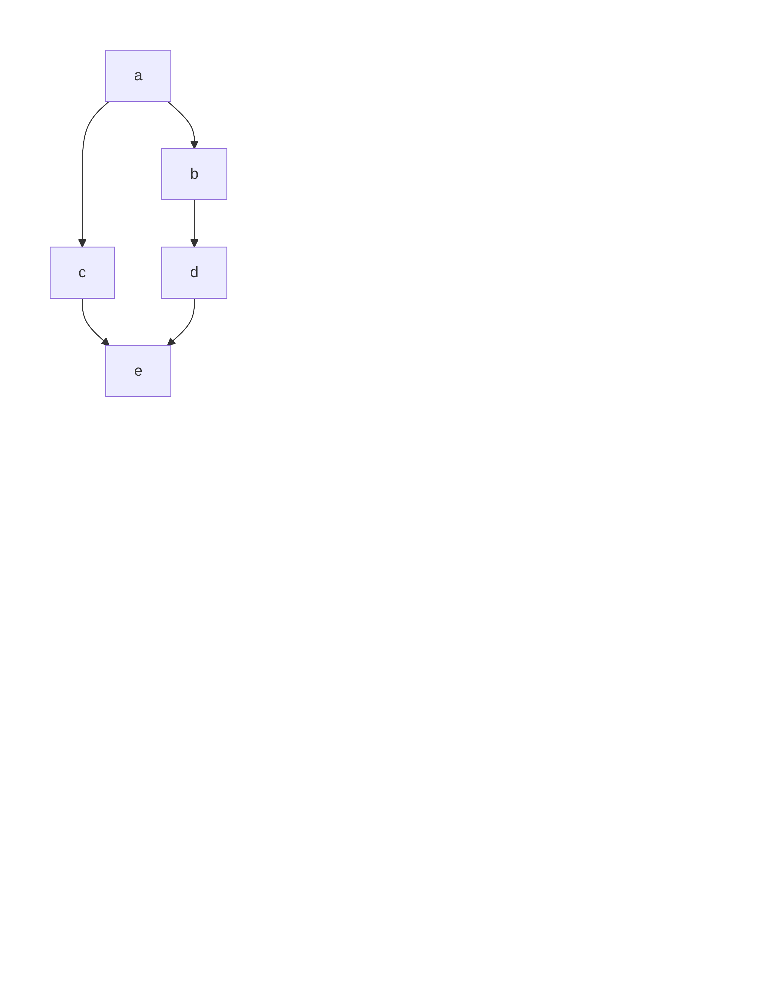
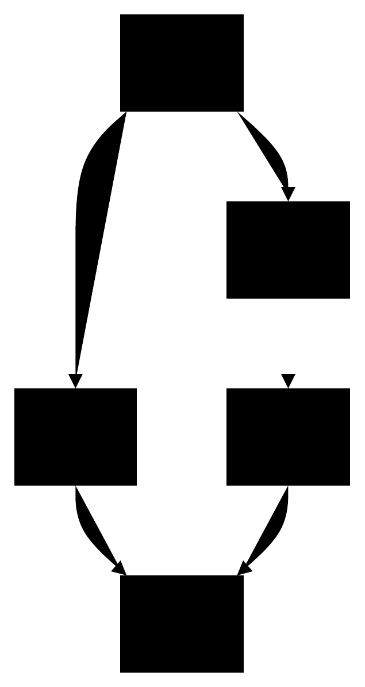
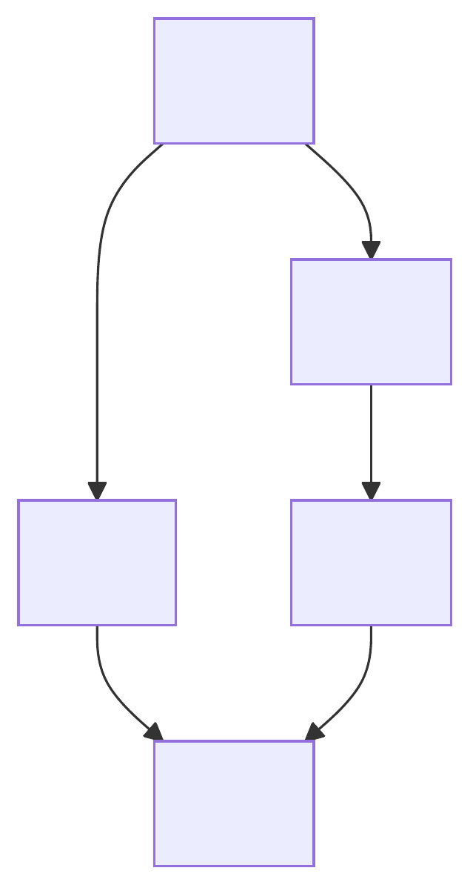
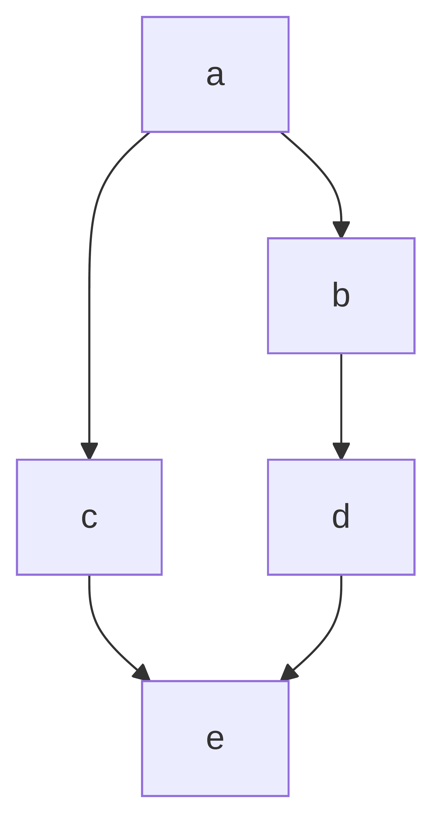
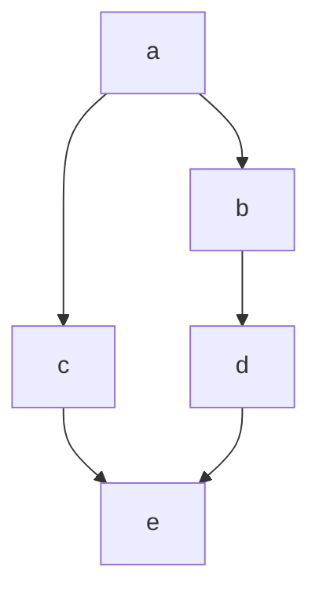

この記事は[OUCC Advent Calendar 2024](https://adventar.org/calendars/10655)の21日目の記事です。

## 記事作成後の気づき
[SVGからPDFへの変換はHeadless Chromeでやろう（と思ったけどやっぱりrsvg-convertでやろう）](https://qiita.com/s417-lama/items/747be70c35204d4e1b39#headless-chrome)の最後にも書いてありましたが、Headless Chromeを使うと、ラスタ画像になっていました。~~(ちゃんと読んでないのが悪い)~~ これでは、この記事の目的は達成できていません。(ラスター画像なら、[mermaid-cli](https://github.com/mermaid-js/mermaid-cli)で作成できる。)
→svgファイルをいじって、ほかの方法で文字が表示されるようにするしかない？

ほかの方法で、変換できれば記事を更新します。

---

試した手法とその結果も載せています。
最終的な方法だけ見たい方は、[結論](#結論)を見てください。

## やりたかったこと
学校の課題で、$\LaTeX$ でレポートを書く必要がありました。
その際、状態遷移図を乗せる必要があったので、Mermaidで簡単に作ってしまおうと思いましたが、作った画像をどう表示させようか悩みました。
$\LaTeX$にsvgを張るのは面倒 ($\LaTeX$のことをよくわかってない) ので、pdfにして表示しようと思いましたが、うまく変換できませんでした。
~~なお、ベクター画像でなければならない理由はない。やりたかっただけ~~

## 試した方法

### Markdown内に書いて、pdfで出力
いくつかの変換方法を試しましたが、文書として出力されるため、画像のみのpdfは出力できませんでした。
pdf内にグラフが小さく表示されてしまいます。




### Mermaid → svg → pdf
[mermaid-cli](https://github.com/mermaid-js/mermaid-cli) というMermaidをsvg/png/pdfに変換できる、cliアプリケーションが見つかりました。これで、Mermaidをsvgに変換し、それをpdfに変換する方法を試しました。
#### Inkscape
Inkscapeで、`inkscape --export-type="pdf" sample.svg`などとして、pdfに変換しようと思いましたが、うまくいかず、黒塗りの画像が出てきてしまいました。mermaid-cliで生成されるsvgには、Inkscapeが想定していない情報も書いてあるようで、そのために処理がうまくいかないようでした。




#### 別の方法
[SVGからPDFへの変換はHeadless Chromeでやろう（と思ったけどやっぱりrsvg-convertでやろう）](https://qiita.com/s417-lama/items/747be70c35204d4e1b39#headless-chrome)を見つけ、そこで紹介されていた、rsvg-convert、Cairosvgは、文字が描画されませんでした。


rsvg-convert

Cairosvg


Headless Chromeでは、ページいっぱいの大きさのグラフが載ったpdfを作成できました。
(1ページ目)

(2ページ目)


## 結論
Mermaidのみを、ファイルに書き、[mermaid-cli](https://github.com/mermaid-js/mermaid-cli)で、svgに変換し、[SVGからPDFへの変換はHeadless Chromeでやろう（と思ったけどやっぱりrsvg-convertでやろう）](https://qiita.com/s417-lama/items/747be70c35204d4e1b39#headless-chrome)で紹介されている、[svg2pdf.bash](https://gist.github.com/s417-lama/84bf66de1096c4587e8187092fb41684)を使って、pdfに変換する。
ただし、このpdfには、謎の2ページ目が存在するので、1ページ目のみを使用する。(1ページ目のみを参照するなり、別ファイルに1ページ目のみを書き出すなりしてください。)

<details>
<summary>サンプル</summary>


Mermaidファイルの記述

```sample.mmd
graph TD
a-->b
a-->c
b-->d
c-->e
d-->e
```

Mermaid


出来上がったpdf
(1ページ目)

(2ページ目)


</details>
