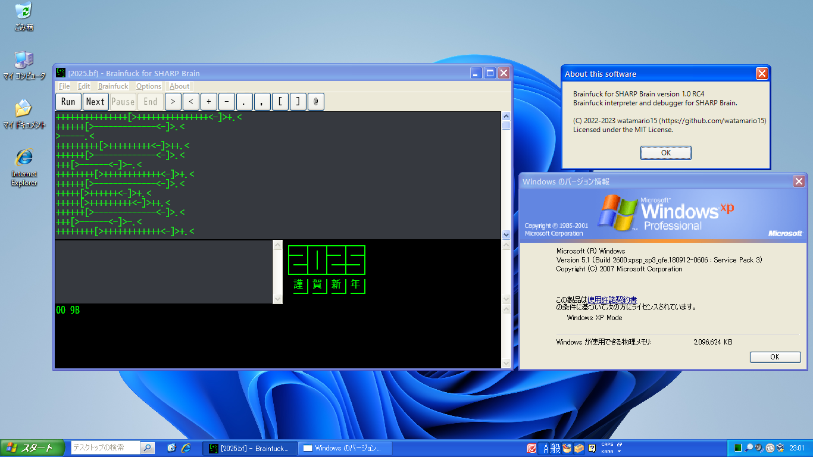

この記事は [OUCC Advent Calendar 2024](https://adventar.org/calendars/10655) の 24 日目の記事です。今回はちょっと早めに投稿しているので、昨日の記事は投稿時点ではまだ分かりません（その日になったらきっと追加されるはず）。本日は、Windows の High DPI 対応用 API の現状を簡単にまとめた上で、Win32 API 実装で古い OS との互換性を切らずに High DPI 対応する方法を説明します。

この記事に掲載するプログラムコードは全て Public Domain ([CC0-1.0](https://creativecommons.org/publicdomain/zero/1.0/deed.ja)) として扱っていただいて構いません。

## Win32 API や High DPI について

Win32 API[^1] は **Windows における最低レイヤの API** です[^2]。低レベル API なのでフレームワークを使用する場合に比べて軽量で、Windows の全機能にアクセスできるため詳細なカスタマイズや高度な機能の利用が可能です。Windows 自体は主に C++ で書かれていますが、Win32 API は C 言語からでも使えます（もちろん C++ や Rust からでも使えます）。今では Web やら [Flutter](https://flutter.dev/) やら [.NET](https://dotnet.microsoft.com/) やら、一般的に何らかの外部フレームワークを使ってアプリを開発しますが、古くから開発が続いているアプリや、組み込みなどの特殊な環境を含む Windows 機に瞬時に展開できる軽量アプリや、Windows の機能を最大限活用したアプリを開発したいときなどに Win32 API を使います。ちなみに、Flutter などのフレームワーク類も内部的には Win32 API を呼び出しています。

High DPI とは Windows 独自の概念で「**画面の細かさを表す仮想的な値 DPI が 96 より大きい環境**」です。DPI という語はプリンタの dots per inch に由来しますが、Windows では「**UI 要素を通常（96 DPI）と比べてどれだけ拡大すべきか**」を表します。ディスプレイ設定の表示サイズ関係のアレ（下図）で、近年の 4K 画面などの普及によりモニタごとに合わせたサイズで UI を描画する必要性が生じて導入されたものです。


これには「対応アプリ」「非対応アプリ」という概念があり、非対応アプリは High DPI 画面ではピンぼけした見た目になります。Windows XP 時代には OS が勝手にフォントサイズなどを大きくして High DPI 対応していましたが、フォント形状などの都合で文字がはみだして隠れるなどのレイアウト崩壊を起こしていたので、原則として「**非対応アプリとして OS 側でピンぼけ拡大させる**」「**対応アプリとしてアプリ側が自分で全部やる**」ことになりました。

ちなみに、Windows 10 Creators Update (1703) 以降では **GDI Scaling** という機能（Windows XP 方式を極力レイアウト崩壊しないように賢くやる）が実装されていて、これを使うと**単純なプログラムでは以下の manifest を付けるだけ**という、最小限のコストで High DPI 対応できます（以下の例では [Common Controls 6 (Visual Styles)](https://learn.microsoft.com/en-us/windows/win32/controls/themes-overview) も有効化しています）。Windows 2000 など、この辺りの機能に対応しない古い OS では単に無視されるだけなので、実行に際して問題は生じません。

```xml
<?xml version="1.0" encoding="utf-8" standalone="yes"?>
<assembly xmlns="urn:schemas-microsoft-com:asm.v1" xmlns:asmv3="urn:schemas-microsoft-com:asm.v3" manifestVersion="1.0">
  <asmv3:application>
    <asmv3:windowsSettings xmlns="http://schemas.microsoft.com/SMI/2017/WindowsSettings">
      <gdiScaling>true</gdiScaling>
    </asmv3:windowsSettings>
  </asmv3:application>
  <dependency>
    <dependentAssembly>
      <assemblyIdentity
        type="win32"
        name="Microsoft.Windows.Common-Controls"
        version="6.0.0.0"
        processorArchitecture="*"
        publicKeyToken="6595b64144ccf1df"
        language="*"
      />
    </dependentAssembly>
  </dependency>
</assembly>
```

上記の manifest が付いていないアプリに対しても、ユーザ側で exe ファイルを右クリックして「プロパティ」を選び、互換性タブから高 DPI 設定を「システム（拡張）」に変更すると有効化できます。ただし、アプリによっては表示が壊れる場合があるので、その場合は開発元の対応を待ちましょう。


GDI Scaling を有効にしても Windows 10 Creators Update (1703) より前の OS では完全に High DPI 非対応のピンぼけアプリとして振る舞うほか、対応環境でも 150% のように整数倍でない場合は仕組み上縮小が掛かり少しピンぼけするため、ネイティブに High DPI 対応するのが一番ですが、あまりコストをかけたくないとか、High DPI 対応は最新環境だけで十分といった状況では最適です。詳細は [Improving the high-DPI experience in GDI based Desktop Apps](https://blogs.windows.com/windowsdeveloper/2017/05/19/improving-high-dpi-experience-gdi-based-desktop-apps/) を参考にしてください。本記事では、以降ネイティブに High DPI 対応する方法を解説します。

## High DPI の魔境

まず、High DPI には以下の 4 区分の awareness（対応度合い）が存在します。

<dl>
  <dt>Unaware &mdash; High DPI 非対応（デフォルト）</dt>
  <dd>常に 96 DPI になる（OS 側でピンぼけ拡大）</dd>

  <dt>System &mdash; Windows Vista 以降</dt>
  <dd>常にプライマリディスプレイの DPI になる（サブディスプレイでは OS 側でピンぼけ拡大）</dd>
  <dd>ログイン時に確定するため、DPI 設定やプライマリディスプレイを変えると再ログインするまで正常動作しない</dd>

  <dt>Per-Monitor &mdash; Windows 8.1 以降</dt>
  <dd>クライアントエリアはウィンドウがあるモニタの DPI になる（非クライアントエリアは System DPI）</dd>

  <dt>Per-Monitor V2 &mdash; Windows 10 Creators Update (1703) 以降</dt>
  <dd>ウィンドウがあるモニタの DPI になる</dd>
</dl>

この中で最も「モダン」なのは **Per-Monitor V2** で、あらゆるモニタで最も綺麗に描画されます。この対応度合いを宣言するには、マニフェストに以下の内容を記述します（忘れてはいけないのは、**対応するのは自分自身**だということです）。[`dpiAware`](https://learn.microsoft.com/en-us/windows/win32/sbscs/application-manifests#dpiAware) は古い OS 用の互換性のための記述で、新しい OS では [`dpiAwareness`](https://learn.microsoft.com/en-us/windows/win32/sbscs/application-manifests#dpiAwareness) が優先されます。例によって High DPI を真面目にやるなら必須になる [Common Controls 6 (Visual Styles)](https://learn.microsoft.com/en-us/windows/win32/controls/themes-overview) も有効化しています。

```xml
<?xml version="1.0" encoding="utf-8" standalone="yes"?>
<assembly xmlns="urn:schemas-microsoft-com:asm.v1" manifestVersion="1.0">
  <application xmlns="urn:schemas-microsoft-com:asm.v3">
    <windowsSettings>
      <dpiAware xmlns="http://schemas.microsoft.com/SMI/2005/WindowsSettings">True/PM</dpiAware>
      <dpiAwareness xmlns="http://schemas.microsoft.com/SMI/2016/WindowsSettings">PerMonitorV2, PerMonitor</dpiAwareness>
    </windowsSettings>
  </application>
  <dependency>
    <dependentAssembly>
      <assemblyIdentity
        type="win32"
        name="Microsoft.Windows.Common-Controls"
        version="6.0.0.0"
        processorArchitecture="*"
        publicKeyToken="6595b64144ccf1df"
        language="*"
      />
    </dependentAssembly>
  </dependency>
</assembly>
```

**プログラム実行中の DPI 変化に追従する**のは簡単で、単に window message [`WM_DPICHANGED`](https://learn.microsoft.com/en-us/windows/win32/hidpi/wm-dpichanged) (`0x2E0`) で `HIWORD(wParam)` を新 DPI 値、`lParam` を `const RECT *` 型の新ウィンドウサイズ及びウィンドウ位置として、ウィンドウやその中の UI 要素群を再配置すれば OK です。それこそ、[`WM_SIZE`](https://learn.microsoft.com/en-us/windows/win32/winmsg/wm-size) でその時点の DPI 値に合わせて UI 要素を再配置する実装になっていれば、以下のフックを window procedure に入れておいて：

```c
case 0x2E0:  // WM_DPICHANGED
  onDPIChanged(hWnd, HIWORD(wParam), (const RECT *)lParam);

  // メッセージを処理したら必ず 0 を返してその旨を OS に伝える
  return 0;
```

処理内容を以下のように書くだけで完了です。

```c
void onDPIChanged(HWND hWnd, int dpi, const RECT *rect) {
  // グローバル変数 DPI で管理している実効 DPI 値を新しい値で更新する
  DPI = dpi;

  // Windows に指示された通りの位置とウィンドウサイズにする（完了後 WM_SIZE が飛ぶ）
  MoveWindow(hWnd, rect->left, rect->top, rect->right - rect->left, rect->bottom - rect->top, FALSE);
}
```

Windows 2000 のような古い OS では単にこの window message が発出されないだけなので問題は生じません。SDK 側の都合で `WM_DPICHANGED` が定義されていなければ、参考例のように `0x2E0` と数値で指定するか自分で定義すれば問題ありません[^3]。

問題は、**起動直後に自分のアプリがどんな DPI 環境に置かれているのかを得る**方法です。

## 起動時の DPI 取得

起動直後、すなわち一度も `WM_DPICHANGED` が発行されていない状況では、自分で API を呼び出して DPI 値を取得するしかありません。そして、ここで OS バージョンによる細かい違いが発生します（クソポイント 1）。

<dl>
  <dt><a href="https://learn.microsoft.com/en-us/windows/win32/api/wingdi/nf-wingdi-getdevicecaps"><code>GetDeviceCaps()</code></a></dt>
  <dd>System DPI 値を返す</dd>

  <dt><a href="https://learn.microsoft.com/en-us/windows/win32/api/shellscalingapi/nf-shellscalingapi-getdpiformonitor"><code>GetDpiForMonitor()</code></a> &mdash; Windows 8.1 以降</dt>
  <dd>指定モニタの DPI 値を返す</dd>

  <dt><a href="https://learn.microsoft.com/en-us/windows/win32/api/winuser/nf-winuser-getdpiforwindow"><code>GetDpiForWindow()</code></a> &mdash; Windows 10 Anniversary Update (1607) 以降</dt>
  <dd>ウィンドウがあるモニタの DPI 値を返す</dd>
</dl>

なぜ `GetDeviceCaps()` は awareness に従って `GetDpiForWindow()` 相当の値を返す API になってくれなかったのでしょうか[^4]。こういうところが Microsoft ですね。これを見ると `GetDpiForWindow()` を使えばいいと思うかもしれませんが、そうするとこの関数がリンカによって exe ファイルの起動時依存として記載されてしまうので、Windows 10 Anniversary Update (1607) より前の OS では起動すらしなくなってしまいます[^5]。そのために、古い OS から新しい OS まで完璧にサポートするには、[`LoadLibraryW()`](https://learn.microsoft.com/en-us/windows/win32/api/libloaderapi/nf-libloaderapi-loadlibraryw) を使って以下のような地獄の実装をする羽目になります。なお、`hWnd` が使われていることからわかる通り、これはウィンドウが生成されてから行う必要があります。[`WM_CREATE`](https://learn.microsoft.com/en-us/windows/win32/winmsg/wm-create) 辺りがタイミングとして適当かと思います。

```c
// 前提
// * hWnd: 対象ウィンドウのハンドル
// * sysDPI: System DPI 値を保存するグローバル変数
// * DPI: 現在の実効 DPI 値を保存するグローバル変数

// System DPI 値を取得する（LOGPIXELSX と LOGPIXELSY は同じ）
// Fallback 値として使うほか、System DPI レベルしか対応しない Win32 API を扱うために使う
HDC hDC = GetDC(hWnd);
sysDPI = GetDeviceCaps(hDC, LOGPIXELSX);
ReleaseDC(hWnd, hDC);

// DLL hijacking 対策としてカレントディレクトリからの DLL 読み込みを無効化
// 別で既に WinMain() などから呼び出してあるなら不要
SetDllDirectoryW(L"");

HMODULE user32 = NULL, shcore = NULL;

// Windows 10 Anniversary Update (1607) 以降で使える GetDpiForWindow() の読み込みを試行する
user32 = LoadLibraryW(L"User32.dll");
if (user32) {
  GetDpiForWindow_t getDpiForWindow = (GetDpiForWindow_t)(void *)GetProcAddress(user32, "GetDpiForWindow");
  if (getDpiForWindow) {  // 読み込めたら使う
    DPI = getDpiForWindow(hWnd);
    goto dpidone;
  }
}

// Windows 8.1 以降で使える GetDpiForMonitor() と Windows 2000 以降で使える MonitorFromWindow() の読み込みを試行する
shcore = LoadLibraryW(L"Shcore.dll");
if (shcore && user32) {
  GetDpiForMonitor_t getDpiForMonitor = (GetDpiForMonitor_t)(void *)GetProcAddress(shcore, "GetDpiForMonitor");
  MonitorFromWindow_t monitorFromWindow = (MonitorFromWindow_t)(void *)GetProcAddress(user32, "MonitorFromWindow");
  if (getDpiForMonitor && monitorFromWindow) {  // 読み込めたら使う
    unsigned tmpX, tmpY;  // X と Y は同じ
    getDpiForMonitor(monitorFromWindow(hWnd, MONITOR_DEFAULTTONEAREST), MDT_EFFECTIVE_DPI, &tmpX, &tmpY);
    DPI = tmpX;
    goto dpidone;
  }
}

// Fallback として System DPI 値を使う
DPI = sysDPI;

dpidone:
if (shcore) FreeLibrary(user32);
if (user32) FreeLibrary(shcore);

// DPI 値に基づいてウィンドウサイズを変更する（サイズは適宜調整）
// adjust() はグローバル変数 DPI を元に、96 DPI における値を実効 DPI における値に変換する関数として組まれている前提
SetWindowPos(hWnd, NULL, 0, 0, adjust(480), adjust(320), SWP_NOZORDER | SWP_NOACTIVATE | SWP_NOMOVE);
```

このコードをコンパイルするには以下の定義が必要です。

```c
typedef enum MONITOR_DPI_TYPE {
  MDT_EFFECTIVE_DPI = 0,
  MDT_ANGULAR_DPI = 1,
  MDT_RAW_DPI = 2,
  MDT_DEFAULT = MDT_EFFECTIVE_DPI
} MONITOR_DPI_TYPE;

typedef UINT (CALLBACK *GetDpiForWindow_t)(HWND hwnd);
typedef HRESULT (CALLBACK *GetDpiForMonitor_t)(HMONITOR hmonitor, MONITOR_DPI_TYPE dpiType, UINT *dpiX, UINT *dpiY);
typedef HMONITOR (CALLBACK *MonitorFromWindow_t)(HWND hwnd, DWORD dwFlags);

static inline int adjust(int coord) { return coord * DPI / 96; }
```

やっていることは以下の通りです。

1. `User32.dll` から `GetDpiForWindow()`（最新 API）を読み込もうとし、成功すればそれを使う
   - 関数ポインタとして動的に読み込んでいるので、この API 関数がない OS でも起動自体は弾かれない
1. 失敗すれば `Shcore.dll` から `GetDpiForMonitor()`（ちょい古 API）を読み込もうとし、成功すればそれを使う
1. 失敗すれば `GetDeviceCaps()`（大昔からある API）の値を使う
1. 得た値を元に [`SetWindowPos()`](https://learn.microsoft.com/en-us/windows/win32/api/winuser/nf-winuser-setwindowpos) でウィンドウサイズを変更する
   - `WM_SIZE` で DPI 値を元に UI 要素を再配置する実装になっている前提
   - 与えている引数の内容はあくまでも参考例

アプリ全体で単一の DPI awareness を使う場合は、`GetDpiForWindow()` は不要なので以下の通り短縮できます（[`MONITOR_DPI_TYPE`](https://learn.microsoft.com/en-us/windows/win32/api/shellscalingapi/ne-shellscalingapi-monitor_dpi_type) などの定義は依然必要です）。

```c
HDC hDC = GetDC(hWnd);
sysDPI = GetDeviceCaps(hDC, LOGPIXELSX);
ReleaseDC(hWnd, hDC);

SetDllDirectoryW(L"");
HMODULE shcore = LoadLibraryW(L"Shcore.dll"), user32 = LoadLibraryW(L"User32.dll");
GetDpiForMonitor_t getDpiForMonitor = NULL;
if (shcore) getDpiForMonitor = (GetDpiForMonitor_t)(void *)GetProcAddress(shcore, "GetDpiForMonitor");
MonitorFromWindow_t monitorFromWindow = NULL;
if (user32) monitorFromWindow = (MonitorFromWindow_t)(void *)GetProcAddress(user32, "MonitorFromWindow");

if (getDpiForMonitor && monitorFromWindow) {
  unsigned tmpX, tmpY;
  getDpiForMonitor(monitorFromWindow(hWnd, MONITOR_DEFAULTTONEAREST), MDT_EFFECTIVE_DPI, &tmpX, &tmpY);
  DPI = tmpX;
} else {
  DPI = sysDPI;
}

if (shcore) FreeLibrary(shcore);
if (user32) FreeLibrary(user32);

SetWindowPos(hWnd, NULL, 0, 0, adjust(480), adjust(320), SWP_NOZORDER | SWP_NOACTIVATE | SWP_NOMOVE);
```

なお、これらのサンプルコードでは `LoadLibraryW()` に単に DLL ファイル名を渡して無条件で読み込みを試行しています。[`SetDllDirectoryW(L"")`](https://learn.microsoft.com/en-us/windows/win32/api/winbase/nf-winbase-setdlldirectoryw) によりカレントディレクトリに不正な DLL が置かれるケースは対策していますが、システムフォルダに不正な DLL を置かれるケース[^6]などを懸念する場合は、バージョンによって存在しない可能性のある `Shcore.dll` について `versionhelpers.h` にある組み込み関数 [`IsWindows8Point1OrGreater()`](https://learn.microsoft.com/en-us/windows/win32/api/versionhelpers/nf-versionhelpers-iswindows8point1orgreater) でガードした上で読み込みます。これは Windows 2000 でも使える API を呼び出す `inline` 関数として SDK 内に定義されているので、Windows 2000, XP のような古い OS でも動作します。SDK になければ [`VerifyVersionInfoW()`](https://learn.microsoft.com/en-us/windows/win32/api/winbase/nf-winbase-verifyversioninfow) を使うと良いでしょう。ただし、以下のように manifest に互換性記述を追加しないと正しく動作しないようなので注意が必要です（クソポイント 2）。

```xml
<?xml version="1.0" encoding="utf-8" standalone="yes"?>
<assembly xmlns="urn:schemas-microsoft-com:asm.v1" manifestVersion="1.0">
  <application xmlns="urn:schemas-microsoft-com:asm.v3">
    <windowsSettings>
      <dpiAware xmlns="http://schemas.microsoft.com/SMI/2005/WindowsSettings">True/PM</dpiAware>
      <dpiAwareness xmlns="http://schemas.microsoft.com/SMI/2016/WindowsSettings">PerMonitorV2, PerMonitor</dpiAwareness>
    </windowsSettings>
  </application>
  <compatibility xmlns="urn:schemas-microsoft-com:compatibility.v1">
    <application>
      <!-- Windows 10, Windows Server 2016 and Windows Server 2019 -->
      <supportedOS Id="{8e0f7a12-bfb3-4fe8-b9a5-48fd50a15a9a}"/>
      <!-- Windows 8.1 and Windows Server 2012 R2 -->
      <supportedOS Id="{1f676c76-80e1-4239-95bb-83d0f6d0da78}"/>
      <!-- Windows 8 and Windows Server 2012 -->
      <supportedOS Id="{4a2f28e3-53b9-4441-ba9c-d69d4a4a6e38}"/>
      <!-- Windows 7 and Windows Server 2008 R2 -->
      <supportedOS Id="{35138b9a-5d96-4fbd-8e2d-a2440225f93a}"/>
      <!-- Windows Vista and Windows Server 2008 -->
      <supportedOS Id="{e2011457-1546-43c5-a5fe-008deee3d3f0}"/>
    </application>
  </compatibility>
  <dependency>
    <dependentAssembly>
      <assemblyIdentity
        type="win32"
        name="Microsoft.Windows.Common-Controls"
        version="6.0.0.0"
        processorArchitecture="*"
        publicKeyToken="6595b64144ccf1df"
        language="*"
      />
    </dependentAssembly>
  </dependency>
</assembly>
```

## 番外編：`MessageBoxW()`

High DPI 対応にあたり、考慮が必要な API があります。ここではほとんどのプログラムで使用するであろう超主要なものを説明します。まずはちょっとしたダイアログの表示に使う [`MessageBoxW()`](https://learn.microsoft.com/en-us/windows/win32/api/winuser/nf-winuser-messageboxw) についてです。


`MessageBoxW()` は System DPI レベルなので、異なる DPI 設定のモニタ間を移動させたり DPI 設定を変更したりするとピンぼけします（クソポイント 3）。その対策として代替 API である [`TaskDialog()`](https://learn.microsoft.com/en-us/windows/win32/api/commctrl/nf-commctrl-taskdialog) が使えますが、引数などの仕様が大きく異なります。また、これは Windows Vista で導入されたため Windows XP 以前では存在しません。なので、以下の仕様の wrapper 関数を作成する必要があります（まあ、Windows Vista 以降しかサポートしないなら `TaskDialog()` をそのまま使えば良いわけですが）。

- `TaskDialog()` が使える場合はこれを使う
- 使えない場合は `MessageBoxW()` を使う

以下の `messageBox()` が最低限の実装例です（全機能をサポートしているわけではない）。関数仕様は `MessageBoxW()` 側に合わせていますが、`TaskDialog()` 側の都合で `hInst` が必須になっていること、`TaskDialog()` が対応しないメッセージ種は `MessageBoxW()` に fallback させていること、対応しない `MB_ICONQUESTION` は `TaskDialog()` 使用時には `MB_ICONINFORMATION` に置き換えるなどの違いがあります。実装としては、`MessageBoxW()` スタイルの引数を解析し、それに相当するダイアログが得られるように `TaskDialog()` の引数に変換していることと、非対応機能が使われた場合や `TaskDialog()` が存在しない場合は fallback として `MessageBoxW()` を使うようにしているのがポイントです。なお、ここでも `LoadLibraryW()` を使っているため、先述の DLL hijacking に関する留意点が存在します。

```c
// TaskDialog() の関数ポインタ型定義
typedef HRESULT (__stdcall *TaskDialog_t)(HWND hwndOwner, HINSTANCE hInstance, const wchar_t *pszWindowTitle,
                                         const wchar_t *pszMainInstruction, const wchar_t *pszContent,
                                         int dwCommonButtons, const wchar_t *pszIcon, int *pnButton);

// TaskDialog() か MessageBoxW() を適宜呼び出してダイアログを出す
int messageBox(HWND hWnd, HINSTANCE hInst, const wchar_t *lpText, const wchar_t *lpCaption, unsigned uType) {
  // uType で MB_ICONMASK や MB_TYPEMASK 外の機能を使っていれば MessageBoxW() を使う
  if (uType & ~(MB_ICONMASK | MB_TYPEMASK)) goto mbfallback;

  // 種別に合わせて TaskDialog() に表示するボタンを選ぶ
  int buttons;
  switch (uType & MB_TYPEMASK) {
    case MB_OK:
      buttons = 1;
      break;
    case MB_OKCANCEL:
      buttons = 1 + 8;
      break;
    case MB_RETRYCANCEL:
      buttons = 16 + 8;
      break;
    case MB_YESNO:
      buttons = 2 + 4;
      break;
    case MB_YESNOCANCEL:
      buttons = 2 + 4 + 8;
      break;
    default:  // TaskDialog() にサポートされない種別なら MessageBoxW() を使う
      goto mbfallback;
  }

  // アイコン指定に合わせて TaskDialog() に表示するアイコンを選ぶ
  wchar_t *icon;
  switch (uType & MB_ICONMASK) {
    case 0:
      icon = NULL;
      break;
    case MB_ICONWARNING:  // MB_ICONEXCLAMATION も同じ値
      icon = MAKEINTRESOURCEW(-1);
      break;
    case MB_ICONERROR:  // MB_ICONSTOP や MB_ICONHAND も同じ値
      icon = MAKEINTRESOURCEW(-2);
      break;
    default:  // それ以外は情報アイコンにする
      icon = MAKEINTRESOURCEW(-3);
  }

  {
    // Windows Vista 以降で使える TaskDialog() の読み込みを試行する
    HMODULE comctl32 = LoadLibraryW(L"comctl32.dll");
    if (!comctl32) goto mbfallback;
    TaskDialog_t taskDialog = (TaskDialog_t)(void *)GetProcAddress(comctl32, "TaskDialog");
    if (!taskDialog) {
      FreeLibrary(comctl32);
      goto mbfallback;
    }

    // 読み込めれば使う
    int result;
    taskDialog(hWnd, hInst, lpCaption, L"", lpText, buttons, icon, &result);
    FreeLibrary(comctl32);
    return result;
  }

mbfallback:  // 諸理由で TaskDialog() を使えなかった場合は MessageBoxW() を使う
  return MessageBoxW(hWnd, lpText, lpCaption, uType);
}
```

## 番外編：`ChooseFontW()`

次はフォント選択画面を表示する [`ChooseFontW()`](https://learn.microsoft.com/en-us/windows/win32/api/commdlg/nc-commdlg-choosefontw) に関してで、これも System DPI レベルの対応です。しかし、こちらはピンぼけではなく**挙動がおかしくなります**（クソポイント 4）。


まず、完全に自分で High DPI を処理する Per-Monitor V2 において、フォントサイズは完全に自分で調整します。例えばフォントサイズ 12 で文字を表示したければ、実際には `12 * DPI / 96` のサイズでフォントを作成して描画に使用します。`ChooseFontW()` の問題点は、これを中途半端にサポートする点です。どういうことかというと、`ChooseFontW()` は **System DPI でフォントサイズを扱います**。つまり、System DPI と異なるサブモニタでアプリを使用しているときに `ChooseFontW()` を呼び出すと、**プログラム中ではそのサブモニタ上での DPI に基づくフォントサイズを扱っているのに、`ChooseFontW()` ではプライマリモニタ側の DPI 値に基づくサイズとして処理されるため、メチャクチャな動作になります（最悪）**。

解決策として、まず**プログラム上では 96 DPI でのサイズを基準値として一貫して扱い、フォント生成などの都度 DPI 値に基づき実際のサイズを計算する**ことにします。そして、**`ChooseFontW()` を呼び出すときには `GetDeviceCaps()` で取得できる System DPI 値を使って System DPI に基づくサイズに変換した数値を渡し、返ってきた結果を逆に 96 DPI でのサイズに変換します**。ダイアログを開くたびに値が変化したりしないよう、変換の計算は ceiling（切り上げ）で行い、フォントが指定されなかった場合は再変換ではなく元の値を直接書き戻すのがポイントです。以下が実装例です。

```c
LONG origHeight = editFont.lfHeight;
// 96 DPI に対応する値（基準値）を System DPI に対応する値に変換する
// editFont.lfHeight が負数なら 96 - 1 で引くことで、この割り算が ceiling になる
editFont.lfHeight = (editFont.lfHeight * sysDPI - (96 - 1)) / 96;

CHOOSEFONTW cf;
cf.lStructSize = sizeof(CHOOSEFONTW);
cf.hwndOwner = hWnd;
cf.lpLogFont = &editFont;
cf.hDC = GetDC(hWnd);  // 表示されるフォントを増やすための CF_BOTH に必要
cf.Flags = CF_INITTOLOGFONTSTRUCT | CF_FORCEFONTEXIST | CF_BOTH;
BOOL ret = ChooseFontW(&cf);
ReleaseDC(hWnd, cf.hDC);

if (ret) {
  // 96 DPI に対応する値（基準値）に戻す
  editFont.lfHeight = (editFont.lfHeight * 96 - (sysDPI - 1)) / sysDPI;
  editFont.lfQuality = ANTIALIASED_QUALITY;
  
  // ウィンドウサイズ変更時のハンドラを呼び出して UI 要素を再配置する
  onSize(hWnd);
} else {
  // 再変換すると値が変わる場合があるため、元の値を直接書き戻す
  editFont.lfHeight = origHeight;
}
```

## おわりに

本日は、Windows の High DPI 対応用 API の現状を簡単にまとめた上で、Win32 API 実装で古い OS との互換性を切らずに High DPI 対応する方法を説明しました。複雑な実装とはなりますが、古い環境でも最新の環境でも完璧に振る舞えるアプリを開発できるのが C/C++ による Win32 API 直呼び出し実装の醍醐味だと思います。まあ、実用的なアプリを開発するには原始的すぎて今となっては非現実的ですが、古くから開発を続けているアプリの High DPI 対応化などの役に立てば幸いです。

実際に Windows 2000 以降の互換性を維持しながら、Windows 11 でも完璧に Per-Monitor V2 High DPI 対応するように設計したソフトウェアとして、拙作の [Brainfuck インタプリタ](https://github.com/watamario15/brainfuck)があります（これはさらに preprocessor switch で [SHARP Brain 電子辞書](https://jp.sharp/edictionary/)を含む [Windows CE](https://ja.wikipedia.org/wiki/Microsoft_Windows_Embedded_CE) にも対応します）。まあ、2025 年を目前に控えて Windows 10 より古い OS をサポートする理由はもはや皆無なわけですが、ロマンがありますよね。

Windows 11 200% (192 DPI):


Windows XP 100% (96 DPI):



そんなわけで、私の今年の Advent Calendar 2024 記事はこれで最後です。良いお年を〜

## 参考サイト

[How to build high DPI aware native Windows desktop applications](https://mariusbancila.ro/blog/2021/05/19/how-to-build-high-dpi-aware-native-desktop-applications/)

[^1]: [Microsoft としては現在では Windows API と呼んで欲しい](https://learn.microsoft.com/en-us/windows/win32/apiindex/windows-api-list)ようですが、現在の API 仕様に落ち着いたのが 32-bit Windows の頃だったことと、API 直接呼び出しによるアプリ開発が広くなされたのが 16-bit 時代から 32-bit 時代にかけてということもあり、Win32 API という呼び方が定着しています。というか、[Microsoft のドキュメント内でも Win32 API という説明が随所に見られる](https://learn.microsoft.com/en-us/windows/win32/apiindex/api-index-portal)ぐらいには、Microsoft 内でも派閥が分かれているようです。
[^2]: 真の最低レイヤは UNIX 系 OS と同様に System Call ですが、仕様が非公開で OS バージョン毎に大幅に変化することから、ハッキング用途以外で使用することはありません。
[^3]: この手のものを手動指定すると将来値が変わるかもと不安になるかもしれませんが、これはコンパイル時展開のマクロ定数なので、この値が変化すると `WM_DPICHANGED` マクロを使っていても結局再コンパイルが必要になります。つまり、単にコードの読みやすさだけの問題で、それも自分で定義するなりコメントを書くなりでカバーできる範囲です。
[^4]: Device context まで指定して呼び出す画面の pixels per inch を返す関数が、High DPI awareness のセーフガードまでついているにも関わらず、System DPI しか返さないのが謎でしかないのです。セーフガードがある時点で壊れる互換性なんてないだろうし、むしろ画面の pixels per inch を取れると期待するプログラムの互換性を壊しているはずです。
[^5]: 2025 年を目前に控えた今では普通それで良いですが、「古い OS との互換性を切らずに High DPI 対応する」が本記事の趣旨なので。
[^6]: もっとも、システムフォルダに不正な DLL が置かれているような状況では、システムはほぼ確実に攻撃者の手中にあるので、私見としてはどう足掻いても無駄だ（そんなことを考慮する意味はない）と思っています。この私見について責任は負いませんが...
