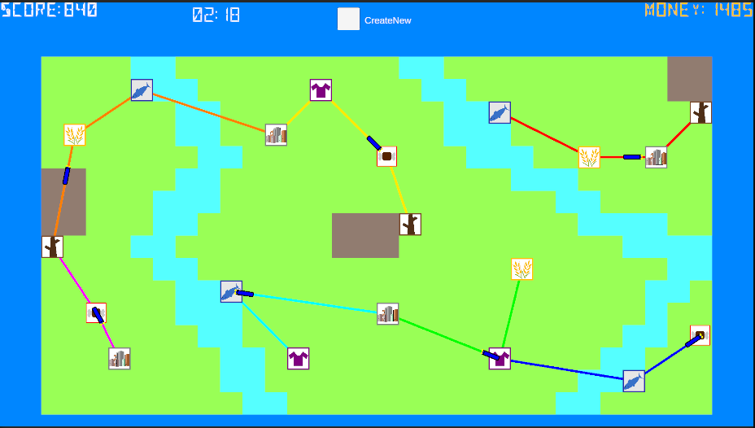
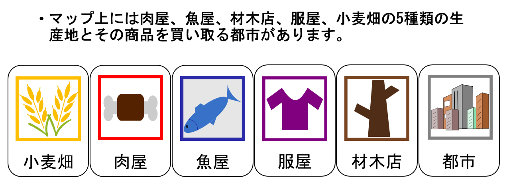
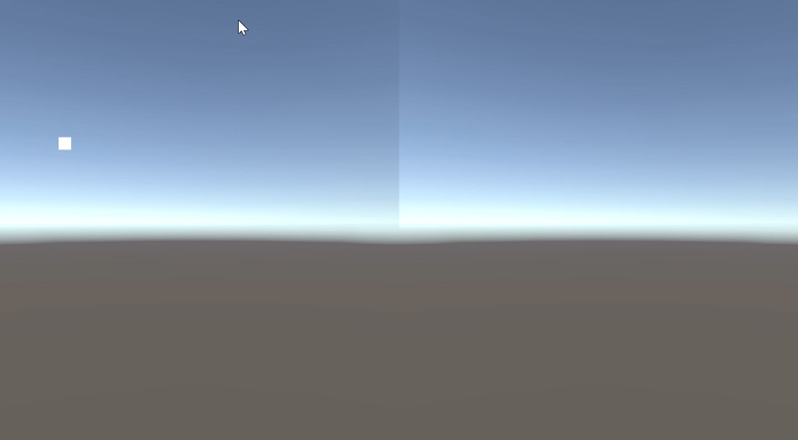
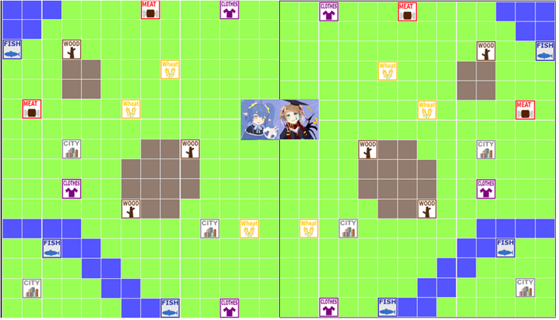

## はじめに
8/15～8/29の2週間で株式会社Cygamesの協賛の元ハッカソンをやってきました\( °∀° )/。テーマは学園祭で展示するゲームということでOUCCの内部事情が浮き出てますね。
## チームメンバー紹介
- Tapet(B3)
    - 内部ロジック
- シルヴィ(B3)
    - イラスト作成,ルール設計
- yuuma(B2)
    - マルチ機能の実装,線路のあれこれ
- kubo(B1)
    - ゲーム画面のUI設計
## ゲームの仕様紹介
画像みたいな感じで路線を引いて荷物を運んでお金(スコア)を稼ぐシミュレーションゲームとなっております。

以下の画像のような施設があります。小麦畑と都市を線路で結ぶと小麦を都市に運搬してお金を稼ぐことができます。つまり生産地と都市をつなぐ路線があるとお金を稼げます。また、2つ以上の路線がある場合は電車は荷物を都市以外にもおろして運搬もできるのでこの荷物を拾って都市に届けてお金を稼ぐこともできます。この2つをうまく使うのが大事!

## マルチプレイについて
自分がやりたかったことだし提案者なのでまあ実装するかといった感じになった。
以下のようにマウスを2つに分けて動かすことができるようになった。

完成品は下の画像みたいになる予定だった。真ん中の人の画像は一定時間たつと現れてそこに相手より多く運搬するとボーナスポイントがもらえるというミニゲームを作る予定だった。

参考記事 https://nekojara.city/unity-input-system-local-multiplayer#Cinemachine%E4%BD%BF%E7%94%A8%E4%B8%8B%E3%81%A7%E7%94%BB%E9%9D%A2%E5%88%86%E5%89%B2%E3%81%99%E3%82%8B
## 反省点
- 実装できなかったことが多々あることかなあ。それのせいでこうなる予定っていうゲームになってしまったね。
    - マルチプレイ
    - 線路や電車のアップグレード
    - 線路の迂回
## 最後に
ハッカソン自体は遊べそうなゲームができたということで成功だね!Cygamesさんが手伝ってくれたのも本当にありがたかった。自分たちで制作したゲームは今年度のまちかね祭までまだ時間があるのできちんと完成まで持っていきたいですね。来年度はもうちょい大きな規模でのハッカソンの開催をしたいが、そうする場合自分が運営になって開発に参加できなそうというジレンマが…来年もハッカソン自体は開催するので乞うご期待を!
