<!-- wp:heading -->
<h2>はじめに</h2>
<!-- /wp:heading -->

<!-- wp:paragraph -->

この記事はOUCC Advent Calendar 2020 の12日目の記事です。

<!-- /wp:paragraph -->

<!-- wp:paragraph -->

新入生へ向けてのアドベントカレンダーということで、今回はここ数年でこの クラブ が行った活動を、私の知りうる範囲で振り返りたいと思います。

<!-- /wp:paragraph -->

<!-- wp:heading -->
<h2>・４月</h2>
<!-- /wp:heading -->

<!-- wp:paragraph -->

４月は新入生歓迎（新歓）の時期ということで、課外活動オリエンテーションで、OUCCがしていることや開発したものを展示し、毎週金曜日には部室で説明会を行いました。

<!-- /wp:paragraph -->

<!-- wp:heading -->
<h2>・５月</h2>
<!-- /wp:heading -->

<!-- wp:paragraph -->

５月にはいちょう祭があり、OUCCの模擬店では、唐揚げや焼き鳥を販売しました。また展示では、部員が作ったゲームを多くのお客様にプレイしていただきました。 この時期あたりで、部員やOBさんが新入生に向けて講習会を開き、講習会に興味のある新入生や部員が講習会に参加しました。（※注）春の講習会の画像は去年のものです

<!-- /wp:paragraph -->

<!-- wp:gallery {"ids":[241,252]} -->
- 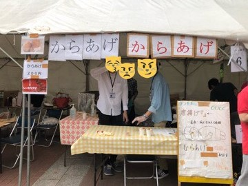
- 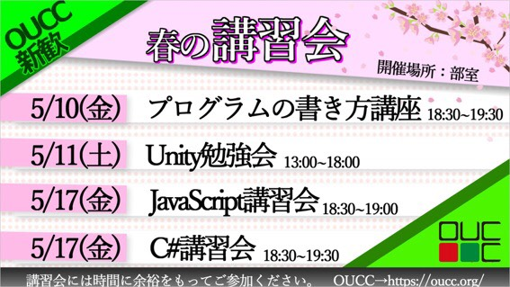
<!-- /wp:gallery -->

<!-- wp:heading -->
<h2>・６月</h2>
<!-- /wp:heading -->

<!-- wp:paragraph -->

６月には確定新歓が行われ、新入生は晴れて正式な部員となります。 去年の確定新歓では、部室でたこ焼きやお菓子を食べながら、新部員と既部員がテレビゲームやボードゲーム、雑談等をして交流しました。 また、OUCCでは２D、３DCG班や競技プログラミング班、WEB班、等があり、各部員は興味のある班活に入って班での活動も行います。

<!-- /wp:paragraph -->

<!-- wp:heading -->
<h2>・７月</h2>
<!-- /wp:heading -->

<!-- wp:paragraph -->

７月は下旬にテストがあるので、上旬の部会で夏休みの各予定を決め、テスト休みとなります。

<!-- /wp:paragraph -->

<!-- wp:heading -->
<h2>・夏休み</h2>
<!-- /wp:heading -->

<!-- wp:paragraph -->

8月上旬にテストが終わったらいよいよ夏休みです！！ 私たちの部室は冷房設備がなく、夏場はサウナと化してしまうため、部員は基本在宅での作業を行います。基本的には個人個人でやりたいことをやりますが、人によっては班で活動したり、似たようなことをしたい同士で共同開発や勉強会を行います。 昨年の夏休みの主な活動としましては、KC３と 夏合宿 がありました。 また、希望者を募って夏コミにも行きます

<!-- /wp:paragraph -->

<!-- wp:heading {"level":3} -->
<h3>・KC３</h3>
<!-- /wp:heading -->

<!-- wp:paragraph -->

KC３とは、関西情報系学生団体交流会の略称で、関西の大学の情報系団体に所属する学生たちが交流を深める会です。 参加団体は大阪大学コンピュータクラブのほかに、立命館コンピュータクラブ、立命館大学情報理工学部PJ団体 RiG++、関西大学電気通信工学研究会、関西学院大学機巧堂、近畿大学電子計算機研究会、京大マイコンクラブ等があります。 去年の９月に行われたKC３では、各クラブの紹介と、各 クラブ による講習会がありました。また、最後には懇親会があり、他のクラブ の部員との交流ができます。 KC３について詳しくは<a href="https://kc3.me/">こちらから</a>

<!-- /wp:paragraph -->

<!-- wp:gallery {"ids":[260,261]} -->
- 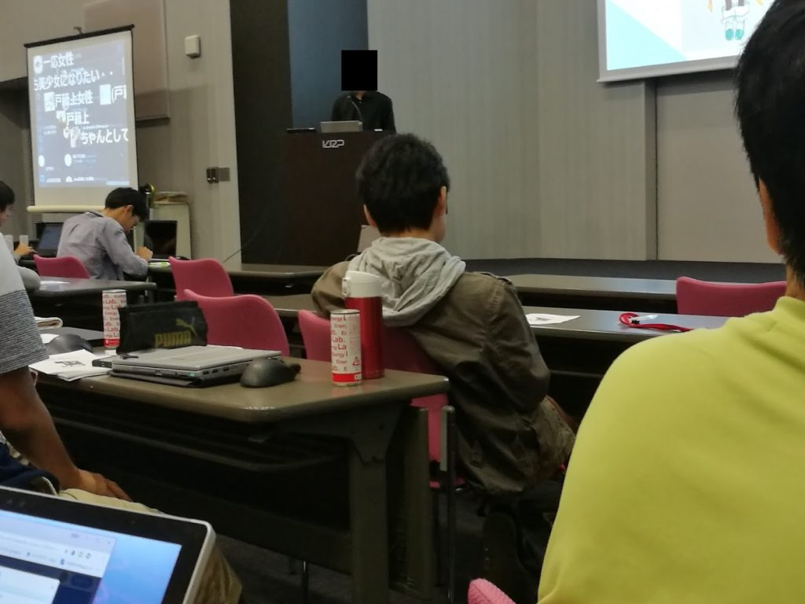
- 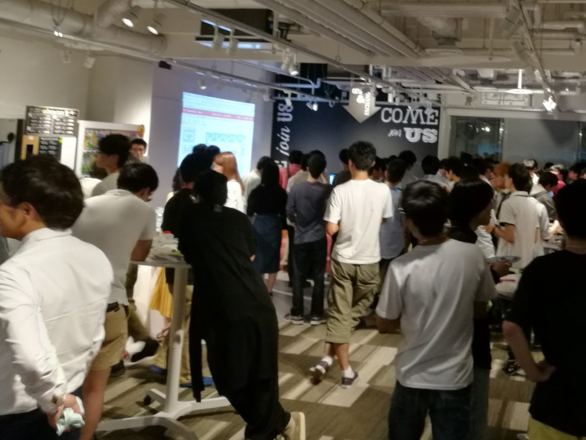
<!-- /wp:gallery -->

<!-- wp:heading {"level":3} -->
<h3>・夏合宿（開発合宿）</h3>
<!-- /wp:heading -->

<!-- wp:paragraph -->

去年は夏合宿で福井に行きました!! この合宿は開発合宿ということで、２つのチームに分かれ、待ちかね祭に向けてゲームの開発を行い、最終日には各チーム制作物を発表しました。

<!-- /wp:paragraph -->

<!-- wp:gallery {"ids":[247,248,249,250,251]} -->
- 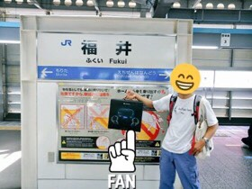
- 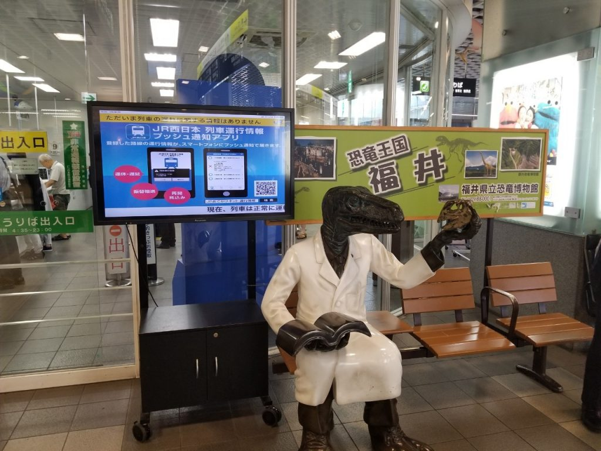
- 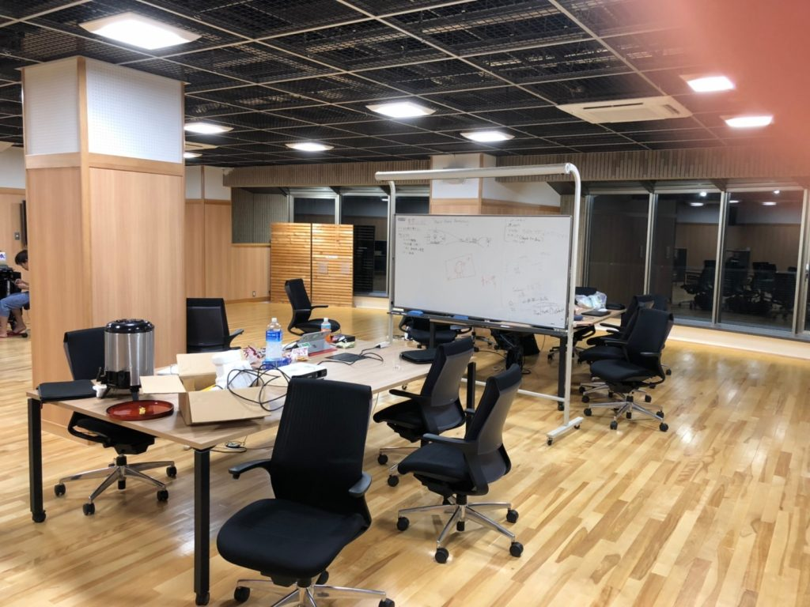
- 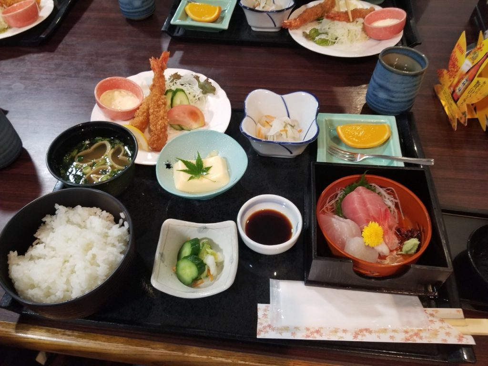
- 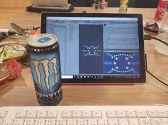
<!-- /wp:gallery -->

<!-- wp:heading -->
<h2>・１０,１１月</h2>
<!-- /wp:heading -->

<!-- wp:paragraph -->

夏休みが終わり１０月になるとまちかね祭の準備に向けて動き出します。 まちかね祭が近づいてくると、模擬店の買い出しの確認をしたり、展示するゲームの開発によるデスマーチが発生したりします。 そして、まちかね祭当日は部員が一丸となって展示・模擬店を行います。

<!-- /wp:paragraph -->

<!-- wp:heading -->
<h2>・１２,１月</h2>
<!-- /wp:heading -->

<!-- wp:paragraph -->

この時期になると部室は冷蔵庫並の寒さになるので、部室にこたつが導入されます。部員たちは、各々の開発を進めたり、課題やテストに追われたりと思い思いのことをします。

<!-- /wp:paragraph -->

<!-- wp:image {"align":"center","id":255,"width":356,"height":319} -->
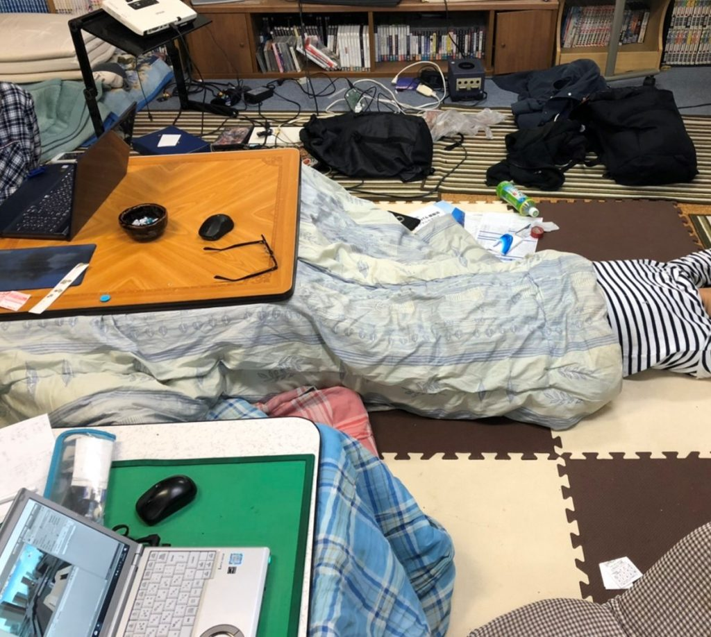
<!-- /wp:image -->

<!-- wp:heading -->
<h2>・春休み</h2>
<!-- /wp:heading -->

<!-- wp:paragraph -->

テストが終わり冬休みになると、部員はバイトをしたり、旅行に行ったり、勉強・開発したりと、それぞれ自分のやりたいことをやります。また、４回生の追いコンも開催しました。（今年は新型コロナウイルスの影響で、追いコンは３,４回生のみでの開催となりました）

<!-- /wp:paragraph -->

<!-- wp:image {"align":"center","id":256,"width":413,"height":310} -->
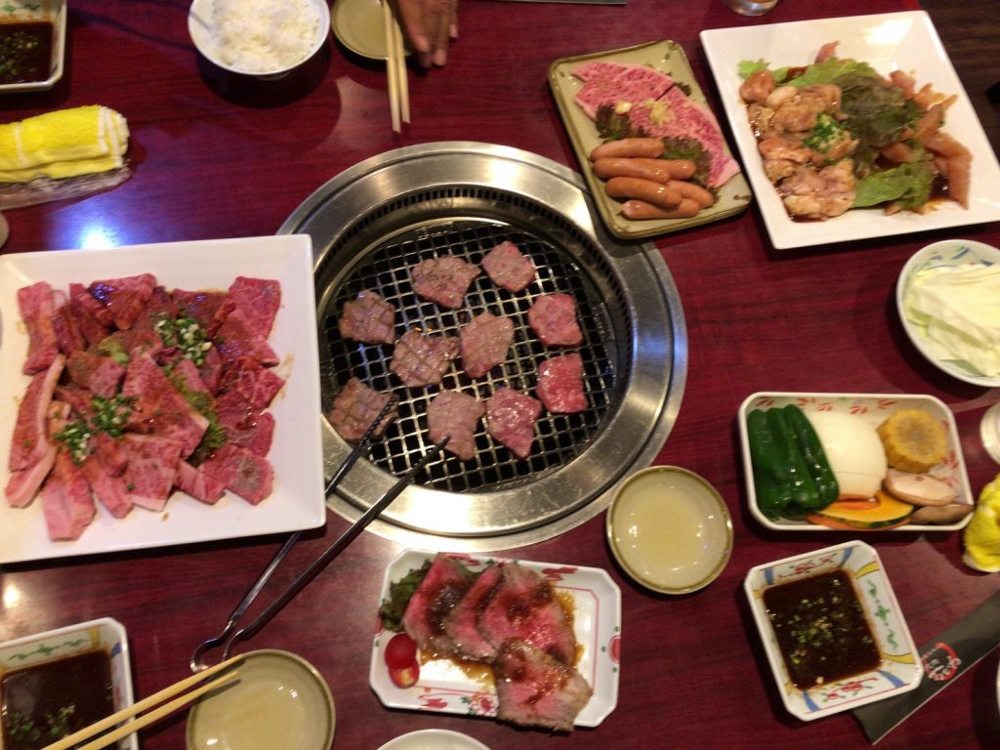
追いコン（画像はイメージです）
<!-- /wp:image -->

<!-- wp:heading -->
<h2>・まとめ</h2>
<!-- /wp:heading -->

<!-- wp:paragraph -->

以上がOUCCのおおまかな活動内容となります。 主な活動曜日は金曜日ですが、部室にはいつでも入れるので、金曜日以外に来て作業をする人もいます。また、月に１回ある部会もオンラインでの参加が可能なので、部室に来れない人でも参加できます。 これまで見てもらった通り、このクラブは活動日を柔軟に決めることができ、他のサークルとの掛け持ちも可能です。 今回は大まかな紹介のみとなりましたが、興味のある人はOUCCのTwitter等を見れば今後の活動が分かると思います。

<!-- /wp:paragraph -->

<!-- wp:heading -->
<h2>・最後に</h2>
<!-- /wp:heading -->

<!-- wp:paragraph -->

このクラブに限らず、サークルや部活に入ることは、他学科の人との交流や大学生活を何かに打ち込むという点で大変良いものなので、自粛期間がおわり各サークルが新歓を始めたら、いろいろなところを見て回ることをおすすめします。

<!-- /wp:paragraph -->
