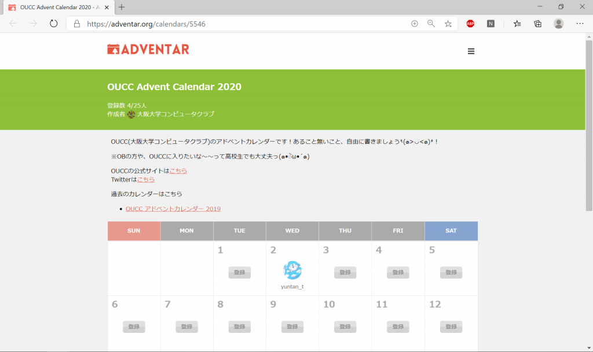
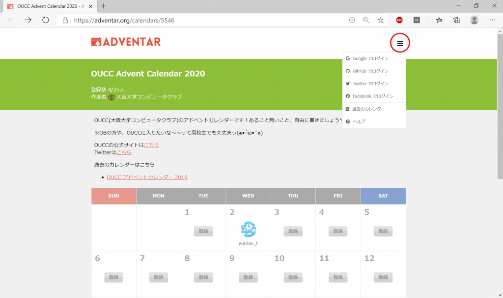
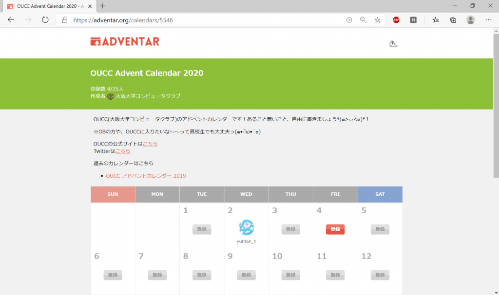
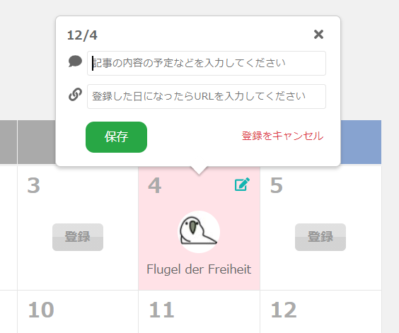

<!-- wp:heading -->
<h2>前提</h2>
<!-- /wp:heading -->

<!-- wp:paragraph -->

今回使用するサイトは、<a href="https://adventar.org/">adventar.org</a>というものです。このサイトに登録するにあたり、

<!-- /wp:paragraph -->

<!-- wp:list -->
<ul><li>Google</li><li>GitHub</li><li>Twitter</li><li>Facebook</li></ul>
<!-- /wp:list -->

<!-- wp:paragraph -->

のいずれかのアカウントが必要になりますので、あらかじめご準備をお願いします。

<!-- /wp:paragraph -->

<!-- wp:heading -->
<h2>参加登録</h2>
<!-- /wp:heading -->

<!-- wp:paragraph -->

まず、指定されたURLを開きます。(2020年度のアドベントカレンダーのURLは<a href="https://adventar.org/calendars/5546">こちら</a>)

<!-- /wp:paragraph -->

<!-- wp:image {"id":287,"sizeSlug":"large"} -->

<!-- /wp:image -->

<!-- wp:paragraph -->

次に、赤円で囲んだマークをクリックして、アドベントカレンダーと連携させるアカウントを選択します。

<!-- /wp:paragraph -->

<!-- wp:paragraph -->

そこからは、アカウントごとに連携させる手順があるので、各自で登録をお願いします。

<!-- /wp:paragraph -->

<!-- wp:image {"id":288,"sizeSlug":"large"} -->

<!-- /wp:image -->

<!-- wp:paragraph -->

無事にログインできたら、まだ枠が埋まっていない日の中から投稿したい日を選択します。

<!-- /wp:paragraph -->

<!-- wp:image {"id":289,"sizeSlug":"large"} -->

<!-- /wp:image -->

<!-- wp:paragraph -->

すると、選択した後に以下のようなウィンドウが現れるので、上の入力部分には投稿する記事の大まかな内容を記入し、下の入力部分には投稿する日になったときにそのサイトのURLを貼り付けます。

<!-- /wp:paragraph -->

<!-- wp:image {"id":290,"sizeSlug":"large"} -->

<!-- /wp:image -->

<!-- wp:paragraph -->

以上の手順によりアドベントカレンダーへの登録は完了となります。

<!-- /wp:paragraph -->
