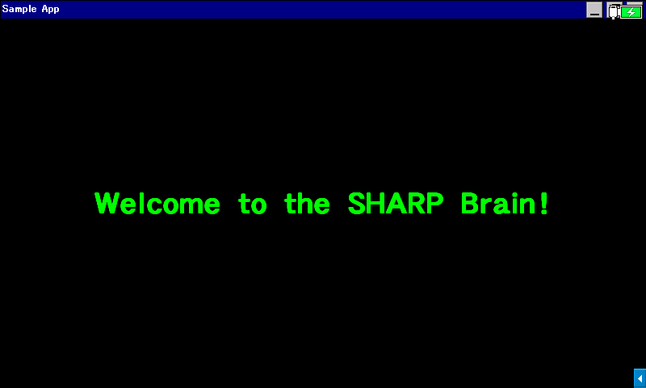

この記事は [OUCC Advent Calendar 2020](https://adventar.org/calendars/5546) の 20 日目の記事です。OS として Windows Embedded CE 6.0、CPU に ARM926EJ-S (Armv5TEJ) を搭載する電子辞書 SHARP Brain 用アプリケーションの作成方法を解説します。



## 注意点
ここで取り扱うものは、**SHARP 公式の内容ではありません**。通常、フリーズなどが起こった場合も本体裏のリセットボタンを押せば元に戻りますが、**万一何らかの問題が発生しても一切補償できませんので、自己責任で試してください**。

新機種の多くには、SHARP 公式のソフトウェア以外を起動できなくするプロテクトが掛かっています。具体的には、ビジネスモデル（PW-SBx）を除く PW-Sx4 以降の機種がそれに該当します。そういった機種での起動方法は[こちら](https://brain.fandom.com/ja/wiki/%E3%82%A2%E3%83%97%E3%83%AA%E3%81%AE%E8%B5%B7%E5%8B%95%E6%96%B9%E6%B3%95)を参照してください。

[この表](https://brain.fandom.com/ja/wiki/Brain%E6%A9%9F%E7%A8%AE%E5%88%A5%E8%A7%A3%E8%AA%AC)で第 1 世代から第 4 世代に分類されている機種を対象とします。2021 年以降発売の[第 5 世代](https://brain.fandom.com/ja/wiki/%E7%AC%AC5%E4%B8%96%E4%BB%A3)に該当する機種用のアプリケーションは、この記事の方法では作成できません。

## プログラム
この記事では、プログラミングよりも開発環境やコンパイル方法など、開発手順の解説に重点を置くため、簡単なプログラムを使用します。[`brain.cpp`](https://gist.github.com/watamario15/0ce68d7825062094c7282fdc7c762efe) をダウンロードしてください。なお、このプログラムは通常の Windows PC と Windows CE のどちらでも使用できるようにしてあるので、Brain を所持していない方でも Win32 アプリケーションを開発できる環境があれば試すことは可能です。

本格的に開発を行う際は、[こちら](https://brain.fandom.com/ja/wiki/C/C%2B%2B%E3%81%A7Brain%E7%94%A8%E3%82%A2%E3%83%97%E3%83%AA%E3%82%92%E9%96%8B%E7%99%BA%E3%81%99%E3%82%8B)のノウハウ集も参考にしてください。

## 開発環境
以下の 3 通りを解説していきます。

- CeGCC
- eMbedded Visual C++ 4.0
- Pocket GCC

Visual Studio 2005/2008 の Professional 以上でも開発可能です。[こちら](https://brain.fandom.com/ja/wiki/Visual_Studio)を参照してください。

## 電子辞書での実行方法
内蔵メモリーまたは microSD カードに日本語で `アプリ` という名前のフォルダを作成し、その中にメニューに表示させたい任意の名前のフォルダを作成します。その中に、コンパイルして得られた実行ファイルを `AppMain.exe` に改名したものと、空のダミーファイル `index.din` を入れます。これにより、「アクセサリー -> 追加コンテンツ -> 追加アプリ・動画」に追加されます。メニューの配置は機種によって異なるので、この通りでない場合は似たものを探してください。加えて、第 3 世代以降の機種の場合、空のダミーファイル `AppMain.cfg` を加えることで高解像度状態のまま実行できるようになります。

`index.din` 及び `AppMain.cfg` は空のテキストファイルを作成し、ファイル名を `index.din`, `AppMain.cfg`（もちろん元の拡張子 `.txt` は消す）に変更するだけで作成が可能です。UNIX 系の環境なら `touch` コマンドでも作成できます。ceOpener などの別ツールを導入済みなどで、 exe ファイルを直接実行する場合は以上の作業は不要です。どんな名前でもどこに置いても構いません。

## CeGCC
Linux, Cygwin, WSL, macOS 等の UNIX 環境で使用できる、最新の Windows CE 開発環境です。Windows XP のような古い Windows 環境が不要で、GCC 9.3.0 ベースなので C++17 を完全にサポートしているなど、現在では最も使いやすい環境です。ただし、個人の方が作成されたものだというのもあり、若干癖があります。

基本的に[公式サイト](https://max.kellermann.name/projects/cegcc/)に従います。Debian 系でない OS や AMD64 以外の CPU を搭載する PC の場合は、[こちら](https://brain.fandom.com/ja/wiki/CeGCC)に従ってください。

### 環境構築
`/etc/apt/sources.list` ファイルに、以下の 1 行を追加します。どちらに属するか分からない場合は、Debian の方で試したうえでエラーが出た場合に Ubuntu の記法を試してください。

Debian:
```
deb https://max.kellermann.name/debian cegcc_buster-default main
```

Ubuntu:
```
deb [trusted=yes] https://max.kellermann.name/debian cegcc_buster-default main
```

この作業にはテキストエディタを用いても構いませんが、今回はファイルの末尾に足すだけなので、以下のコマンドを実行すればよいです（1 行目は改行、2 行目は実際の追記）。

Debian:
```bash
sudo bash -c 'echo >> /etc/apt/sources.list'
sudo bash -c 'echo deb [trusted=yes] https://max.kellermann.name/debian cegcc_buster-default main >> /etc/apt/sources.list'
```

Ubuntu:
```bash
sudo bash -c 'echo >> /etc/apt/sources.list'
sudo bash -c 'echo deb [trusted=yes] https://max.kellermann.name/debian cegcc_buster-default main >> /etc/apt/sources.list'
```

その後、以下のコマンドを実行してインストールします。

```bash
sudo apt update
sudo apt install gcc-arm-mingw32ce
```

終わったら、以下のコマンドを入力します。

```bash
arm-mingw32ce-g++ -v
```

以下のような出力が得られれば環境構築は終了です。お疲れさまでした！コマンドが見つからないというエラーが出た場合は、正しくインストールできていないので今までの手順をもう一度確認してください。

```
Using built-in specs.
COLLECT_GCC=arm-mingw32ce-g++
COLLECT_LTO_WRAPPER=/usr/libexec/gcc/arm-mingw32ce/9.3.0/lto-wrapper
Target: arm-mingw32ce
Configured with: ../../../configure --build=x86_64-linux-gnu --host=x86_64-linux-gnu --target=arm-mingw32ce --disable-dependency-tracking --prefix=/usr --syscon
fdir=/etc --with-gcc --with-gnu-ld --with-gnu-as --enable-threads=win32 --disable-nls --enable-languages=c,c++ --disable-win32-registry --disable-multilib --dis
able-interwork --without-newlib --enable-checking --with-headers --disable-__cxa_atexit
Thread model: win32
gcc version 9.3.0 (GCC)
```

### ビルド
[`brain.cpp`](https://gist.github.com/watamario15/0ce68d7825062094c7282fdc7c762efe) を配置したディレクトリで、以下のコマンドを実行します。

```bash
arm-mingw32ce-g++ -Wall -Wextra -O3 -std=gnu++2a -march=armv5tej -mcpu=arm926ej-s -static -s -o AppMain.exe brain.cpp
```

成功すると `AppMain.exe` が生成されるので、電子辞書にコピーして実行します。冒頭の画像のようになれば成功です！

しかし、この長いコマンドを毎回入力するのは面倒です。また、ここでは紹介しませんが、リソースを含む場合はそのためのコマンドも必要となり、さらに面倒です。ここで、ビルド作業を自動的に行う shell script を用意しました。[`ceg++`](https://raw.githubusercontent.com/watamario15/dotfiles/main/tools/ceg++) (C++) / [`cegcc`](https://raw.githubusercontent.com/watamario15/dotfiles/main/tools/cegcc) (C) を、コマンドラインオプションにソースファイル名（複数可）を指定して実行すると `AppMain.exe` が出力されます。カレントディレクトリに `resource.rc` があれば、それもあわせてコンパイルします。

### 注意点
CeGCC のヘッダファイルは通常版 Windows のものが流用されていますが、Windows CE での定数は通常版 Windows とは一部異なるため、これが原因で問題が発生する場合があります。例えば、最小化ボタンを表示させたはずが最大化ボタンが出たりします。そのため、ヘッダファイルを書き換える、正しい数値を直接指定する、正しい数値でマクロ定数を定義しなおす、等の対応が必要となります。今回のサンプルソースでは、冒頭にマクロ数値を補正するコードを記述してあります。Microsoft は初期の頃の Windows CE 開発環境を高値で販売していたようなので、「定数をずらすことでフリー実装の登場を遅らせて、その間に自社の開発環境で儲けよう」みたいなことを企んでいたのかもしれません。

また、CeGCC の公式ビルドはデバッグ情報を取り除く strip 処理が行われていないため、開発したアプリケーションを Brain 上で動かすときに必要な C/C++ ランタイムを普通に静的リンクすると、極端に exe のサイズが大きくなります。これに対応するため、挙げたコマンドやスクリプトでは strip を表す `-s` オプションを付けてあります。

## eMbedded Visual C++ 4.0
知る人ぞ知る、2000 年頃の Windows CE 用 Microsoft 純正無料 IDE です。激古なので C++ の新しい機能は使えず、Windows 2000 と Windows XP でしかフル機能が使えないという難点がありますが、最新の CeGCC が発見されるまでは唯一の無料で使える開発環境でした。

### 環境構築
まず、 [Microsoft Download Center](https://web.archive.org/web/20201130112637/https://www.microsoft.com/ja-jp/download/details.aspx?id=24809)（[直リン](https://web.archive.org/web/20201008100955/https://download.microsoft.com/download/f/7/1/f711e5dd-fd65-421b-8da9-34707a73c310/JA_eVC4.exe)）からダウンロードします。これは自動解凍式の圧縮ファイルになっているので、実行して適当な場所に解凍します。それで得られたファイルの `setup.exe` を実行し、手順に従ってインストールします。途中でプロダクトキーを聞かれますが、先ほどのダウンロードページの「インストール方法」欄に記載されているものを入力すれば大丈夫です。

次に、Windows 2000, XP の場合は [Service Pack 4](https://web.archive.org/web/20210120144550/https://www.microsoft.com/ja-jp/download/details.aspx?id=16683)（[直リン](https://web.archive.org/web/20201008101356/https://download.microsoft.com/download/b/f/d/bfd2a609-ee3a-4ac3-931b-06030d251eef/evc4sp4JPN.exe)）、Windows Vista 以降の場合は [Service Pack 3](https://web.archive.org/web/20180420090632/http://www.microsoft.com/ja-jp/download/details.aspx?id=4800)（[直リン](https://web.archive.org/web/20180420090715/https://download.microsoft.com/download/3/9/e/39e7ef4d-8c26-482b-8133-5e07c7c5b208/evc4sp3JPN.exe)）をダウンロードして、同様の手順でインストールします。

最後に、いずれかの Standard SDK をインストールします。Windows 2000, XP の場合は両方の SDK をインストールしておき、ビルド時にどちらを使うか選択することも可能です。
- Windows Vista 以降であるか、他の CE4 系デバイス（Sigmarion III など）も対象とする場合は、最初に解凍した中身の SDK フォルダに入っている `setup.exe` を実行し、指示に従いインストールします
  - Windows Vista 以降では **Windows XP (Service Pack 3) の互換モードを設定して**実行します
- Windows 2000, XP であり、他の CE4 系デバイスを対象としない場合は、[Windows CE 5.0 の Standard SDK](https://www.microsoft.com/en-us/download/details.aspx?id=17310) をダウンロードし、インストールします
  - SHARP Brain のネイティブに近いのはこちらです

### プロジェクト作成・ビルド
左上の「ファイル(F)」から「新規作成」をクリックします。その後、下の画像のように設定します。CPU に関して、 SHARP Brain は Armv5TEJ ですが、この IDE にはないため ARMV4I を選択します。SHARP Brain 以外の CE デバイス用のビルドも行いたければ、ARMV4I に加えてその他の CPU を選択しても構いません。設定できたら「OK」を押します。


次の画面では、「空のプロジェクト」を選択します。


プロジェクト概要の画面で OK を押すと、プロジェクトが作成されます。

その後、左を FileView に切り替え、Source Files を右クリックしてソースファイルを追加します。分かりやすくなるよう、ソースファイルはプロジェクトフォルダ内に予め入れておくことをお勧めします。


ソースファイルが追加できたら、FileView から先ほど追加したファイルをダブルクリックすると、画面内にソースファイルが表示されます。ここでプログラムを編集することが可能です。今回はソースファイルを UTF-8 エンコードしたためコメントの日本語が文字化けしていますが、無視してください。必要であれば、メモ帳などの別のソフトウェアで Shift\_JIS に変換すると正しく表示されます。というか何で Windows CE は Unicode のみ対応なのに、eVC4 は Unicode 非対応なのだろうか...

ここで、SHARP Brain で実行する際は `AppMain.exe` になっていた方が色々とうれしい（先述）ので、デフォルトでこの名前になるように設定しておきます。「プロジェクト -> 設定」を開き、「リンク」タブに移動すると下のような画面になるので、画像のように出力ファイル名を編集して OK を押します。


最後に、画面左上の「STANDARDSDK」という部分では、利用する SDK を指定します。Windows CE 5.0 用の SDK をインストールした場合は、STANDARDSDK\_500 となります。

これで準備完了です！では、下の画像の赤丸で囲ったボタンを押してください。


ビルド終了後、以下のようなメッセージが出ますが無視してください。コンパイルエラーがなければコンパイル成功です。


プロジェクトフォルダの `ARMV4IDbg` フォルダ内に `AppMain.exe` が生成されているはずなので、電子辞書にコピーして実行してみてください。冒頭の画像のようになれば成功です！

なお、Win32 (WCE ARMV4I) Debug と書かれているプルダウンメニューから、Release ビルドや他の CPU への切り替えが可能です。

## Pocket GCC
SHARP Brain 上でのセルフ開発が可能な GCC の Windows CE 移植版コンパイラです。eVC4 よりさらに機能は限られますが、PC がなくても使用できます。

### 準備
まず、[こちら](https://brain.fandom.com/ja/wiki/%E3%83%97%E3%83%AD%E3%82%B0%E3%83%A9%E3%83%9F%E3%83%B3%E3%82%B0)を参考に導入します。DOS窓Open の準備も必要です。

一通り終わったら、[`brain.cpp`](https://gist.github.com/watamario15/0ce68d7825062094c7282fdc7c762efe) を `win.cpp` に改名したものと [`WINBUILD.BAT`](https://raw.githubusercontent.com/watamario15/prime-calculator/master/PocketGCC%201.50/WINBUILD.BAT) を電子辞書内の同じフォルダに入れます。この際、`WINBUILD.BAT` の 2 行目と 3 行目を環境に合わせて編集しておきます。

その後、DOS窓Open の `cd` コマンドでそのフォルダに移動し、`WINBUILD.BAT` を実行します。空白や日本語を含んでいても、クォーテーション不要で `cd` できます。成功すると `AppMain.exe` が生成されるので、これを実行して冒頭の画像のようになれば成功です！

ちなみに、この記事では説明しませんが `WINBUILD.BAT` は `resource.rc` があった場合、それも含めてコンパイルするようになっています。その際、34 行目の `-l commctrl` は Pocket GCC に `commctrl.lib` が含まれないため取り除いてください。一応、eVC4 の SDK からこのファイルを持ってくると（大量の警告の下で）使えるようにはなります。

## おわりに
今回は、SHARP Brain 用アプリケーション開発の方法をまとめました。SHARP Brain のハックに興味がある方は、Brain で動作する Linux ディストリビューション [Brainux](https://brainux.org) の開発やその他の議論が活発に行われているコミュニティ [Brain Hackers](https://github.com/brain-hackers/README) に参加してみると面白いかもしれません。

Win32 API プログラミングについては一切触れませんでしたが、[こちら](https://brain.fandom.com/ja/wiki/C/C%2B%2B%E3%81%A7Brain%E7%94%A8%E3%82%A2%E3%83%97%E3%83%AA%E3%82%92%E9%96%8B%E7%99%BA%E3%81%99%E3%82%8B)のノウハウ集が参考になると思います。ただし、ノウハウ集にも記載の通り、Windows における最も原始的な開発方法となるため難易度が高く、C/C++ をそれなりに理解していることが求められます。私も、高 2 の頃 `Hello, world!` にたどり着くまでに 1, 2 週間かかりました。さらに [Command Bar](https://docs.microsoft.com/en-us/previous-versions/windows/embedded/ee503345(v=winembedded.60)) など、調べても出てこない Windows CE の独自仕様も相当あるので大変です。しかし、**電子辞書で自作ソフトが動作する感動**はなかなかのものです！

ちなみに、執筆者もいくつかの SHARP Brain 用ソフトウェアをオープンソースで公開しています。執筆地点では[素因数分解](https://github.com/watamario15/prime-calculator)、[超大量ファイル整理](https://github.com/watamario15/file-organizer)、[KN MemoPad 機能追加版](https://github.com/watamario15/kn-memopad)、[Brainfuck for SHARP Brain](https://github.com/watamario15/brainfuck)、[tetris](https://github.com/OUCC/tetris) がありますので、もしよければ使ってみてください。Win32 API プログラミングに関しても何か参考になるかもしれません。

では、ここまでお読みいただきありがとうございました！OUCC では、現在も部員を募集中です。興味がある方は、ぜひご気軽に [Discord サーバー](https://discord.gg/jBM2NP7ZxK)にご参加下さい！
