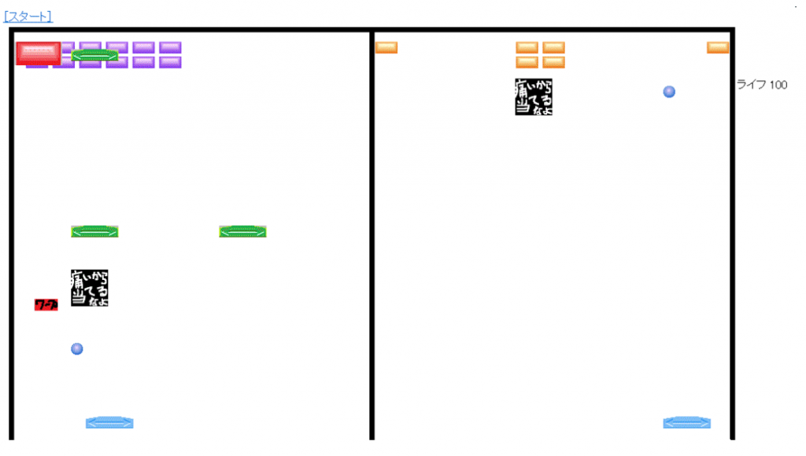
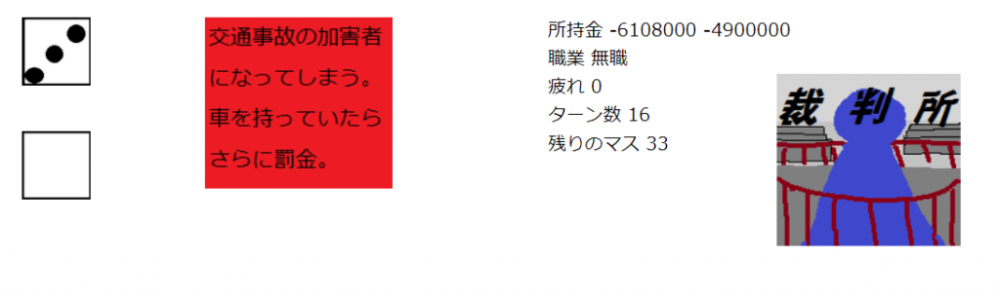
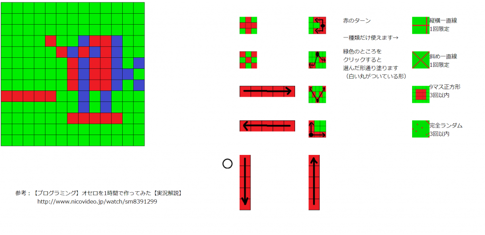
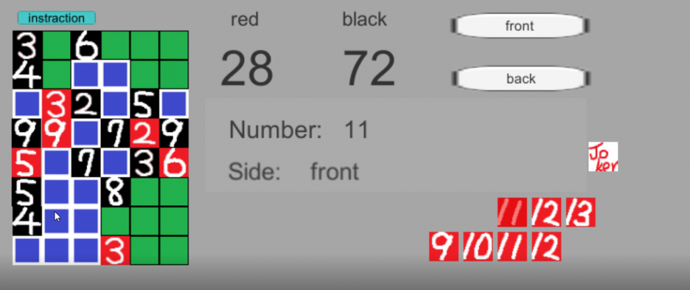

<!-- wp:paragraph -->

これはアドベントカレンダー25日目の記事です。なんでトリなんて選んだんでしょうね。

<!-- /wp:paragraph -->

<!-- wp:paragraph -->

特に書くこともないので昔作ったゲームでも紹介します。 1つ目はブロック崩し。 僕が初めて作ったゲームです。javascriptとhtmlで作りました。

<!-- /wp:paragraph -->

<!-- wp:image {"id":355,"sizeSlug":"large","linkDestination":"none"} -->

<!-- /wp:image -->

<!-- wp:paragraph -->

2つのゲームを同時にクリアさせる必要があります。カーソルは1つなのでなかなか忙しいです。当てるなってやつに当てると画面が変化して見づらくなります。初めて作ったにしてはなかなかいい発想してたと思います。

<!-- /wp:paragraph -->

<!-- wp:paragraph -->

 2つ目は人生ゲーム。何番目に作ったのかは覚えてません。 小学生のころ考えた留置所と戦争に行くという要素を含んだものです。 ほかにも途中で無職になったり、事故を起こして裁判になったりと、およそ市販できないようなマスを用意しています。最近のマスがどんなものか知りませんが。大体所持金がマイナスになるというそれはひどい人生ゲームです。ちなみに画像は無職なのに車を買って事故を起こし、裁判で賠償金490万払ったところです。賠償金安すぎですね。

<!-- /wp:paragraph -->

<!-- wp:image {"id":354,"sizeSlug":"large","linkDestination":"none"} -->

<!-- /wp:image -->

<!-- wp:paragraph -->

3つ目は陣取りゲームです。某イカのゲームが流行っていたので作りました。

<!-- /wp:paragraph -->

<!-- wp:image {"id":357,"sizeSlug":"large","linkDestination":"none"} -->

<!-- /wp:image -->

<!-- wp:paragraph -->

右にあるいろいろな塗り方から選んで盤面を塗っていきます。緑色の場所しか選べず、盤面がすべて赤色か青色で塗られたらゲーム終了。色の多いほうが勝ちです。一番右にある4つはスペシャル技で、1種類だけ使えます。正方形が強かった気がします。

<!-- /wp:paragraph -->

<!-- wp:paragraph -->

最後はトランプオセロ。これだけ大学に入ってから作ったものです。部室でトランプで遊んでた時にふと思いついたのでゲームにしたものです。

<!-- /wp:paragraph -->

<!-- wp:image {"id":358,"sizeSlug":"large","linkDestination":"none"} -->

<!-- /wp:image -->

<!-- wp:paragraph -->

トランプでオセロをすることで、単純に表の数でなく数値の和で勝敗を決める戦略性、裏が同じ模様のトランプであることから両者が使える裏というおき方、裏返ったカードの色と数値を記憶する必要があるという神経衰弱要素、そしてジョーカーを使うことで場のカードを1枚ひっくり返せるという逆転要素が盛りだくさんです。自分の周りでは結構評価高かった気がします。

<!-- /wp:paragraph -->

<!-- wp:paragraph -->

<!-- /wp:paragraph -->

<!-- wp:paragraph -->

こうして振り返ってみるとなかなか頑張ってたなという気がします。今はこんな気力はないですけど、また面白そうなもの思いついたら形にしておきたいですね。たとえ日の目を浴びなくても、こうして思い出すことで自分も頑張ってたんだな、とか面白いこと考えてたな、とか懐かしい気持ちになれるなら形にした意味はあるんじゃないでしょうか。

<!-- /wp:paragraph -->
