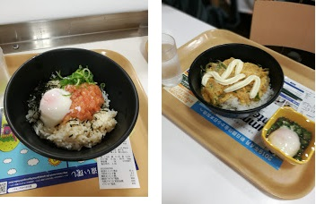
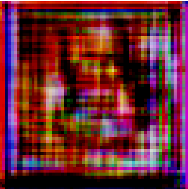
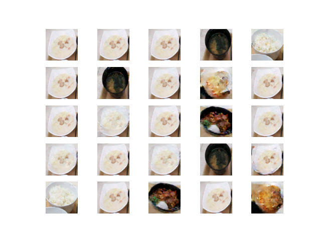

<!-- wp:heading -->
<h2>～あらすじ～</h2>
<!-- /wp:heading -->

<!-- wp:paragraph -->

　GANを3か月前から学び始めたんですが、OUCCのAdvent Calendarの24日目？の記事を書くに当たって、自分が今までやったことがない技術を使用しようと思いまして、StackGANというGANを使用したアプリを制作しようとしました。具体的には大阪大学生協食堂の料理の写真とその料理名を学習して、入力された架空の料理名から架空の料理画像を生成するアプリです。結論から言いますと上手くいかなかったのですが、その間に得られた知見などの心に移りゆくよしなし事をそこはかとなく書きつくりました。

<!-- /wp:paragraph -->

<!-- wp:heading {"level":3} -->
<h3>～GANって？～</h3>
<!-- /wp:heading -->

<!-- wp:paragraph -->

GANについて軽く説明します。詳しくはググってください。

<!-- /wp:paragraph -->

<!-- wp:paragraph -->

　GeneratorとDiscriminatorという2つの学習するモデルから構成される機械学習モデルです。小学校とかの先生と生徒の関係で例えると、生徒のGenerator君は答えを写した宿題を作成し、Discriminator先生は提出された答案が答えを写したものかきちんと解いて得られた答案かを見分けます。その見分けた結果、答えを写したことがばれて叱られたGenerator君は、学習してより自分で解いたかのように見える答案を作成します。Discriminator先生もきちんと解いてきた答案かどうかを見分けられる様に学習します。そのように一方が利するともう一方が損する関係によってお互いが高めあい、Generator君は自分で解いた答案と変わらない答案を作成することができるように成長します。つまり、Generatorモデルが最終的に本物そっくりのものが生成できるようになる学習の仕組みがGANというモデルです。

<!-- /wp:paragraph -->

<!-- wp:heading {"level":3} -->
<h3>～StackGANって？～</h3>
<!-- /wp:heading -->

<!-- wp:paragraph -->

　私も最近知ったのでよく知りません。言語から画像を生成する方法ないかなと探していたら発見したGANの一種のモデルです。これも詳しくはGoogle先生に教えを乞うか、<a href="https://benrishi-ai.com/stackgan01/" title="https://benrishi-ai.com/stackgan01/">私が参考にしたサイト</a>を閲覧してください。(GANの説明に疲れて丸投げしたのでは無い)

<!-- /wp:paragraph -->

<!-- wp:paragraph -->

　なお、レシピから料理を生成するCookGANというものがあるみたいですが、今回は料理名をラベルとして使用するので恐らく使えないです。

<!-- /wp:paragraph -->

<!-- wp:heading {"level":3} -->
<h3>・何が駄目だったのか</h3>
<!-- /wp:heading -->

<!-- wp:paragraph -->

　あまり制作にかける時間がなかったので原因究明はきちんとはされていないですが、早い話学習データが圧倒的に不足していました。もし、学習が上手くいかなくてどういうわけかこのページに行きついてしまったかわいそうな人にはこんな結論で申し訳ないです。それはさておき何が駄目だったかというと、130枚の、しかもラベルが重複しない、共通点としては器の形が似ているだけの画像で学習しようとしたことが無謀でした。そのデータ数でよくやろうと思ったなと言われそうですが、言い訳をすると入力する料理名に含まれる名詞は重複が多く何とかなるかなと思ってやってみた次第です。さらにGANの学習データを水増しするDifferentiable Augmentationという技術を発見して、もしかしたら出来るのでは？と愚考した次第です。

<!-- /wp:paragraph -->

<!-- wp:paragraph -->

　Differentiable Augmentationについて軽く説明しますと、従来の画像のクラス分類学習では訓練データにちょっとした加工を加えることでデータの水増しを行うことができましたが、GANの学習ではさらにGeneratorの生成した画像に同様の加工を加えることで、より良いデータの水増し効果が得られるという技術がDifferentiable Augmentationです。間違っていたらすみません、詳しくはgoog(ry

<!-- /wp:paragraph -->

<!-- wp:heading {"level":3} -->
<h3>・使用したデータの一例</h3>
<!-- /wp:heading -->

<!-- wp:image {"align":"center","id":373,"width":431,"height":279,"sizeSlug":"large","linkDestination":"none"} -->

<!-- /wp:image -->

<!-- wp:paragraph -->

　一枚目がピリ辛サーモン丼。美味で個人的なおすすめ。二枚目はマヨラーの友人によって犠牲となった親子丼。親子丼に何の恨みがあったのだろうか。なお、二枚目は学習には使用していません。

<!-- /wp:paragraph -->

<!-- wp:heading {"level":3} -->
<h3>・結果</h3>
<!-- /wp:heading -->

<!-- wp:paragraph -->

　StackGANのstage1の学習段階で上手くいきそうな気配がないのでやめました。

<!-- /wp:paragraph -->

<!-- wp:paragraph -->

一応stage1の学習結果だけ載せておきます。

<!-- /wp:paragraph -->

<!-- wp:image {"align":"center","id":365,"width":305,"height":306,"sizeSlug":"large","linkDestination":"none"} -->

<!-- /wp:image -->

<!-- wp:paragraph -->

心が清い人には遠目で見るとかろうじて料理に見えるはず。

<!-- /wp:paragraph -->

<!-- wp:paragraph -->

　これだけでは申し訳ないので、同じデータセットで学習したDCGANで生成したものを貼り付けておきます。

<!-- /wp:paragraph -->

<!-- wp:image {"id":374,"sizeSlug":"large","linkDestination":"none"} -->

<!-- /wp:image -->

<!-- wp:paragraph -->

　右下以外はまんま存在する料理が生成されています。あ、そう　くらいのつまらなさで申し訳ない。やはり、生成画像を人間がコントロールできるものを作った方が楽しいですね。

<!-- /wp:paragraph -->

<!-- wp:heading {"level":3} -->
<h3>・損失関数について</h3>
<!-- /wp:heading -->

<!-- wp:paragraph -->

　最近GANの学習にはHinge Lossを使用すれば上手くいくよという記事を見つけたので、これとは違うGANのアプリに実装すると劇的に学習が向上しました。なのでこのDCGANにもHinge Lossを適用したらより上手くいくかと思ったら、逆に学習しなくなってしまいました。Hinge Lossの取る値はReLUみたいに途中から一定の値になりますが、Binary Cross Entropyは少しの値の変化もLossの値に反映されるので、これが原因ではないかと考えています。

<!-- /wp:paragraph -->

<!-- wp:heading {"level":3} -->
<h3>～終わりに～</h3>
<!-- /wp:heading -->

<!-- wp:paragraph -->

　いかがでしたか？ろくな原因究明をしていない分、悪質なキュレーションサイトの方がよっぽど役に立つような内容でした。この山無し落ち無し意味なしのやおいページにお付き合い下さり有難うございました。そして1月になって記事を書いたことお許しください。

<!-- /wp:paragraph -->

<!-- wp:paragraph -->

<!-- /wp:paragraph -->

<!-- wp:paragraph -->

著者：AI班上月

<!-- /wp:paragraph -->
