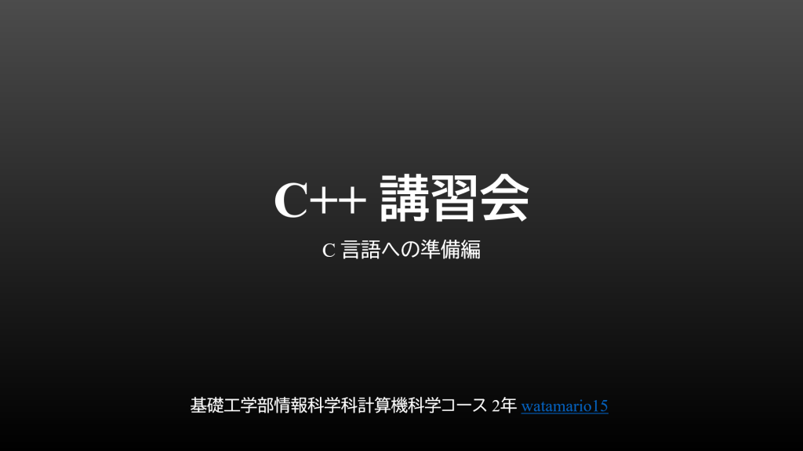

<!-- wp:paragraph -->

本日 4/18(日) に C 講習会、その準備編として昨日 4/17(土) に C++ 講習会を行いました。今回参加できなかった方も、講習会資料を Discord 新歓サーバーで配布していますので、ご参加下されば参照可能です。内容に関する質問もいつでも受け付けております。

<!-- /wp:paragraph -->

<!-- wp:image {"id":414,"sizeSlug":"large","linkDestination":"none"} -->

<!-- /wp:image -->

<!-- wp:image {"id":415,"sizeSlug":"large","linkDestination":"none"} -->

<!-- /wp:image -->

<!-- wp:image {"id":416,"sizeSlug":"large","linkDestination":"none"} -->

<!-- /wp:image -->

<!-- wp:image {"id":417,"sizeSlug":"large","linkDestination":"none"} -->

<!-- /wp:image -->

<!-- wp:paragraph -->

C は広く利用される非常に有名な言語で大学の講義で1年から早速学びますが、プログラミング初学者にとっては修得が難しいものとなっており、それに向けた助けとなることを目指した内容としました。

<!-- /wp:paragraph -->

<!-- wp:paragraph -->

講義の予習として、また、講義が理解できなかったときの参考書代わりとして、ご活用いただければ幸いです！

<!-- /wp:paragraph -->
