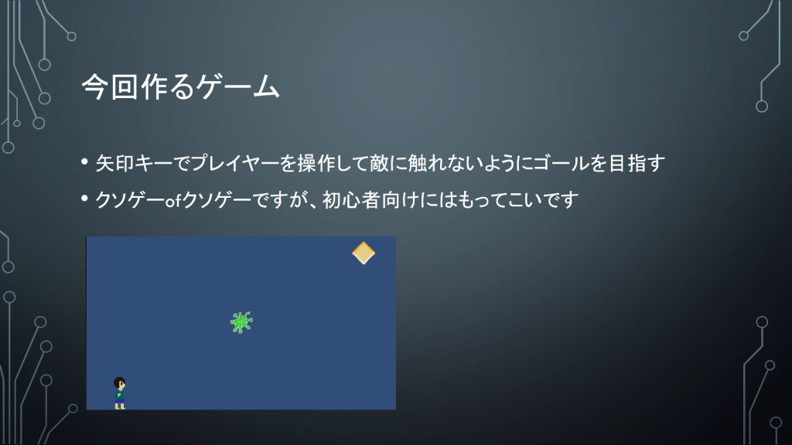
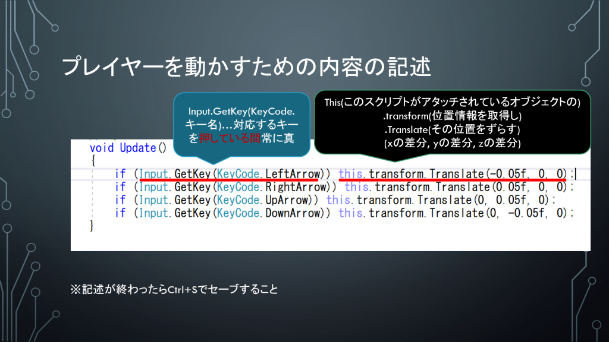
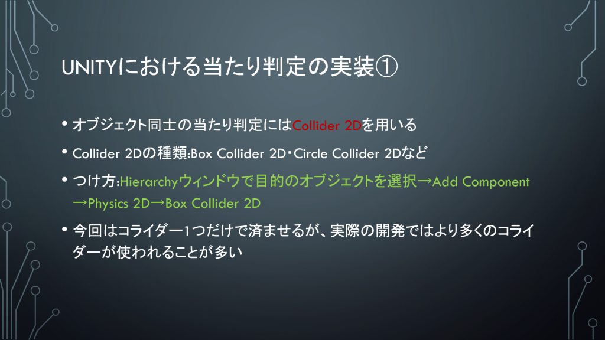
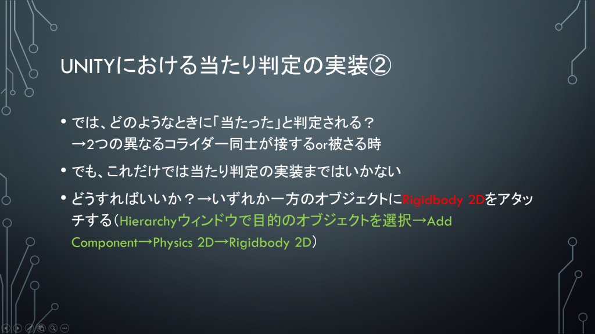
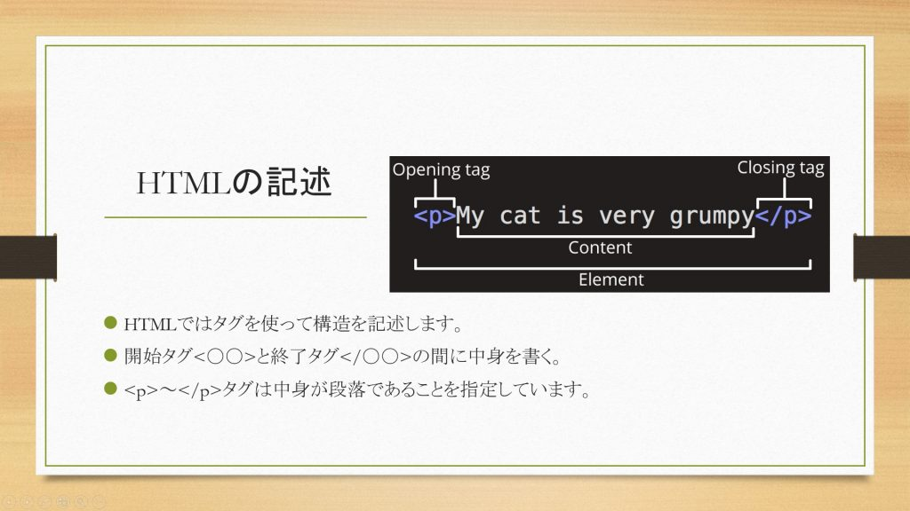
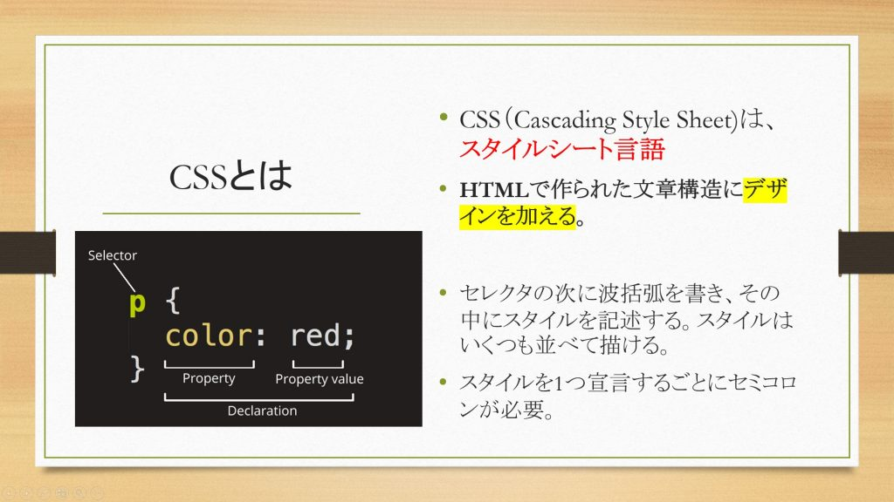
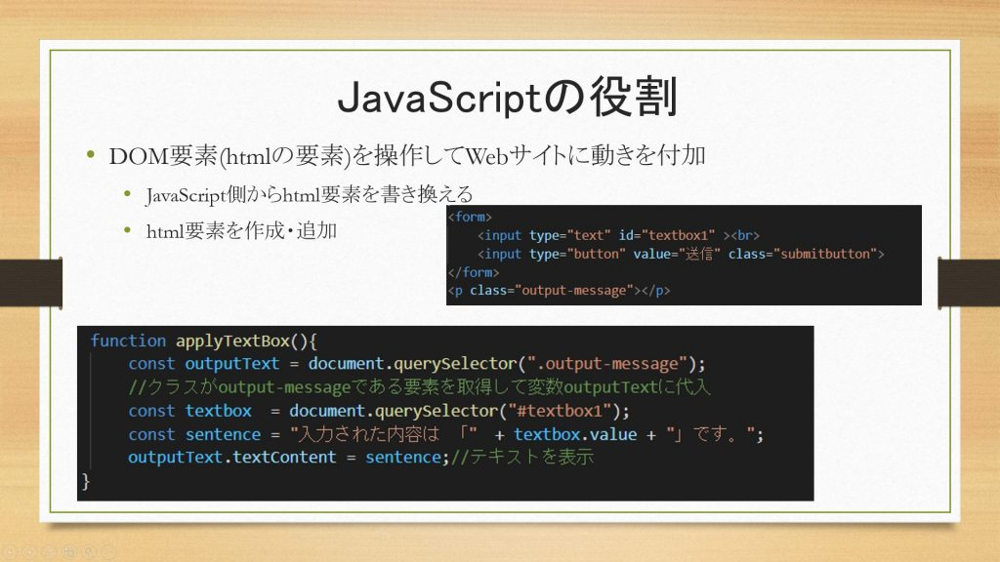
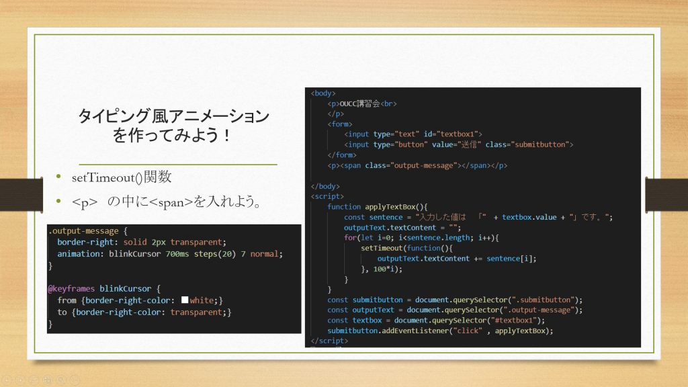

昨日 4/24(土) に Unity を用いた 2D ゲーム制作の講習会、そして本日 4/25(日) に HTML/CSS/JavaScript を用いた Web サイト制作の講習会を、Discord 新歓サーバーでオンラインで行いました。今回も、資料は Discord 新歓サーバーで配布していますので今回参加できなかった方もご参加下されば参照可能です。内容に関する質問もいつでも受け付けております。

## 2D ゲーム制作 (Unity)

Unity での 2D ゲーム制作の基礎として、ものすごく単純なゲームを作成しました。

単純とはいっても、スクリプトの書き方や当たり判定の実装、シーンの作成や遷移、そして Unity の各種機能の使い方など、Unity 初心者が身に着けるべき内容を丁寧に説明しています。Nintendo Switch 等の有名プラットフォームでも Unity で開発されたゲームが増えてきていますが、そういったゲーム開発の裏側に触れることができる講習会となりました。

以下に講習会のスライドを抜粋して掲載します。

## Web サイト制作 (HTML/CSS/JavaScript)

Web サイト制作において最も基本的な HTML/CSS/JavaScript を用いて、簡単な Web サイトを作成しました。

まずは HTML で Web サイト制作への導入を行い、CSS で背景や文字などのスタイルを変更できることを確認したのち、最後に JavaScript でインタラクティブな Web サイトを実現できることを学びました。このブログも含め、日々目にする Web サイトの仕組みに触れることができる講習会となりました。

以下に講習会のスライドを抜粋して掲載します。

## 今後の予定

次は 5/8 (土) に Blender、5/9 (日) に競技プログラミングの講習会を、同じく Discord 新歓サーバーで予定しています。オンラインなので緊急事態宣言などの影響を受けることはありません！興味のある方は <https://discord.gg/jBM2NP7ZxK> からご参加ください。なお、最新情報は Discord 内及び[新歓特設サイト](/workshop)でも紹介していますので、こちらもご確認ください。
