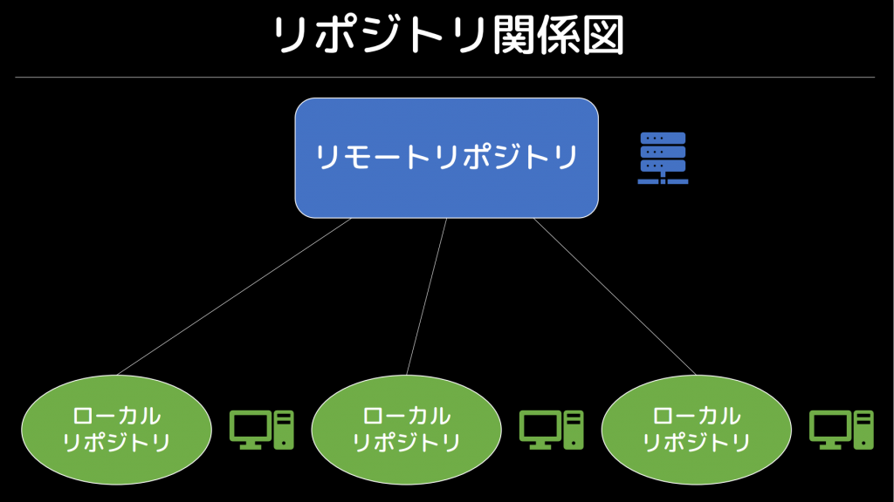
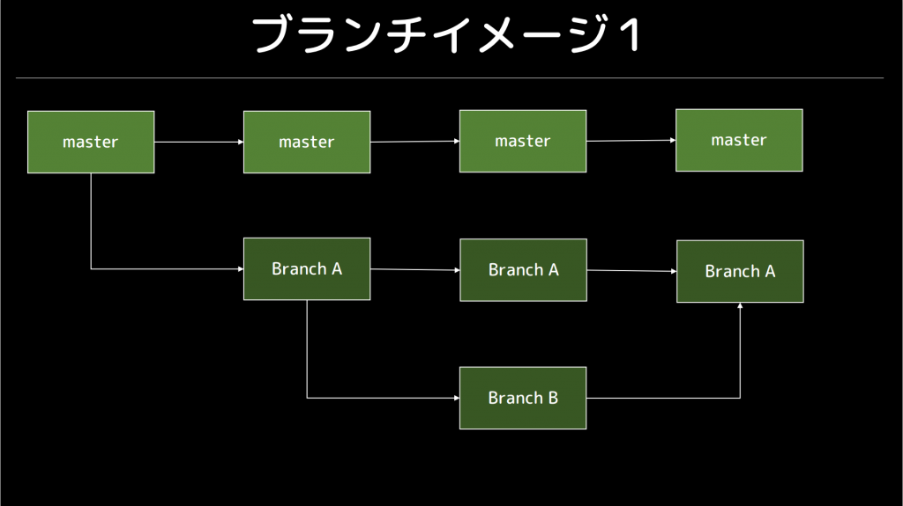
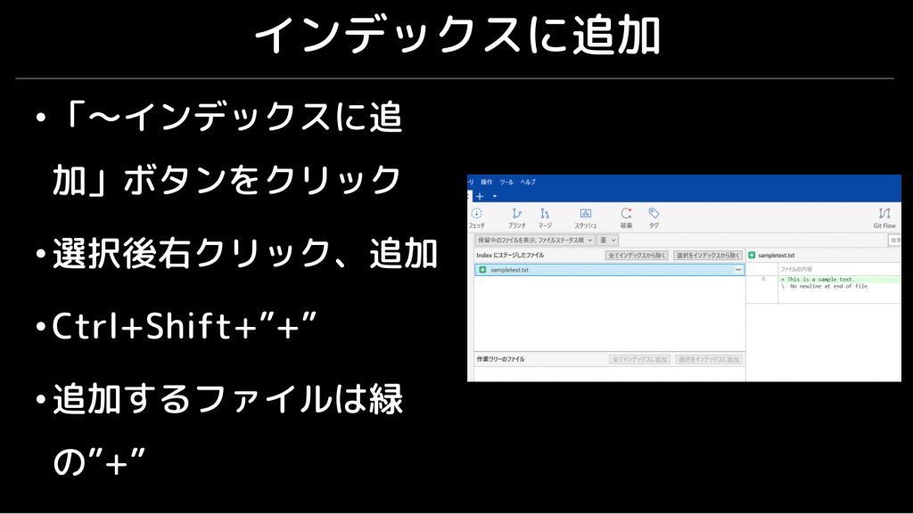
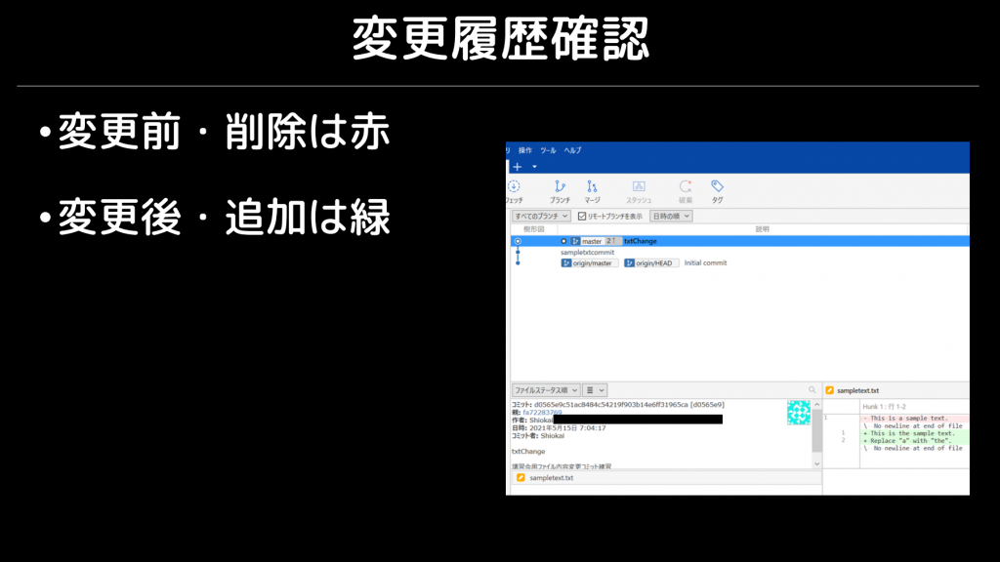
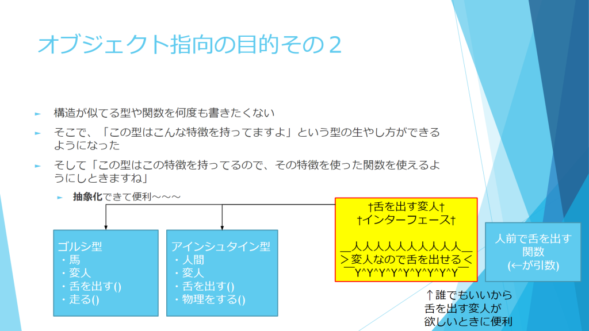
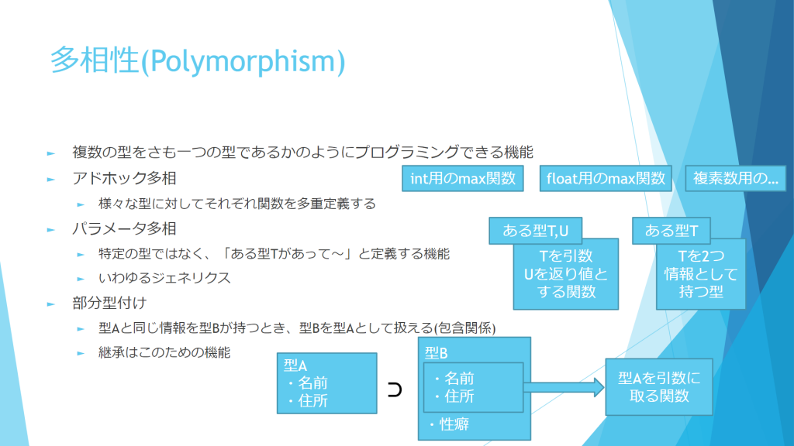
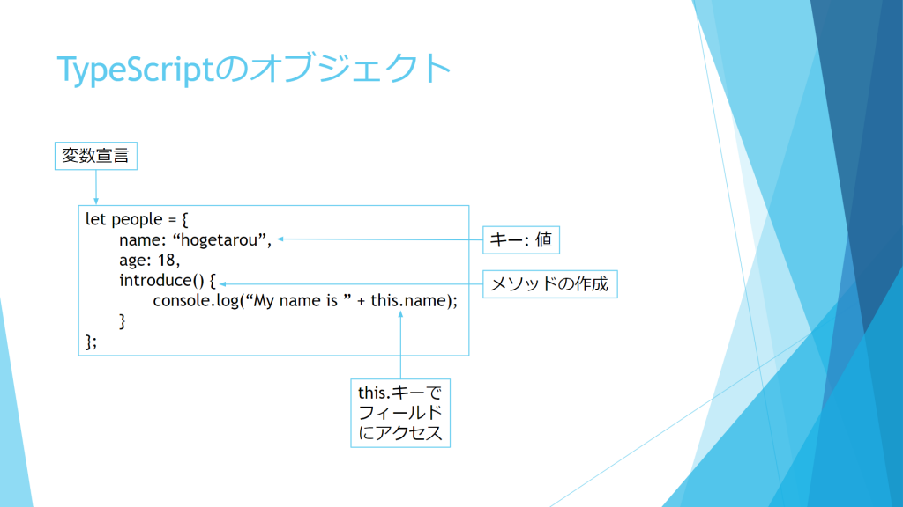
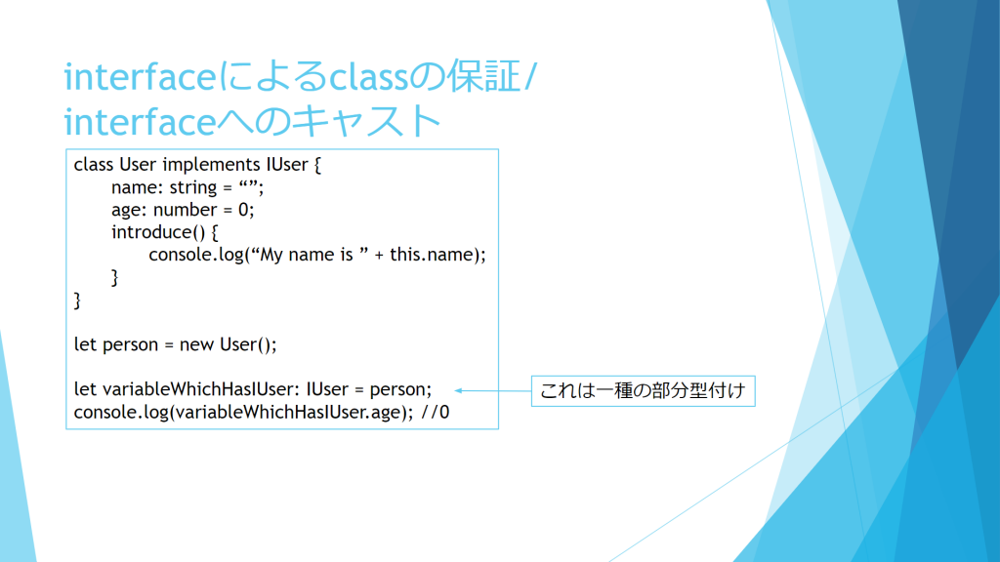

5/15 (土) に SourceTree と GitHub による Git 講習会、5/16 (日) に TypeScript を用いたオブジェクト指向プログラミング (OOP) の講習会を Discord を用いてオンラインで開催しました。

## Git 講習会

Git は分散型バージョン管理システムで、近年のソフトウェア開発で頻繁に利用されるほか、複数人開発では必須ツールとなっています。仕組みが複雑で初心者にはとっつきにくいのが難点ですが、使いこなせればソフトウェア開発を力強くサポートしてくれるとても便利なツールです。今回は、初学者にも比較的扱いやすい SourceTree という GUI ソフトウェアを用いて、Git を扱うのに最低限必要な技能を身に着けることに重点を置きました。

## OOP 講習会

オブジェクト指向は「関数と型の関連付け」と「抽象化」を目的としたもので、「カプセル化」「継承」「多相」が主な特徴となります。近年はソフトウェアのメンテナンス性を重視する傾向が強まってきており、そういった点で合理的な OOP が広まっています。また、この考え方を取り入れた言語も数多く存在します。しかし、これもまた初学者にはとっつきにくいものであることから、今回は入門編としてその目的や定義を紹介したのち、TypeScript を題材として実際の実装例を確認しました。

## 今後の予定

次は 5/22 (土) に Python、6月初めに Linux の講習会を、同じく Discord 新歓サーバーで予定しています。興味のある方は <https://discord.gg/jBM2NP7ZxK> からご参加ください。なお、最新情報は Discord 内及び[新歓特設サイト](/workshop)でも紹介していますので、こちらもご確認ください。
