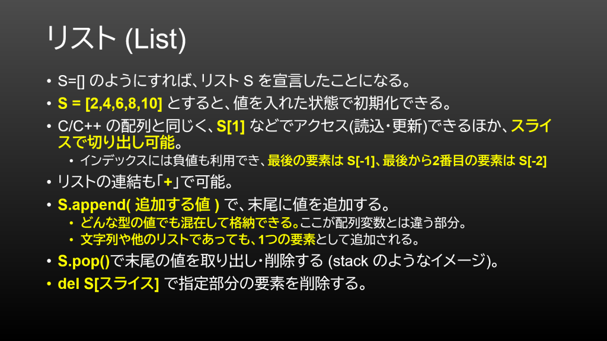
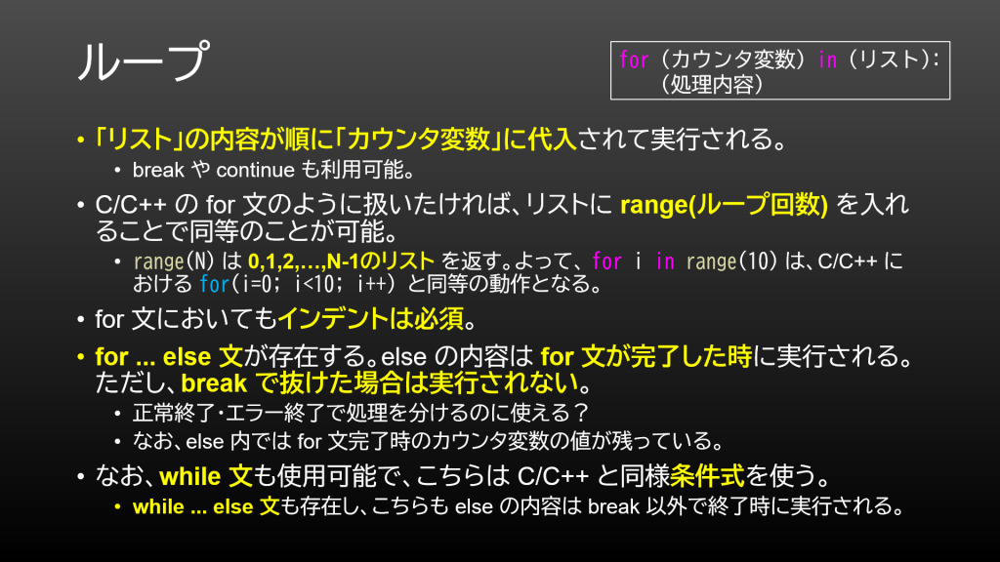
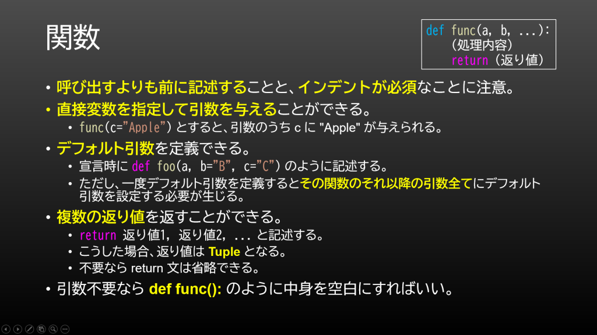
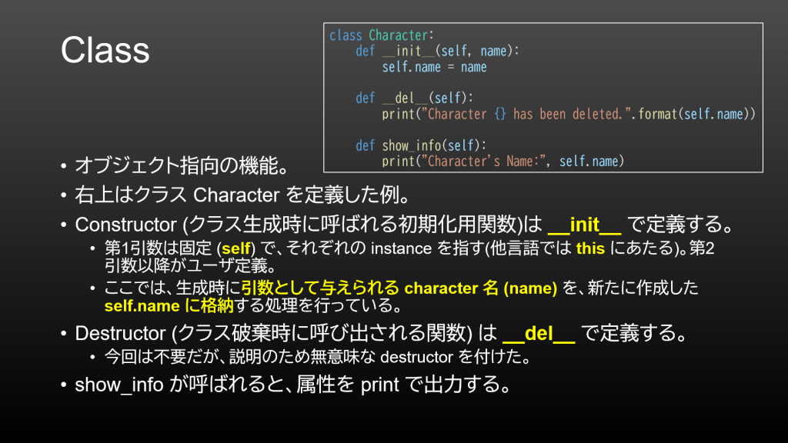
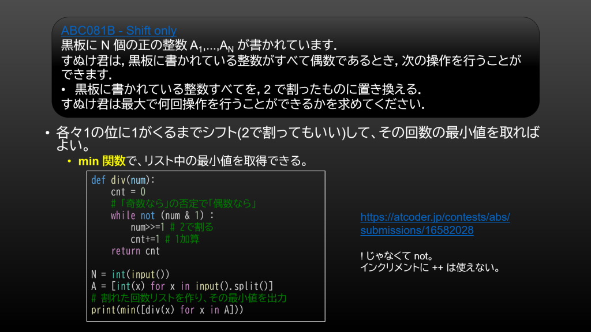

5/22 (土) に Python 3 の講習会をオンライン開催しました。

Python は C/C++ のような言語よりも手軽に扱えることから多くの人に好まれている言語です。また、統計処理や機械学習系のライブラリが充実しており、その分野でも広く使われています。今回の講習会では、Python が持つ基本的な機能を網羅的に解説し、<a href="https://atcoder.jp/contests/abs/tasks" title="https://atcoder.jp/contests/abs/tasks">AtCoder Beginners Selection</a> で演習することで、Python を活用できるようになることを目標としました。

資料は Discord で配布していますので、今回参加できなかった方もその資料で学習可能です！

<h2>今後の予定</h2>

次は6月初めに Linux の講習会、そして 5/29 - 6/26 にチーム開発イベントを同じく Discord 新歓サーバーで予定しています。興味のある方は <a href="https://discord.gg/jBM2NP7ZxK">https://discord.gg/jBM2NP7ZxK</a> からご参加ください。なお、最新情報は Discord 内及び<a href="/workshop">新歓特設サイト</a>で紹介していますので、こちらもご確認ください。

