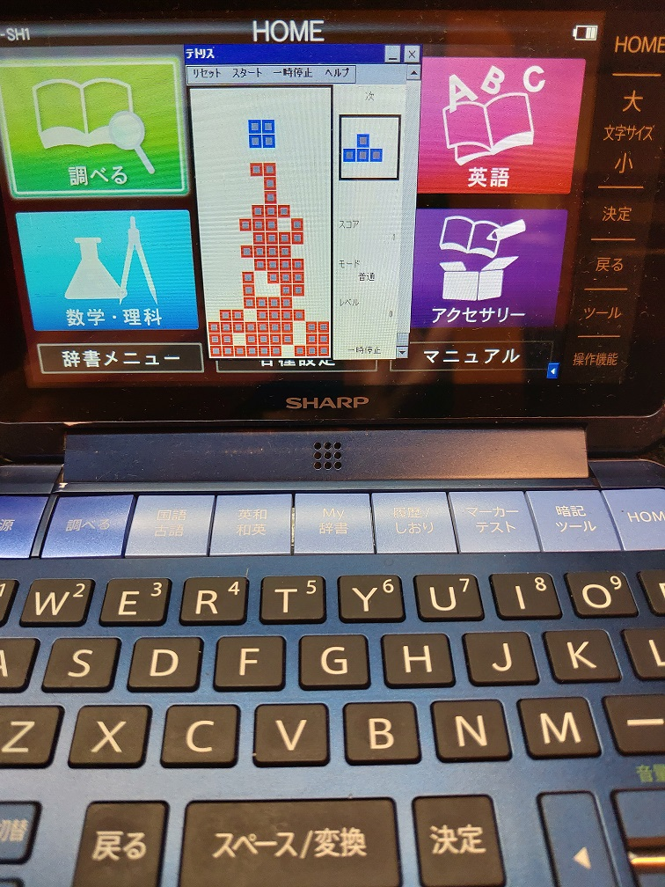

これは [OUCC Advent Calendar 2021](https://adventar.org/calendars/6722) の 14 日目の記事です。前日の記事は...おかしいなぁ誰もいないぞ？w 明日の記事は shiokai が担当します。

さて、何を書きましょうか。マジでネタがありません。何を隠そう今まさに12月14日23:22です。今年は**大量の課題**やら部室の引っ越しやらノーキャリアの学祭やら [Brain Wiki](https://brain.fandom.com/ja/wiki/Brain_Wiki) の整備やらの事務的なことが多く、個人でプログラムを書く時間をあまり取れなかったのです（そういえば、今年から [Brain Wiki の Admin](https://brain.fandom.com/ja/wiki/%E3%83%A6%E3%83%BC%E3%82%B6%E3%83%BC:Watamario15) になりました）。情報科学科なら講義でプログラムを書くのでは？と思うかもしれませんが、はっきり言ってあんなのおまけで**数学**や回路設計の方がはるかに workload が高いです。というか、プログラミングの講義自体レポートを書く部分が本質みたいなところあります。つらい。

うーんどうしようか、そういえばギリギリ今年のはじめに OB の方が作ったテトリスを電子辞書に移植するのやってたな、あれの流れと宣伝でも書いとくか（ここでようやくタイトル欄を埋める）。

## 経緯

さて、電子辞書とは言っても明確な機種を指定していませんでしたね。機種は [SHARP のカラー電子辞書 Brain シリーズ](https://jp.sharp/edictionary/)です。ただし、2021 年発売のモデル以降は見た目こそほぼ変わりませんが中身が全く違うので対象としません。[昨年の私の記事](/blog/articles/303)で、実際に作り方を説明していますので興味があれば見ていってください。

まず、なぜ移植しようと思ったのか。それは突如として OB さんの1人が

> 「最近win32apiでテトリスを実装しました。」

という投稿と共に OUCC の Discord（内部サーバーで、当時はこちらがメインの活動場所だった）でテトリスを添付されたことが始まりです。何という奇遇でしょうか。WinCE が動く SHARP Brain は、ライブラリこそ碌に流通していませんが Win32 API の subset を利用することができます（詳細は[昨年の記事](/blog/articles/303)）。そして、その完成度の高さにも驚きました。結構昔から電子辞書で動くテトリスは[実はあった](https://brain.fandom.com/ja/wiki/Brain%E3%81%A7%E3%83%86%E3%83%88%E3%83%AA%E3%82%B9)のですが、それはモノクロで乱数も seed 値が全く同じでパターンが変化しない、とても単純なものでした。

```
「これは移植すると面白いかもしれない」
```

そうして、移植が始まったのでした。

## 序盤

本当は詳しく書きたいものですが、何しろ今 23:38 です。時間がありません。概況だけ書きます。

まず、最初の状態でそのまま [CeGCC](https://max.kellermann.name/projects/cegcc/) に掛けるとしっかりエラーになりました。まあ、そうなりますよね。想定内です。あくまで subset の API しかサポートしないので、そのまま動くなんぞ甘い期待は禁物です。

まず、1 つは menu bar の仕様違いです。ここは WinCE をやるときの1つの沼で、私もかつて知るまではずっと何がダメなのか分からなかったし、分かっても仕様がどこを調べても書いていないので苦労しました。CE はモバイル用 OS で、それゆえ画面領域が貴重です。狭い範囲に最大限の情報を詰め込むため、×ボタンなどの並びと menu bar を共通にできる [command bar](https://docs.microsoft.com/en-us/previous-versions/windows/embedded/ee503345(v=winembedded.60)) が導入されています。なので、これに置き換える必要があるのです。とはいえ、この苦労は既に1年前に経験したものですから、簡単に切り抜けました。

## 中盤

あ＾～もう 23:46 じゃないか！！やばい！！

次はレイアウトの問題です。何か酷いことになってたんですよねこの段階では。これも command bar の仕業です。通常 Windows なら menu bar は描画範囲外ですが、何と CE では範囲内です。なので、その分画面全体を下にずらさなければなりません。いやぁとんだ沼ですね。しかも、幅はさすがに取得する API があるのですが画面が出てからしか使えません。よって、ウィンドウサイズを起動した後に変えるような仕様変更をすることになりました。

## 終盤

ここが一番苦労した部分です。なぜか適切に描画されなくなる問題が生じて、あれやこれやと色々試す沼にはまりました。時間も無いので（23:54）結果だけ書いてしまうと、電子辞書の超低スペックでもまともに動くようにするために FPS を落としたとき、プログラム仕様をよく分かっておらず「やってはいけない」設定変更を実施したことによるものでした。悲しいですね。

## 成果



<https://github.com/OUCC/tetris>

何はともあれ一応動くものは完成しました。上記の GitHub Repository に置いてあるので、対象機種をお持ちの方はぜひ遊んでみてください（くれぐれも先生の前でやって没収されぬよう...）。ただ、割と高度な音声処理が組み込まれているらしく、そのせいか電子辞書では結構もっさりします（十分遊べますが）。あと、電子辞書版が遊ばれる状況を考慮して初期状態では音量が0になっています。右のスライダーやページ送りボタンで音量を上げると、効果音付きで遊べますので是非お試しください。

（あー 10 分超過したッ！！許せッ！！）
