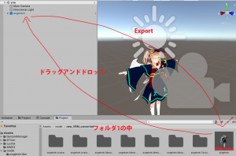

この記事は多分OUCCアドベントカレンダーの最終日の記事になります。

プロローグは暇な人だけ読んでね

それ以外の人は[本題](#本題)へ

## ～プロローグ？～

### ～3Dモデル制作以前

去年のハッカソンでは、何かと不満を言われるE-Learningと和解しようという企画にて、自然言語で会話できるBotを制作しました。 
その過程で会話相手として、E-Learningの化身、angEL-reinちゃん(名前はE-Learningのアナグラムから)が生まれました。私が生みました(生産者表示) 
この名前微塵も流行らず、代わりにいーちゃんと呼ばれているのですが、このいーちゃんを音声で入出力して会話できるようにして学祭に出そうという話になりました。そこで私はRustサーバーを作って非常に遅い言語生成処理の高速化を行ったりしたわけですが、そんな話は今回どうでも良く、それよりやはり音声での会話をするならば、会話する相手が見えた方がいいですよね？古来より偶像崇拝があるように概念を相手にするよりかは、視覚的に見えるものを相手にした方が良いに違いない。 
というわけで、れいんちゃんの3D化計画を極秘裏に進めました。 
以前の記事で既にLive2D化した話はしましたが、我慢できずに3D化に踏み切ってしまいました。

### 3Dモデル完成(仮)まで

まずVROIDで素体を生成し、Blenderで服などを制作しました。 
私は3Dモデルを作るのはこれで2回目なので初めてというわけでは無いですが、やはりそれなりに苦戦はしました。特に前回と同様ウェイトペイントでは常に苦戦させられ、今回も最後まで難敵となりました。 
まあ兎に角色々あってFBXモデルが完成しました。 
VRChatに出したかったのでまずVRChat用の改変をしつつシェーダの調節をしていきました。 
その結果完成したのがこちら

ちなみに私は目にこだわる人なので、目は虹彩を奥に配置し、反射光を前面に出すなど立体的にしています

<video controls class="w-full" src="https://video.twimg.com/ext_tw_video/1584827761960837122/pu/vid/866x610/CO7Tx-DZP0uWzJJR.mp4" ></video>

その後単眼カメラによる姿勢推定アプリを制作する、又はキャラクタを後世の人に使ってもらうためにVRMモデルへの変換を行いました。

## 本題

　Blenderで制作して完成したと思っても、実際に動かしてみたりするとウェイトペイントが上手くいってなくて服が突き抜けたり、頂点にウェイトが割り当てられてなかったり、テキスチャがおかしかったりと、様々な問題が発生してBlenderでの修正を再三に迫られる場面は多いです。 
　そのためにBlender側ではLazy Weight Toolなどを使って個々の頂点についてウェイトを塗りなおしたりして修正したものを出力してUnityに読み込ませます。そのUnityへ読み込ませる際にちょっとした工夫をすると作業量を緩和できます。

## fbxファイルのBlender→Unity

　fbxファイルをunityに読み込むと、モデルをScene上に配置できるようになります。VRChatを想定した場合、その配置したモデルにPhysboneなどのコンポーネントを設定していくことになります。 
　しかしこの方式では、後で修正をかけたモデルで上書きして読み込む際にfbxファイルと共にScene上のオブジェクトもリセットされてしまい、またコンポーネントの設置などをしなければならなくなります。 
　これでは非常に非効率なので、fbxファイルを上書きで読み込んだ際にScene上のオブジェクトのコンポーネントがはがれないようにしたいです。

　そんな時に便利なのがPrefab Variantです。 
　Projectビューからfbxファイルを右クリック→Create→Prefab Variantで生成できます。 
　この生成したものをドラッグアンドドロップでSceneに配置してコンポーネントを張り付けてみてください。 
　こうすることでfbxファイルを上書き更新しても、Scene上のモデルだけが更新され、コンポーネントは剥がれなくなります。

## VRChatモデル→VRMモデル

基本的には [VRM Converter for VRChat](https://booth.pm/ja/items/1025226) を使用しますのでこれを既にUnityへインポートしている前提で記述します。

### 初めてのexport

　まず変換するVRChatモデルを選択した状態でツールバーのVRM0→Export VRM file from VRChat avatarで適当に入力してAssetディレクトリ内に用意したフォルダ(フォルダ1)にexportします。 
　この際もしかしたら未使用シェイプキーにチェックを入れてexportした方がいいかもしれません。 
　兎に角これでフォルダ1内にVRMファイルとそのprefabが生成されます。エラーが出ても、何も変えずにもう一度実行すると何故かうまくいったりします。 
　Unity上だけで表情やマテリアル、SpringBoneなどの設定を変更するくらいなら、そのPrefabをSceneに配置・編集して、そのモデルを選択した状態でツールバーVRM0→export to VRM0でフォルダ1に出力すると、フォルダ1のVRMを上書き修正することができます。

### 2回目以降のexport

1. 　モデルを変更した場合、またVRChatモデルからVRMへの変換をする必要があります。 
   　この変換においてVRM0→Export VRM file from VRChat avatarで出力する場所はフォルダ１とは異なるフォルダ2へ出力した方が良いです。 
   　何故なら、フォルダ1に出力してしまうとせっかく以前に設定した表情や物理などのコンポーネントが上書きされてしまうからです。 
   　この時、フォルダ1には旧、フォルダ２に新モデルが入っていることになります。
2. 　生成された新モデルのPrefabファイルをSceneにドラッグアンドドロップで配置。
3. 　ツールバーのVRM0→Open CopyVRMSetting Wizardで以前のデータからSpringBoneや表情などの情報を新モデルへコピーします。 
   　この時に、Sorceにはフォルダ1の旧Prefabアセット(Projectビュー上)を選択し、Destinationには新モデルオブジェクト(Sceneビュー上)を選択しないとエラーが出ます。 
   　ここまででコピーできていないのはマテリアルのみです。
4. 　マテリアル情報を新モデルにコピーしていくのですが、使用マテリアルが多ければ多いほどこの作業が非常に面倒です。 
   　よってそれをやってくれるツールを自作しました。 
   　ここ(https://github.com/sachsen/TransferInspectorMaterials)　から.csファイルを入手して、readmeに書かれている通りに導入してください。
5. 　ツールバーTools→Open Inspector Material Transfer Windowとします。 
   　sizeにコピーするSkinnedMeshRendererの数を入力し、Sorceにコピー元の、Destinationにコピー先のSkinnedMeshRendererを指定してCopy！ボタンを押すとマテリアル情報がコピーされます。なお、マテリアル自身は複製されません。
6. 　新しいモデルを選択してツールバーVRM0→export to VRM0でフォルダ1へ出力、上書きします。 
   　これでVRMファイルが新しくなって置き換わります。

## 完成
３Dモデルはこちらからぐりぐり見れます。
https://hub.vroid.com/characters/7942564502413041514/models/2799418893141239533
文化祭での様子

<iframe class="w-full aspect-video" src="https://www.youtube.com/embed/ZpUEFc9xowI" title="まちかね祭2022" frameborder="0" allow="accelerometer; autoplay; clipboard-write; encrypted-media; gyroscope; picture-in-picture; web-share" allowfullscreen></iframe>

もっといい方法があるかもしれないですが、私はこの方法でやりました。

よければお使いください。

著者：上月
