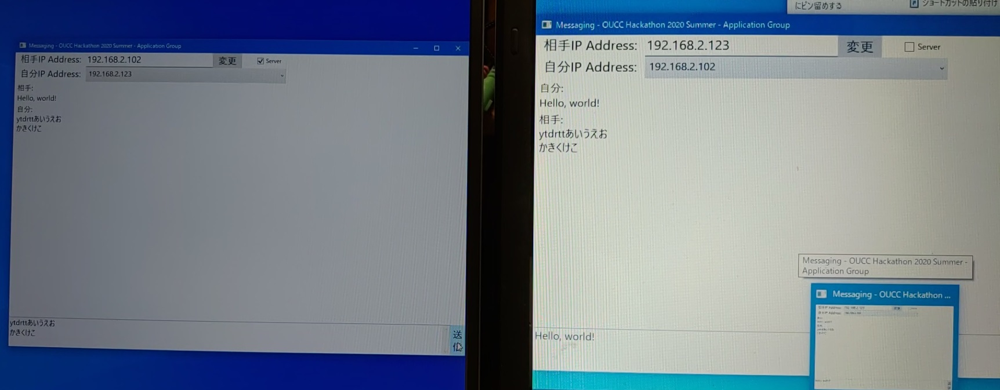
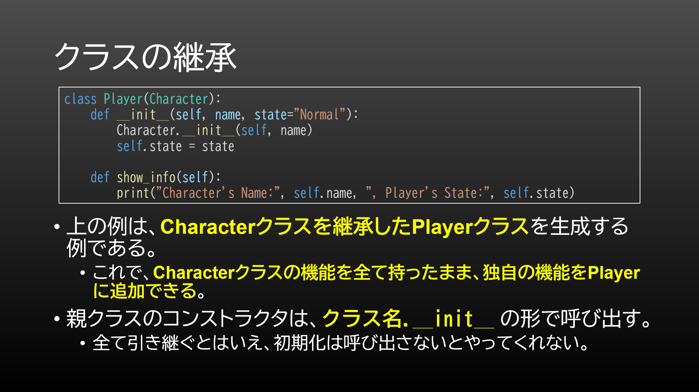
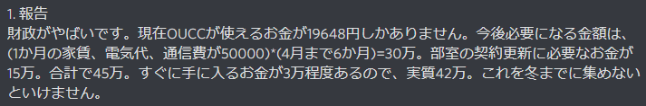
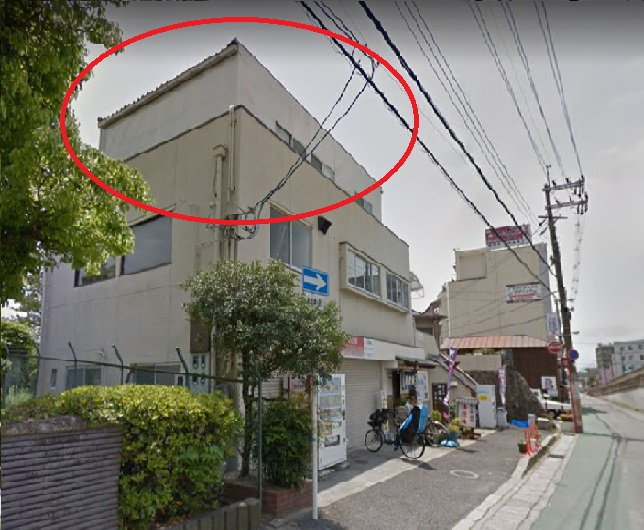

執筆者: [watamario15](https://github.com/watamario15) (2022 年度部長)

これは [OUCC Advent Calendar 2022](https://adventar.org/calendars/7859) の 1 日目の記事です。明日は中編をお届けします。

今年もこの季節がやって参りました。部室を手放した[昨年](/blog/articles/490)からもう 1 年経つのですね。課題に追われる日々は、本当に過ぎ去るのが早いものです。さて、今日は、私が在籍していたこの 3 年間、OUCC がどのような事態に陥り、変遷を遂げてきたかをまとめておきたいと思います。先に言っておきますが、かなりの長文になります。どこの団体でもそうだと思いますが、OUCC も例に漏れず、色々な危機に瀕することとなりました。

## OUCC とは
初日ですので、ざっくりと OUCC の紹介をしておきます。

OUCC は、[大阪大学文化系公認団体](https://www.osaka-u.ac.jp/ja/campus/circle-club/kounin)「[コンピュータクラブ](https://oucc.org)」の略称です。「コンピュータに関連する多種多様な事柄を通じ、部員相互の技能向上、並びに親睦を図り、もって人格形成に寄与し、健全な学生としての成長を促す」が設立の目的です。...要するに、コンピュータ関連の活動は大体何でも対象としています。部の運営に一定の人手が必要であることと、イベントなどに誰も参加しないと悲しいことになってしまうこととで、参加必須となるような活動もいくつかありますが、基本的には何をするか、あるいは何もしないかというのも自由な緩いクラブです。

学祭などの行事を除き完全オンラインで活動しています。部費は、サーバ代やドメイン代などの設備維持のため、年間 2000 円ほど頂いています (十分格安だと期待しています)。部員数は 25 人ほどで、学部は情報系がほとんどという訳でもなく、文系含め様々な学部の人が所属しています。入部には阪大生であることと部費の納入が必要ですが、活動場所自体は[公開の Discord サーバー](https://discord.gg/jBM2NP7ZxK)を使用しており、大阪大学の関係者ですらなくとも (荒らしやスパムでなければ) 誰でも参加可能なので、興味のある方は是非覗いてみてください。

なお、OUCC はそれなりに歴史があるクラブであることが知られています。普通、こう言う話には設立年が併記されるものですが、できません。記録が残っていないのです。一体何故なのでしょうか... 一応、1985 年ごろの OUCC の OB と名乗る方が新聞記事で取り上げられていたことから、1985 年時点ではすでに存在していたことが示唆されているものの、やはり具体的にいつ設立されたのかは謎のままです。

## 2020 年度
2020 年度は、COVID-19 のパンデミックが発生した年であり、また[私が大阪大学基礎工学部情報科学科に入学した](https://gist.github.com/watamario15/b57dc1a9698e1b489c1a518f5d6a5905)年でもあります。中学でブラッククラブに所属していたという黒歴史を抱えていることと、他人に何かをやらされることが基本的に嫌いなため、クラブ・サークルへの参加には消極的でしたが、コンピュータに興味は持っていたため調べていたところ、OUCC を発見しました。講習会をやるとあったので、面白そうだなと思い Discord 新歓サーバー (前節で紹介した公開サーバーと同じ。当時は新歓用だった。) に入りました。その後、講習会、(3 週間の) ハッカソンイベントを経て、自由な雰囲気なら悪くなさそうだと思い入部しました。当時の入部金は 5000 円でした。

ちなみに、ハッカソン (3 週間をハッカソンと呼んでいいかどうかは疑問だが) では「通」というテーマがあり、C# によるチャットアプリ、AI とのチャットアプリ (うろ覚え)、音ゲー、アクション RPG が開発され、私は「C# によるチャットアプリ」に所属しました。まあ、「多さ課題が苦」で知られる大阪大学定番の課題地獄の真っ最中だったこともあり、一応の完成を見たのは前者 2 つだけでしたが...

### KC3 2020 (9 月)
例年通り、[KC3 2020](https://kc3.me/news/171/) に参加しました。私が以前を知らないので何とも言えないですが、COVID-19 パンデミック前の 2019 年度までは対面実施だったものがオンライン開催となったようです。私はあくまでも受講生としての参加でしたが、OUCC としては「[HerokuでLINEとDiscordをつないでみよう](https://kc3.me/study/137/)」と「[経験ゼロからウェブページを作ってみよう](https://kc3.me/study/148/)」と「[3DCG入門](https://kc3.me/study/151/)」を出していました。

### 他大学との連携 (9 月)
さりげなく [ANU CSSA](https://cssa.club) と緩やかな関係 (実質的に、相互の Discord サーバーに部員が参加し合っているだけ) を構築しているのですが、それが始まったのがこの年です。8 月末に相手方からメールで連絡があり、面白そうだということで関係を結ぶことにしました。不思議なことに、当時新入部員であった私がいつしか主導していました。最初は[競プロイベント](https://www.hackerrank.com/cssa-x-oucc-contest)を開いたのですが、それ以降は交流案もなく、緩やかな関係に留まっています。まあ、それでも相手方の運営方針、活動状況、文化、英語圏 (のインテリ層) から見た現況など、色々と学べることは多いので有意義ではあると思っています。

### 夏の勉強会 (9 月)
COVID-19 下だからといって活動を何もしないという訳にはいかないので、オンラインで勉強会が開かれました。とはいっても、何人かのグループを作り、期日までに何かの技術を学んで報告資料を作成する、といった感じでした。自分は Python をやりました。

### 財政危機 (10 月)
10 月に入ると、当時の会計から以下のような報告が為されました。

何というか、やばいという言葉だけで片付けてはいけないレベルに致命的です。学生が 42 万をホイホイと出せる訳がありません。そもそも、なぜこんなことになったのでしょうか。鍵になるのは「補助金」「部員数」「学祭」「部室」です。

OUCC は、当時部室を学外に所有していました。これは、学内の部室は他の団体と共有になるために高価な PC 等を置きづらい、ネット回線を引きづらい、などが理由としてあったようです。しかし、これの代償は極めて大きく、家賃としてコンスタントに月 5 万が吹っ飛びます。石橋阪大前駅からそれほど離れていない「駅チカ」物件としては破格ですが、それでも全予算を自力で確保する学生団体としてはかなり厳しい額です。

しかし、昔は普通に賄えていたようなのです。まず、これは噂の域を出ない (記録が残っていない) のですが、大学から公認団体に対して補助金が出ていた時代があったようです。企業による支援金があったという話もあります。次に、部員数もかつてはかなり多く、100 人いた時代もあったと言われています (これも例によって記録が残っていない)。さらに、年 2 回の学祭の食品模擬店でもかなり (10 万円以上) 儲けていたようです。そういうこともあり、部室を維持できていたようです。

ところが、2020 年時点ではそれらがすべて崩れていました。まず、大学からの補助金は皆無で、協賛企業もありません。そして、部員数についても、正確な記録は行われていなかったものの 10 人 + 新入生 6 人程度でした (2 年は何と 1 人)。学祭も感染拡大防止のため中止されました。その結果収入源が無くなり、危機的状況に陥っていたのです。

### 部室をどうするか (11 月)
部室の家賃を払えないとなると、その解決策は「部室を引き払う」です。その際問題になるのが部室にある備品ですが、当時の部長が大学の学生センターと連絡を取り、倉庫スペースを貸してもらえるという話がありました。なお、この時点では学内に部室の空きはありませんでした。余りに狭く、本当に最低限しか置けないスペースでしたが、金がない以上仕方ないということで、一旦この方針になりました。

しかし、OB の方々とも連絡を取ったところ、部室には思い入れがあるので支援したいという方が何人か現れました。あまり記録はない (なぜ？) ものの、30 年近く借りていたことを示唆する資料もあるので、それだけ部室に思い出を持った方もいたわけです。部員としても、残せるなら残したいというのが本心だったため、何度か話し合いを重ねたのちに、「支援をお願いし、今後様子を見ながら来年 5 月頃にまた再検討する」という結論になりました。結果、多大なる支援を頂くことができ、2021 年までは維持可能な財源を確保することができました (本当に感謝です...)。ここで、事態は「一時的に」収まることになります。

ちなみに、部室を維持するようにしたことにより、部費は高額なまま据え置かれました。入部金は 5000 円だったと書きましたが、これは新入部員向け特別価格です。既存部員には前期、後期それぞれ 15000 円でした。~~そりゃぁ部員も減るよ...~~

#### 部室環境

一応、部室の話が出たからには当時の部室がどのようであったかの説明をしておきましょう。まず、立地としては阪急線を挟んで大阪大学豊中キャンパスの反対側にあり、阪急石橋阪大前駅から徒歩 5 分程度の場所でした。部室そのものは 2 階建ての建物の 3 階です。ん？今何か変なことを言いましたか？まあ、画像から薄々察せるかとは思いますが、屋上付きの建物の屋上に置かれたプレハブです。建付けは素晴らしく、全て閉め切ってあるのに台所の下から猫が侵入して鍋で生活していたそうです。夏は屋上からの照り返しで 45℃ を超える暖かさで、一度部室に入ると靴下の裏が埃で真っ白になるなど、環境も快適でした。ちなみにエアコンなんて豪華なものはありません。

とはいえ、こう見えて面積は割と広く、色々なところに目を瞑れば駅チカで格安の、学生団体には十分な部室でした。講習会やハッカソンを行ったり、布団があるので泊まる人が居たり、大量のゲーム設備 (後述) で交流を深めたり、と COVID-19 のパンデミック前には大いに活用されていたようです。

### Advent Calendar (12 月)
毎年恒例 [OUCC Advent Calendar 2020](https://adventar.org/calendars/5546) が行われました。自分は「[SHARP Brain 用アプリケーションの作成方法](/blog/articles/303)」なる記事を書きました。裏話としては、この内容は今では [Brain Wiki](https://brain.fandom.com/ja/wiki/Brain_Wiki) にあるのですが、それは私が後で Brain Wiki の管理者を引き継いで内容を反映したからであって、丁寧に開発方法をまとめた記事は当時まだありませんでした。部員以外にも、部室の話で (何故か失われていた) OB さんとのコネが復活したため、昔の OB さんも記事を書いてくださいました。~~その割に全然 25 記事に達していないのは内緒。~~

### 金曜部室 (1 月)
COVID-19 によって活動がかなり縮小したことが懸念事項となり、その解決策が話し合われました。その結果、金曜日の夜に Discord に集まって交流会をしたり雑談会をしたりといった緩い集会を開き、部員同士の交流を維持しようとする試み「金曜部室」が始まりました。これは、時期に合わせて履修相談会にしたり LT 会を開催したりと一定の成功を見せ、ネタが無くなってマンネリ化した 2021 年度の終わりまで続きました。

なお、これ以前にも一時的に「もくもく会」が木曜日に開かれていました。目的ややることも概ね似ていたため、金曜部室はある意味でそれの再興ともいえます。

## まとめ
2020 年前半については自分の入部前だったりして曖昧な情報しかない ~~(というかほぼ自分語り)~~ ですが、それでもオンライン活動への移行や財政再建など、激動の 1 年でした。まさかコンピュータクラブがこんな状況に陥っていようとは、誰が予想しただろうか... まあ、国際的な関係構築など、良い面もありましたが。

前編はここまでです。続きは [OUCC の 3 年間を振り返る [中編]](/blog/articles/870) にお進みください。
