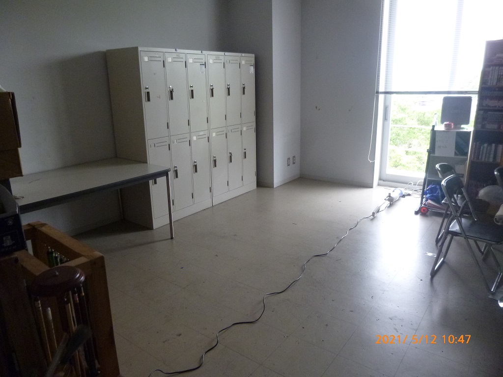

これは [OUCC Advent Calendar 2022](https://adventar.org/calendars/7859) の 2 日目の記事です。昨日は[前編](/blog/articles/835)をお届けしました。明日は後編をお届けします。

## 2021 年度
2021 年度には、曖昧な数え方になっていた「部員」「OB」を明確化したり、それに併せて 10 年以上誰も触ってこなかった部の規約を実情に沿うように大幅に改正したり、部室を引っ越したり、既に経験者がいなくなっていた学祭に参加したり、活動形態を変更したり、顧問が交代したりと OUCC にとって大きな局面となりました。ちなみに、当時私は役職上は 2020 年度の流れで ANU CSSA との橋渡し役を担っており、副部長（当部における実質リーダー）ではなかったのですが、なぜか部の方向性を大幅に担っていたり副部長より部を回していたりと不思議な立ち位置にいました。

### 新歓（講習会、チーム開発など, 4-6 月）
2020 年度に新入部員（我々世代）がそれなりに入ったため、人数的には 2020 年度よりマシでした。しかし、注意しなければならないのは「2 年目部員がほとんど」というところです。講習会できるネタを持っていない部員も多く、割り当てにはかなり苦労しました。結果、自分は C, C++, Python の 3 つの講習会を受け持つことになりました（）なお、この年度から新たな取り組みとして、2020 年に大学公認団体に加わった[阪大競技プログラミング部 RAINBOU](https://rainbou.org/) から [@small_onions](https://twitter.com/small_onions) さんを招き、競プロ講習会を実施しました。同じ大学の情報系団体として、交流を深めていきたいものです。

チーム開発では、[パスワードマネージャ](https://github.com/OUCC/password-manager)、会話ボットの新規開発と、2020 年度のアクション RPG、既存ゲーム「阪大大戦」の改善の 4 つのチームに分かれ、1 か月間の開発を行いました。「ハッカソン」の名は用いていないので、期間が長くとも問題はありません（ｷﾘｯ。ちなみに、自分はパスワードマネージャでした。


なお、この頃は講習会のハイライトやイベントの告知など、頻繁に Twitter 投稿を行いました。その甲斐あってか新入生が 10 人ほど入部し、OUCC に活気が戻ってきました。

### 部室をどうするか（5 月）
> 「支援をお願いし、今後様子を見ながら来年 5 月頃にまた再検討する」

さて、その時が来ました。「様子」としては、5 月のいちょう祭（学祭）も結局中止となり、明らかにアウトでした。しかし、今回はまだ 2020 年度ほど極限状態ではないので、検討の時間がありました。2020 年の流れを受けて、何とか残すことはできないかと、選択肢を洗い出しました。

- 協賛
- HP 広告料収入
- 企業との交渉
- クラウドファンディング
- 有償 OB 会の設置

なんというか、無理！！って言いたくなるような選択肢です。協賛では部室維持につながるような額は期待できず、広告料、企業との交渉、クラウドファンディングは余りに難易度が高く、「多さ課題が苦」の部員が十分にそれに貢献できるとも期待できません。有償 OB 会は [KMC](https://www.kmc.gr.jp/) で実際に採用されているなど有力でしたが、加入メリットの捻出が課題です。しかし、部室を手放すと以下の懸念がありました。

- 備品置き場所問題
- 学祭時の商品保管用冷蔵庫
- 2 度とあの部室を取れないかもしれない
  - 大家さんとの契約更新の際の反応は、学生の入居は騒がしい等で迷惑になったり、老朽化による安全性が心配だったりとあまり積極的ではなかったようで、手放すと立地にしては（家賃的に）超好条件だったあの部室をもう 2 度と借り直せなくなる恐れがありました

しかし、今回は耳寄り情報がありました。何と、他部の解散により学内の部室（共用室）に空きができたのです。学外に確保していた部室より遥かに狭い（4m x 3m）ため、活動スペースが取れないばかりか物品も結局ほとんど処分しなければ収まらず、インターネットもなく、共有空間なので高額機器や金銭の保管に少し抵抗が生まれるなどの問題点はありましたが、金がない以上贅沢は言えません。



- 共用室に興味を持っている団体は他にもあり、判断を待ってもらえるのは今年限り
- 収支を計算するとマイナス 40 万超（年間）なので、仮にクラウドファンディングで 50 万儲けても 1 年しか伸ばせず、もし 100 万儲けられたとしても 2, 3 年延ばすのみ
  - しかもその時点で共用室は取れなくなる
- 部室維持が困難になったのは COVID-19 のパンデミック前からの話であり、収束しても厳しいことに変わりはない
  - 結構前から、部費半期 1 万円であったことが判明した
  - 部費の高さで入部をためらう声もあり、部室維持のために部員が減るのは本末転倒である

以上の思考の元、部室維持は長期的に非現実的だということを部員一同が認識し、2021 年末を以って部室を手放し、物品は共用室に移送することで合意しました。

しかし、話はこれで終わるほど単純ではありません。大量の物品をどうやって残す/売る/捨てるの判断をするのか、私物が紛れていないか、どうやって運ぶのか、どうやって捨てる/売るのか。そこにこそ、最大の砦が待ち構えていたのです...

### 活動形態の変更（8 月）
部室を手放すということは、完全に Discord が活動場所になるということです。そこで、Discord サーバーの整理を始めました。まず、役割の同じチャンネルが複数あったり、全く使われていないチャンネルがあったりと、散らかり放題だった内部サーバーを、実情に合わせて再編しました。そして、「新歓サーバー（公開）」と「メインサーバー（内部）」の 2 つが存在していたのですが、これらの役割を変更し、前者をメインサーバー、後者を議論用サーバーに変更しました。これには、以下の背景があります。

まず、新歓サーバーはその名の通り、2020 年に新歓目的で作成されたサーバーでした。そして、内部サーバーが活動のメインであり、こちらは 2019 年に Slack から移行する形で作成されました。新歓サーバーは、おそらく新歓期間終了後破棄することを想定されていたものですが、新歓時期終了後にも新たな参加者が入ってくることが結構あり、また公開サーバーであるという側面から先述の ANU CSSA の方との交流にも利用され、その結果、破棄されず 2021 年の新歓にも使用されました。しかし、新歓時期にしか使用しないとなると、OUCC の活動風景が唯一見える新歓サーバーは新歓時期を過ぎると閑散とし、これによって新たな参加者も発言しにくくなり、多大な機会損失が生じているのではないかという懸念がありました。

現代では、誰でも参加できる高度なオンラインコミュニティが無数に存在します。部費を払わないと参加できないオンライン活動のクラブは、この点で大きなディスアドバンテージになります。これは OUCC に限らず、[多くのクラブ・サークルが直面した問題](https://bizspa.jp/post-521768/)です。そもそも、私は「それによって価値を失ったクラブ・サークルは、そのまま消えてしまえばいい」という考え方です。これは、OUCC に対しても同じです。しかし、OUCC には「同じ大学のコンピュータに興味のある人と情報交換ができたり、（主に）情報系学科なら履修や講義の相談ができたりする」という価値を見出していました。なので、そこに重点を置くことを考えました。具体的には、「活動を公開空間で行い、部員以外でも誰でも参加できるようにする。つまり、コミュニティとしての存続を目指す。」ということです。とはいえ無料で運営できる状態ではないので、部として参加する外部イベントへの参加、活動方針の決定、備品利用等の「部員」にのみ提供される付加価値をいくらか残すことで、部費を払って入部するメリットも確保しました。

### KC3 2021（9 月）
[KC3 2021](https://kc3.me/news/315/) も、2020 年度と同じくオンライン開催となりました。この回も私は受講生側でしたが、当時の部長が JavaFX の講習会「[初心者向けGUIプログラミング －某番組のシステムをまねてみよう](https://kc3.me/study/301/)」を開いていました。

### 部室の整理（9-10 月）
部室には大量の物品が存在し、共用室への移動時には大量の処分を行わなければいけないことが分かっていました。そのため、「今どのような物品が存在し、どれが優先度が高いか」を明らかにする必要がありました。ちなみに、「部室をどうするか」から 4 か月も経っているのは、学期中には碌な活動ができないという「多さ課題が苦」ならではの制約によるものです。これが、後に地獄を招くことになるのですが...

さて、まず、整理には 4 日間を確保しました。行う内容は以下です。
- 必要な物を優先度の高い順に整理する
  - よく分からないもの・判断に迷うものは適宜 OB さんにもメンションしながら頻繁に質問する
- 明らかなゴミを除き、写真と共に選別結果ごとにリスト化する
  - 大きい物品は採寸結果も
  - 1 つ 1 つのリスト化は非現実的なので、小物類はまとめて写真を撮るだけでもいい
- 古い PC を起動し、スペックを確認する
  - 使えそうでないものは USB 等にデータの救出を行う
  - 起動しないものは HDD を取り出せばいいと思われるが、大したデータはなくそのまま捨ててもいい
- コード類はどこに繋がるものかわかればその機器に繋ぐ
  - 最悪まとめて箱詰めでも良い
- OB さんに原則 25, 26 日に自分の所有物を回収してもらう
  - 都合が合わない方は 11/14 までの範囲で柔軟に調整するが、できる限り早くにお願いする
  - 11/14 までに連絡がないものは、部の備品として処分などの取り扱いを行うことも併せて告知する
- 業者に運んでもらうものを決める
  - 見積もり訪問が来るので、値段が変わらない範囲を探る

できそうに見えた方も多いことでしょう。実際、我々もできると思って 4 日間としましたから。しかし、現実はそう甘くはありませんでした。


はい、無理です。まず足の踏み場がないので、整理やリスト化などの作業を行うためのスペースすらなく、リスト化作業もかなり滞りました。遠い昔の世代が遺した得体の知れない物体も大量に存在し、これもまたリスト化作業の停滞を招きました。最終的に、リスト化は「ある程度」進みましたが、「優先度の高い順に整理」は無理でした。結局、学期が始まってからも部員が頻繁に通ってリスト化が済んでいないものをリストに追加する作業が続くこととなりました（自分も 65 枚ぐらい撮りました）。ちなみに、このリストは最終的には 41 ページに渡る巨大文書となりました。


リスト化できたら、これに優先順位をつける作業に入ります。これは、部会で投票方式で行いました。時間が掛かることは分かっていたので、限界まで時間短縮するためにテンポよく短時間の投票を繰り返す方式にしたのですが、それでも 14:00 に開始して 22:30 終了という、過去に例を見ない恐ろしく長丁場な部会となりました。


### 引っ越し（10 月）
必要なものが決まれば引っ越しですが、単純に量が多いことと冷蔵庫のような大型物品を含むことから、学生だけでは非現実的で業者に頼むことは必須でした。格安業者は不安だったため、大手の業者で相見積もりを取って決めました。壊れた冷蔵庫（冷蔵庫は 3 台あり、そのうち 1 つは壊れていた）の処分を含めて 32,890 円になりました。家電リサイクル法~~とかいうクソ~~が絡む物品を含んでいることを考えると、まあ妥当な額です。ちなみに、箱詰め資材が届くのが引っ越しの 2 日前の夜という感じで、そこから（大幅処分の上でも依然）大量の物品を箱詰めする訳なので、かなりギリギリでした。近くに住んでいる部員が夜遅くまで献身的に働いてくれたことで、辛うじて間に合いました。~~ブラック労働~~

しかし、これで引っ越しが完了した訳ではありません。処理しなければならない不要物品が大量に残っているし、さらに事前に伝えておいた冷蔵庫とホワイトボード以外は箱に入るものしか運んでもらえず、結局プリンタなどは部員で運ぶことになりました。この辺のこと、ちゃんと確認しておかないといけないという教訓ですね。まあ、それでも助かったことは間違いないです。


### まちかね祭（11 月）
いきなり何の関係もない話題に飛びますが、実際にこのタイミングに学祭が割り込んできたのです。実際には準備があるので、8 月から議論が始まっていました。引っ越しと学祭出展の 2 刀流はもう... しかも、この学祭、食品模擬店とゲーム有償展示の 2 店舗同時出店なんですよね。両方の準備をしなければならないし、何より少ない部員で 2 店舗を準備日含めて 4 日間割り当てないといけない。はっきり言って無謀ですが、この学祭は完全に資金獲得を目的としており、財政がギリギリという背景から、何としてもそうせざるを得なかったのです。

この学祭はただ大変だっただけではなく、2 年ぶりということで、学祭経験者がもはや 0 でした。ゲーム展示の方は、部として持っているゲーム（VR、シューティング）と夏休みに新規開発した占いを出すということで、企画自体はまあ何とか決まりました。問題は食品模擬店です。まず何を売ればいいのか、色々と議論の後に唐揚げに決まった後も何 kg 仕入れればよいのか、調理にあたって必要なものは何か、買い出しはいつどこでどうやればいいのか、全てが手探りでした。あまりに不安要素が大きかったため試食会を部室で開き、調理方法などを確認しました。

そして迎えた本番、COVID-19 が小康状態であったことや久し振りの学祭ということもあって、とんでもない客入りでした。唐揚げは~~原価率 25% で~~飛ぶように売れ、ゲーム展示にも長蛇の列ができました。私は食品模擬店を担当しており、ゲーム展示の担当ではなかったのと、現場が限界運営で状況報告をする余裕がなかったようで、全く状況は分からなかったですが、とりあえず盛況だということは間違いなかったようです。


もうとにかく「大変」の 2 文字だった学祭ですが、その効果は絶大でした。売上 249,849 円で 180,650 円の利益を出したのです。もはや我々にも信じられない数字でした。頑張った甲斐があるというものです（そして当時来てくださったお客さんにはもう感謝してもしきれません）。そしてこれによって得た盤石な財政は、以降の引っ越し作業を大いに救うことになります。

### 不要物品の処分・売却・譲渡（11-12 月）
学祭が終われば、不要物品の処理です。この時点で OB さんによる回収期限は終わっていたので、あまりに高価だと判明した物品以外は部員と OB さんが自由に持って帰ってもいいという方針にしました。それでも残ったものを処理する形になります。

まず、粗大ごみは大変です。ゴミ処理場まで運ぶのには車が必要になり、処分費用も掛かります。電化製品なら家電リサイクル法~~とかいうクソ~~も絡んできます。今回は、CM でおなじみの[ジモティー](https://jmty.jp/)を利用し、部室まで引き取りに来てもらうことを前提にタダで出しました。結果、鉄くずを集めているらしい業者っぽい方が全て回収してくれて、この辺の物品は特に大きなテレビ台などを除き無事処理できました。

続いては、金になるもの（書籍、ゲーム、ゲーム機等）の処理方法です。それぐらい残しておいてもいいじゃないかと思うかもしれないですが、量が尋常ではないのです。書籍もゲームも、「それぞれ」200 以上はあったのではないでしょうか。もはや数えることすらできませんでした。ゲーム機も PS2 が 5 機ぐらいあったりと意味不明でした。一体どの世代が何のために... オタクの楽園ではありますが、こんなものを狭い共用室に運べるわけがないので処分が必要になります。金になるなら売りたいというのが、常に財政がギリギリの貧乏クラブの発想で（そもそも、だから部室を引き払うことになったわけで）、ボドゲと一部の漫画は[ボドゲ研](https://wikiwiki.jp/handai_simu/)と[漫研](http://handaimanken.web.fc2.com/)に売りました。しかし、先述の学祭で資金を獲得したことで、「何としてでも金になるものは売らないとまずい」というよりは、「あと 1 か月で引き払わないといけないのにこれでは間に合わない」の方が強くなっていたため、特に高額なもの以外は業者に一括で丸投げする方針になりました。というか、期日が近づくにつれてどんどん適当になっていきました。まあ、本当に売ることを考えるとヤフオクやメルカリになりますが、これはあまりに大変なので非現実的でした。なお、この方針でさえ期日ギリギリだったので、学祭で大失敗していればもう... かなり悲惨な結果だったことでしょう。


参考までに、当時のメモを掲載しておきます：

```md
TODO:
- 書籍類/ゲームソフトの分類(種類別)、その後シリーズごとに出品用写真を撮り箱詰め。
  - 箱詰めは、部屋に散乱して作業の大きな妨げとなっているため行う。どれがどの箱に行ったか分かるようにすること。
  - 見落とされていた専門書は共用室へ移動エリアに置く。
- 書籍類/ゲームソフトのうち高価な物を探す。
  - 上の作業で写真が届くのと並行に、現地にいない人が解析すると効率が良さそう。
- ゲーム機/周辺機器の分類と、出品用写真の撮影。
  - これも、現地にいない人が同時に価格解析すると効率良さそう。
- PC/モニタ/HHKB/ゲーム系/例のレンジの動作確認。
- 共用室に運ぶエリアに置いた物品と高価値物品の移送。また、そこにはないがクーラーボックスや座布団と椅子と机(とモニタ)も運ぶ。

- あまり価値のないゲームソフト/ゲームハード/書籍類/トレカは BOOK OFF か HARD OFF に一括で投げる。
- 不要な家具類はヤフオクかジモティーで出品する(最悪0円でもいい)。引き取り手が無ければ粗大ごみ。
- 重要度の低いボドゲをボドゲ研かメルカリ/ヤフオクに売る。

- 大量のゴミ(粗大ゴミ含む)の処分。
  - 行政サービスを使うか民間業者を使うか。行政サービスなら手続きとかいろいろあるし休日や年末年始は受けてくれない可能性があるし、申込期限もあるので注意。
- 鍵の取り外しと、マナーとして最低限の掃除。
```

さて、残りはシンプルに「ゴミ」です。それの量は、「引っ越し」の節の最後に示した画像から察してください。一部、引っ越し業者の箱に入らなかったために部員が自力で運んだ物品、ギリギリになって発掘されたり議論が漏れていたりしたために検討時間が取れなかった物品、処分方法不明な自動車関連の缶系物品など、共用室に運び込んだ物はありますが、ほとんどはゴミです。これを、自治体のゴミ収集で何とかできるでしょうか。そもそも、部員の力で運び出せるでしょうか。...無理です。どう考えても無理です。ということで、ゴミ処理の業者を呼ぶことになりました。業者決めというのは例によって大変なのですが、今回はコネがありました。そう、ジモティーのときに粗大ごみを引き取ってくれた業者です。ここの業者に相談したところ、何と大量の書籍の売却、粗大ゴミの回収を一挙に引き受けてくれるということで、これでようやく先が見えました。さらにこの業者は、粗大ごみ以外の大量のごみも引き受けてくれて、部室が一気に片付きました。軽トラック大盛 2 回分で 24,000 円と良心的な価格で、学祭の利益をもってすれば余裕でした。この業者に巡り合えていなければどうなっていたか、考えるだけでも恐ろしいです。ジモティーへの出品がきっかけでこの結果にたどり着いたことを考えると、人生何がどう繋がるか、分からないものですね。


### 部室の退去（12 月）
さて、前節の業者によるゴミ回収が 12/18 で、退去日は 12/25（年末年始休暇に入るので 25 が限度だと大家さんに言われたため）でした。残りの物品も、授業の合間を縫っていくつか運び、退去日の 25 日に何人かで集まって運び終わりました。本当にギリギリですが、何とかなりました。

しかし、最後に事件が起きました。物品移送の後、共用室で棚を組み立てていたときのことです。退去の立ち合いをしていた部員から、連絡が入りました。

> 2021/12/25 15:07
>
> 下駄箱は元からあったものでは無いので運び出してくれと言われました
> 人手が要ります

怪しいかもしれないとは思いつつ、しかしこれはさすがに備え付けだろうと思って処分しなかった下駄箱が、なんと当日にこう言われた訳です。傘立ての壺があったのですが、これについても同様でした。契約当時を知る OB さんとは既に連絡が取れなくなっており、というか誰かも分からず、大家さんに確認を取るも返事がなく、当日にこの有様... 現場は大混乱でした。契約が切れた以上当日中に撤去する必要があり、しかし共用室に入るサイズではありません。先日の業者も、こんなタイミングでいきなり呼んで来てもらえるとは期待できないし、そもそもこの日は年末ということもあり条件は最悪です。

しかし、どうにかするしかないので、最寄りのリサイクルショップを半ば賭けで目指しました。最寄りとはいえ、大荷物をタイヤがボコボコの台車で徒歩で運ぶとなるとかなり遠いです。何とか着いても、壺は無償引き取りできたものの、やはり下駄箱は無料引き取りもできず、有償処分も引き受けていないと言うことでした。途方に暮れていると、見かねた店員さんが知り合いの業者をあたってくれ、8,000 円出せば処分を引き受けてくれる人を見つけてくれました。下駄箱 1 つ 8,000 円とは普通の感覚ではぼったくりですが、タイミングがあまりに最悪（年末の夕方）で他の選択肢は川に投げるしかないという状況にあったため、金を積めばそんな状況を救ってくれるというだけでもものすごく有難かったのです。何なら数万円でも出すつもりでした。というわけで、この条件で引き受けてもらうことにしました。これも、学祭による盤石な資金が後ろ盾にあったためにできた判断であり、先の学祭の成功は重要な鍵になりました。

という訳で、一悶着ありましたが、何とか部室の引っ越しが完結しました。


...はい、結局新たなオタクゴミ屋敷になりました。そもそも活動スペースが取れないことは想定内であり、倉庫として運用するつもりだったため自然な結果ではありますが、運び込んだ備品を使うスペースすらないため、物品の保持基準を更に厳しくして断捨離する必要がありそうです。とはいえ、これには 1 年経った今も手を付けられていません。

### Advent Calendar（12 月）
毎年恒例 [OUCC Advent Calendar 2021](https://adventar.org/calendars/6722) です。今回は部室の引っ越しのクライマックスと被ったことでかなり厳しかったです。その結果、12 記事しか集まらず、それも後半のみという寂しい感じになりました。しかし、OUCC 部員でない方が 1 つ記事を埋めてくれたのには、公開コミュニティ化の手応えを感じました。

ちなみに、私は「[テトリスの電子辞書移植](/blog/articles/490)」という記事を書きました。締め切り直前に書き始め、ブログシステムのトラブルによって結局間に合わなかった迷作です。

### 役職再編（12-1 月）
実際の運営状況を反映し、旧来の役職体系を再編しました。それぞれの責任範囲を明確にし、「これは誰がやるのか」問題を減らそうとも試みました。「これは誰がやるのか」というのが曖昧なものって、結局誰もやらないので私に回ってきていたんですよね。そういう意味でも、運営の健全化において重要でした。なお、部室係はここで廃止したものの、半年後に需要が出てきたため復活させました。

旧：
```
・部長
・副部長: 部会の司会進行、部の運営・意思決定、他役職のサポート
・国際交流: ANU CSSAとのやり取り
・国内交流: 外部(大学・他企業)との交流(これまでの渉外と同)
・会計: 部のお金の管理
・Webサーバー係: Webページ更新など
・出版係: 部誌・広告作成
・部室係(部室に近い人)
・店舗・副店舗
・展示・副展示
```

新：
```md
# 新3年配当

部長
- 副部長への職務継承、アドバイス、手助け

店舗
- 学祭の食品模擬店の正責任者
- 総会の出席、検便の回収、シフト決め等を行う

展示
- 学祭の展示の正責任者
- 総会の出席、シフト決め等を行う


# 新2年配当

副部長
- 部の代表者
- 部会などイベントの計画・開催
- 他の人の手が回ってないこと全部

会計
- 会計記録
- 部費徴収
- 部長、副部長、会計による会計会議への参加
- バイトの斡旋
- その他、金銭に関わること

渉外
- 部外の方との橋渡し(郵便受けの確認やメール対応、会議など)
- 教室確保(共用室の利用届更新を含む)

Intl PR
- ANU CSSA とのやり取りを含む国際交流
- 留学生のサポート

広報
- Twitter (@OUCC, @OUCC1) や OUCC BLOG の対応と情報発信
- 新歓(サーオリを含む)の取り仕切り

サーバ
- サーバの管理・運用
  - セキュリティ更新とクラッキング被害有無の確認/対応
  - bot の管理
- OUCC が管轄する GitHub, GitLab, Discord, Slack, etc の管理
  - これらの Owner 権限あるいは類する最高権限を持つことを想定

出版デザイン
- Web サイトの管理・更新(部誌制作の代わり)
- 紹介動画制作、サーオリ/学祭等のサムネイル/ビラ制作
```

### 部費システムの大幅変更（2 月）
まず、何度か軽く触れましたが、当時は

- 春夏学期・秋冬学期それぞれ、会計が決めた額の部費を支払う
  - 大阪大学は~~形だけの~~ 4 学期制なのでこの呼び方になりますが、前期・後期と読み替えても支障はありません
- 新規入部者は「入部金」という、部費よりも安く設定した料金を支払うことで参加でき、これを当期の部費納入と見做す

というシステムでした。そして、その部費は部室の家賃を賄うために 15,000 円まで跳ね上がっていたのでした。

しかし、月 5 万の部室を手放した今、そこまで部費を吊り上げる必要はありません。もっと安価にできます。そして、半期単位での集金は会計への大きな負担になっていました。この時点で出費を考えると、

- サーバレンタル料
- ドメイン（oucc.org）代
- 学祭費用

でした。学祭費用は大抵の場合学祭の利益で相殺されることと、却って利益になることの方が多いため考えないことにすると、残りは年間 3 万円程度でした。ということは、全体で年間 3 万円を部費として徴収できれば、OUCC は安定して存在できる訳です。そこで、部員 15 人は確保できるだろうと見込み、以後固定で年間 2,000 円とすることにしました。今まで年額に直すと 3 万円前後徴収していたことを考えると、超大幅値下げです。部費はオープンコミュニティ化における大きな障壁だったため、この値下げは重要でした。また、有効期間を厳密に年度単位（4/1 - 3/31）としたことで手続きも分かりやすくなり、この期間に部費を納入した人数として部員数の正確な統計も得られるようになりました。

### まとめ
2021 年度の「活動」は、まあ見ての通り、ほとんど「部室」でした。折角沢山入ってきてくれた新入部員に労働しか与えられなかったという点は申し訳ないなぁという気持ちですが、こうする他ありませんでした。改めて、自分の世代で出した遺産の処理をその世代のうちに済ませておくことの大切さを感じました。

一方で、運営関連では雑だった部分を是正したり、公開コミュニティ化したりと、時代に合わせた大幅な改革を行いました。これによって入部できない人も活動に参加してくれるようになったりと、一定の手応えは感じています。公開コミュニティ化については、2022 年現在においても不十分なところはあります。例えば、課題の質問は剽窃や講義の規則（第三者に資料を渡してはいけない etc）等の懸念があったり、単に恥ずかしかったりで公開サーバーでは行いづらく、結局内部サーバーでの会話の方が多くなってしまっている現状があります。また、公開コミュニティ化する上では開発プロジェクトは OSS 化したいものですが、外部公開を想定して開発していなかったためにソースコードがぐちゃぐちゃだったり、著作権周りが怪しかったりで開発に携わった部員が消極的なことも多く、既存プロジェクトについてはあまり実現しませんでした。この辺をより推進するのは、2022 年度以降に託されました。

中編はここまでです。続きは [OUCC の 3 年間を振り返る [後編]](/blog/articles/871) にお進みください。
