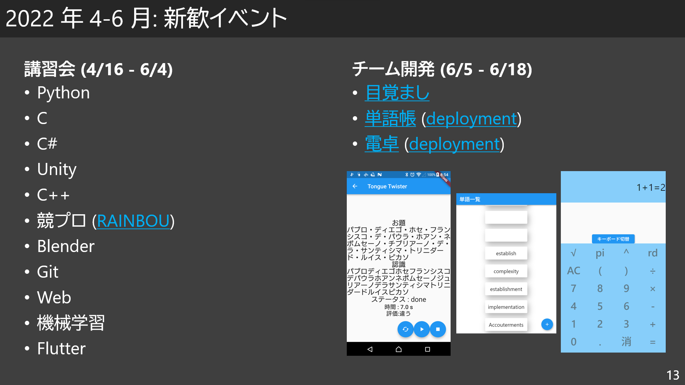
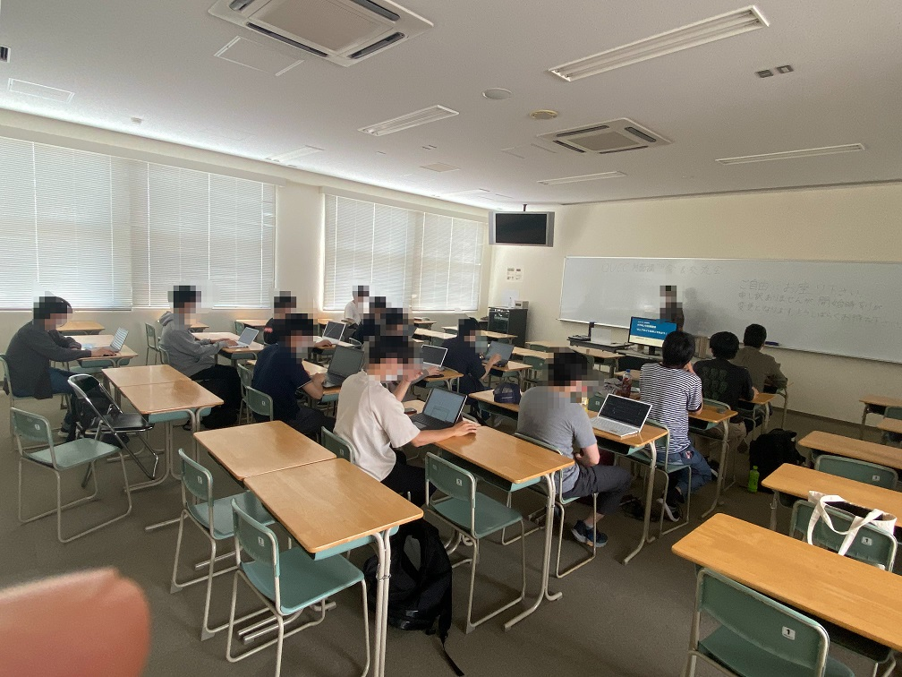
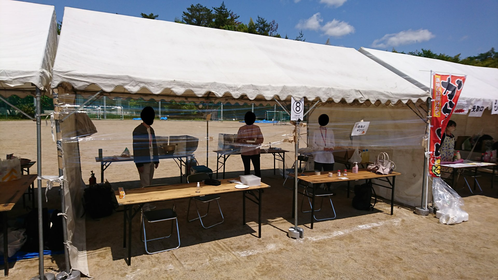

執筆者: [watamario15](https://github.com/watamario15) (2022 年度部長)

これは [OUCC Advent Calendar 2022](https://adventar.org/calendars/7859) の 3 日目の記事です。昨日は[中編](/blog/870)をお届けしました。

## 2022 年度
2022 年度は、2021 年度に進めた改革の続き、2021 年度には部室の処理があったためにできなかった「コンピュータクラブ」としての活動の再興、そして後輩への継承を進めました。私は部長となりましたが、恐らく部の運営に関わる最後の年になるため、引継ぎを考えて関与量は 2021 年度よりはかなり減らしました。

### 新歓 (講習会、チーム開発など, 4-6 月)
2021 年度と同じ流れですが、部員数がかなり回復したことで、講習会担当者の割り振りはものすごくスムーズでした。結果、1 人で 3 つ担当するとかいう 2021 年度の私のような人は生じず、1 人 1 つ以下で回せました。COVID-19 もある程度落ち着いてきていたため、副部長が中心となり、大学の教室を借りて 3 年ぶりの対面講習会も実施されました。2021 年度に引き続き、RAINBOU による競プロ講習会 ([@KowerKoint2010](https://twitter.com/KowerKoint2010)) も実施しました。また、チーム開発も全員参加ではなく、興味のある人の任意参加としました。2021 年度までは「自由な緩い部活」を謳いながら、人数の都合上強制参加のイベントがそれなりにあるという矛盾状態にあったのですが、2022 年度の人数なら任意参加でもできると判断しました。これによってか、あるいは流行りのクロスプラットフォーム開発環境 [Flutter](https://flutter.dev/) を選んだのが良かったのか、今回は全て少なくとも「使える」レベルの一定の完成度に達しました。

各開発プロジェクトのリンクはこちらです:
- [目覚まし](https://github.com/OUCC/alarm2022)
- [単語帳](https://github.com/OUCC/EnglishWordCard2022) ([deployment](https://oucc.github.io/EnglishWordCard2022/))
- [電卓](https://github.com/OUCC/calculator2022) ([deployment](https://oucc.github.io/calculator2022/))

ちなみに、こうして掲載できていることからわかるように、この開発は完全に OSS で行われました。このまま OSS で開発することが当たり前となり、公開コミュニティ化が推進されていくと嬉しいものです。

### いちょう祭 (5 月)
部室を手放したことで財政的には安定していましたが、それは「存続できる」という意味であって、何か古い機器の更新など、設備投資ができる状態ではありません。入部障壁を下げるために部費を減額した以上、学祭は重要な収入源となります。この時期は新歓という意味でも重要です。という訳で、まちかね祭に引き続き久し振り (3 年ぶり) に開催されたいちょう祭にも出展することになりました。

さて、いちょう祭自体は 3 年ぶりですが、やることはまちかね祭と同じです。なので、特に問題なく...行きませんでした。まず、懲りずに食品模擬店と展示を両方出展したので、やはりカツカツでした。そして、一番は思ったより客足が無かったことと、唐揚げが他の 5 店舗と被ったことでした。被りについてはギリギリまで知らされなかったためどうしようもなかったのですが、結果大量に余り利益が出ませんでした。まあ、原価率 25% なので大赤字とはならず、15163 円の赤字で済みましたが。

これで懲りたので、以降は「いちょう祭ではゲーム展示 (新歓、活動紹介) のみを行い、まちかね祭では食品模擬店 (活動資金の獲得) のみを行う」という方針になりました。

### 夏の開発 (8 月)
2 年前から続くアクション RPG の改良、2021 年度の会話ボットの強化、画像判別の新規制作が行われました。これらは 11 月のまちかね祭での出展を目指して制作され、実際に使用しました。2022 年度のまちかね祭に関しては、副部長が記事を作成しているそうなのでここでは省略します。ちなみに、まちかね祭では食品模擬店という方針にしたと先ほど書いたところですが、これについては、部員がもう食品は懲り懲りだということで、今年度限りでまちかね祭もゲーム展示とする方針になりました。

### KC3 2022 (9 月)
毎年恒例 [KC3 2022](https://kc3.me/news/387/) です。今年度はハイブリッド形式となり、2 年ぶりに対面開催が復活しました。OUCC からは [@kakikaki85](https://twitter.com/kakikaki85) による「[画像認識で遊んでみよう](https://kc3.me/study/451/)」と私のニッチな「[電子辞書でプログラミング](https://kc3.me/study/485/)」を出しました。高い技術力を持った関西の情報系学生が一堂に集まったことで、刺激を受けた部員も多かったはずです。

### まとめ
まちかね祭の話を省略するので、12/1 時点で書ける内容はこの辺りです。遺産の処理が終わったこと、部員数が回復したこと、財政的にも余裕ができたことで、部の運営は随分と安定するようになりました。後輩も積極的に運営を支えてくれており、来年度以降も期待できます。

## 今後の展望
私が目指していたものは、「同じ大学のコンピュータに興味のある人と情報交換ができたり、(主に)情報系学科なら履修や講義の相談ができたりする」コミュニティでした。これは、従来の「クラブ・サークル」としての在り方とは一線を画すものであり、同時に現代の多くのコミュニティの姿でもあります。特に Discord 等のオンラインコミュニティ形成に便利なサービスが登場したことによって可能になったものでしょう。今ではソフトウェアを GitHub で公開して Twitter で発表する、ということが誰でもできるようになったため、既に技術を持っている人は大抵自分でプロジェクトを決めて開発するようになり、クラブ・サークルに所属する流れは縮小に向かっているのだと思います。冒頭に述べたとおり、私も元はクラブ・サークルへの所属に消極的でした。では、それを邪魔することなく、意見交換などができるコミュニティとしての OUCC ならどうでしょうか。これなら、既に技術を持っている人でも入部、あるいはそこまでいかなくとも公開コミュニティへの参加までは検討してもらえるのではないかと期待しています。そして、そういうコミュニティは、時代が変わっても常に需要があるものだと思うんですよね。そういう意味で様々な改革を進めましたが、まだ不完全な部分は多いです。これをどういった方向に発展させていくのか、あるいはまた根底から覆して全く別の OUCC に改革するのか、これは次世代に託します。

様々な苦難を経て、ようやく安定した基盤を確立できました。余裕ができてこそイノベーションのきっかけが生まれるので、これは重要です。来年度以降、この基盤の上にどういった情報系コミュニティ OUCC が生まれるのか、是非とも期待したいところです。

## おわりに
12/5 - 12/11 にかけて、[Osaka University Giving Campaign 2022](https://osaka-u.giving-campaign.jp/) なるイベントが開催されます。今回が初めてのイベントであり、我々としてもつい先日大学からメールがあったところなのでよく分からないところも多いですが、東大初のベンチャー企業 [Alumnote](https://corporate.alumnote.jp/) が、スポンサー企業から集まった寄付金を得票数によって分配するイベントのようです。胡散臭さがすごいですが、主催は大阪大学となっており、大阪大学の内部ツール KOAN でも学生センターから通知が行われたため、怪しいイベントではないでしょう。既に述べたように、OUCC は資金面において安定して存在できる状態にはありますが、設備投資が行える状態にはありません。最新機器 (考えているものは Apple Silicon Mac や VR 機器) を導入することができれば、OUCC はコミュニティとしての価値のほかに、新しい技術を気軽に試し、学び、新たなイノベーションに繋げる遊び場としての価値も持つことができるようになります。本記事で紹介した OUCC のここ 3 年間の活動や、今後の展望に賛同いただける方は、「大阪大学コンピュータクラブ」にぜひご投票をお願いいたします。各日「正午から 30 分に最も多くの票を集めた団体」に追加で資金分配が行われる「デイリーチャレンジ」なるものがあるようなので、もし可能であればこの時間に投票いただけると有難いです。

最後に、OUCC の公開 Discord サーバーの招待リンクを掲載しておきます。荒らしやスパムでなければ、阪大関係者でなくとも誰でも参加可能としておりますので、他大学の方でも高校生以下の方でも、興味のある方は気軽にご参加ください。なお、スパム対策として「自己紹介」チャンネルで簡単な自己紹介を投稿した参加者にのみ、他のチャンネルに書き込めるようになるシステムとなっておりますので、その点はご協力をお願いします。

招待リンク: https://discord.gg/jBM2NP7ZxK
