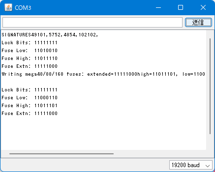

これは [OUCC Advent Calendar 2022](https://adventar.org/calendars/7859) の 4 日目の記事です。結局誰も入れてくれなかったので、自分のストックをそのまま放出します。昨日までは、3 編に分けて OUCC の 3 年間と展望をお届けしておりました。そちらも興味があれば見ていってください。

(ここから本文)

昔入手した [Japanino](https://otonanokagaku.net/japanino/) という付録マイコン、単体では何もできない (当たり前) ので放置していたが最近ふと調べてみると、水晶発振子が搭載されているのに使われていないという情報を発見した。そもそもこのマイコンを活用できていない以上何の意味もないわけだが、使えるはずのものが使われていないというのはどうにも気持ち悪いものだ。で、方法を調べてみると fuse ビットを書き換えると有効化できるようだが、それには書き込み装置か別の Arduino が必要らしい。ただ「使えるはずのものが使われていないというのはどうにも気持ち悪い」というだけで購入するようなものではない。ということで、結局諦めていたのだった...

話は変わるが、2022 年春夏学期、実験 B の授業が始まった。COVID-19 の感染状況が読めない中、いつオンラインにせざるを得なくなっても対応できるように毎回部品類を持ち帰るシステムとなった。また、今年からボードを Arduino (Uno R3) に切り替え、内容を一新したらしい。そして、毎回持ち帰る部品類には当然 Arduino も含まれている。

...ここで何か気付くだろうか。

> fuse ビットを書き換えると有効化できるようだが、それには書き込み装置か別の Arduino が必要らしい。

**あるじゃないか！！まさに今、手元に！！**

ということで、[\[Japanino\] 外部水晶発振子を使う: 案山子のメモ帳](http://kamemo.cocolog-nifty.com/blog/articles/2010/06/japanino-9afa.html)を参考に 2022 年にこの作業を実施してみたログを残したいと思う。

## 要件
- Japanino (持ってなかったらそもそも読んでないと思うけど)
- Arduino Uno R3 (他のボードは知らない)
- PC (Uno R3 にスケッチを書き込み、シリアルモニタから操作する)
- ジャンパワイヤ6本

なお、この手順に従ったことによって発生した損害に関して私は一切責任を負わない。**自己責任で実施すること。**

## 手順
1. 普通に最新の IDE を https://www.arduino.cc/en/software から入手する。Japanino 用は Uno R3 に対応していないので使えない。
1. https://playground.arduino.cc/Code/Programmer2/ の一番下にある [programmer2.txt](https://playground.arduino.cc/uploads/Code/programmer2/index.txt) をダウンロードする。japanino-quartz.ino みたいなファイル名にして、その名前のフォルダに入れておくとそのままスケッチとして開ける。
   - もし削除されてダウンロードできなくなった等の際には、Internet Archive を使う。
1. ダウンロードしたファイルをスケッチとして Arduino IDE で開き、以下のような編集を加える。
   - 240 行目ぐらいの謎の隙間に `#define BYTE 0` と書く。別に `void DebugLCD::clear()` より前であって、`#ifdef` の中でなければどこに書いてもいいけど。
   - 450 行目付近の `void DoSTK()` 関数内の `case 'a':` 直後に `break;` を追記する (`case 'a': break;` でいい)。タイプミスで bootloader をふっ飛ばさないようにするための保険。
   - 1000 行目付近の `void Fuse_Arduino_Style()` 関数内の `case atmega168:` で、`CMD_Write_Fuse_High( 0xdf);` を `CMD_Write_Fuse_High( 0xdd);`、`CMD_Write_Fuse_Low( 0xef);` を `CMD_Write_Fuse_Low( 0xc6);` に書き換える。
   - 1100 行目付近の `loader8` と `loader168` (大量の数値が並んでるところ) に `const` 修飾を加える。要するに `unsigned char PROGMEM loader8[]` を `const unsigned char PROGMEM loader8[]` に、`unsigned char PROGMEM loader168[]` を `const unsigned char PROGMEM loader168[]` にすればよい。
1. Arduino Uno R3 に書き込む。
1. 以下のように Arduino Uno R3 と Japanino をジャンパワイヤで結線する。Arduino Uno R3 を PC に接続していれば、この結線によって Japanino にも電源供給されるはず。
   ```
   Arduino Japanino
     +5V --- +5V
     GND --- GND
     D10 --- Reset
     D11 --- D11
     D12 --- D12
     D13 --- D13
   ```
1. Arduino Uno R3 を PC につないだままの状態で、シリアルモニタを開いて 19200 baud に設定する。もし外してしまっても再接続すればよい。
1. `*s` を送信してシグネチャを確かめる。Arduino IDE 2 では Ctrl + Enter が送信。
   - 何も表示されない場合は Arduino Uno R3 を外して Arduino IDE を閉じ、再度 Arduino IDE を立ち上げて Arduino Uno R3 を接続してシリアルモニタを開き、コマンドを再送信してみる。もしそれでもうまくいかなければ、Japanino 用 IDE 等の古いバージョンのシリアルモニタを開いて試してみる。
   - Arduino Uno R3 に書き込んだスケッチはずっと動いているので、IDE の再起動やバージョン変更に伴うスケッチの再コンパイルは不要。
1. `*A` を送信する。`Writing` から始まる文字列が表示されるはず。
   - 小文字にすると全く違う意味となり、手順3で該当箇所の修正を行っていない場合は最悪 bootloader が吹っ飛ぶので注意。
1. `*u` を送信し、以下の出力と一致すれば成功(ただし =&gt; 以降は補足のための追記)。
   ```
   Lock Bits: 11111111 => FF
   Fuse Low:  11000110 => C6
   Fuse High: 11011101 => DD
   Fuse Extn: 11111000 => F8
   ```
   逆に以下なら元のままで、変更できていない。以上の手順を再確認してほしい。
   ```
   Lock Bits: 11111111 => FF
   Fuse Low:  11010010 => D2
   Fuse High: 11011110 => DE
   Fuse Extn: 11111000 => F8
   ```

念のため、書き込んだときに自分が得た出力を掲載する。はじめ最新 IDE では `*s` と `*A` が利かず Japanino の IDE で実行した画像となっているが、その後最新 IDE でも利くようになった。謎。



あいにく私は精度を確認できる機器を持ち合わせていないため、本当にこれでうまくいっているのかどうかは分からない。実際に確認できた人がいれば、Twitter 等で教えてほしい。

## おまけ - Japanino を 2022 年最新環境で使う
以上の作業では Japanino にスケッチを書き込む必要がないため、Japanino 用の環境構築は必要なかった。しかし、実際に Japanino 用に開発を行う際には環境構築が必要になる。以下にその手順を記す。

### ドライバ
Japanino 用 IDE に付属するドライバは古いので、https://jp.silabs.com/developers/usb-to-uart-bridge-vcp-drivers の「ダウンロード」から最新のドライバを取得することを推奨する。Windows なら「CP210x Universal Windows Driver」、macOS なら「CP210x VCP Mac OSX Driver」だろう。

ちなみに、インストールは Windows に関しては .inf ファイルを右クリック (Windows 11 ならさらに「その他のオプションを表示」) で「インストール」を選択してもいいし、Japanino を接続すればデバイスマネージャーに警告表示になっているデバイスが現れるはずなのでそれを選択し、「ドライバの更新」からダウンロードしたドライバを選択してインストールしてもよい。前者は何も表示されないのでちょっと心配になるが、Japanino を接続して Arduino IDE が認識すればインストールできている (最新版 IDE なら不明なボード扱いになるが問題ない)。macOS は知らないので、自分で調べてほしい。多分普通のドライバインストールと同じ。

### IDE
Japanino 用 IDE を使ってもいいのだが、Arduino IDE 2 が使えるようになった今あの太古の昔の IDE は使いたくないだろう。でも朗報だ。**普通に接続して表示されたポートを選び、ボードとして「Arduino Pro or Pro Mini」を選択した上で「ツール -&gt; Processor」から「ATmega168 (3.3V, 8 MHz)」を選べば普通にコンパイルと書き込みが行える。** これは VSCode で行う場合も同じ。
