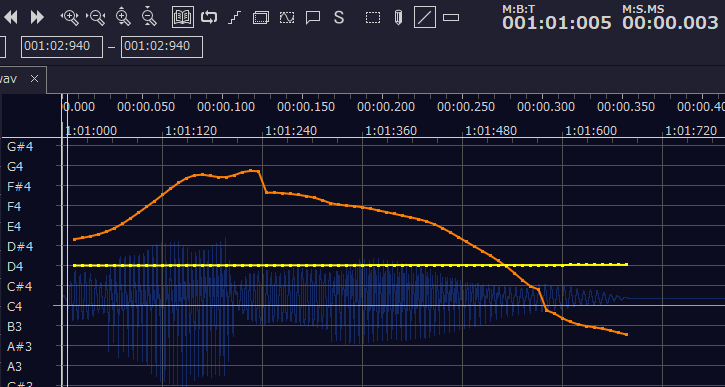

執筆者: ちょくぽ

これは [OUCC Advent Calendar 2022](http://https://adventar.org/calendars/7859 "OUCC Advent Calendar 2022") の 12/9 の記事です。
記事中の〇はただの検索避けです
# 音MADをつくろう
音MADを作る動機はファンアートなどと同じですが、音MADに使われる技術は他のことにも使えます。基本的にDAWとvocalshifterの技術なので。
- 合成音声に歌わせる・変な声を出させる
- 歌の調整をする(人間でも合成音声でも)
- 普通の動画で音ハメ

などなど……
## 前提
Q. 音MADって著作権的にどうなの？
A. 元ネタ(素材)の作者に訴えられた場合、確実に負けます。
音MADを作るなら、著作権者に目を付けられないよう、黙認されるよう常に心がけましょう。(要するに二次創作と同じ)

Q. 音MADって儲かるの？
A. 商用利用が許可されている素材だけで作れば広告を付けることはできますが、それが面白くなる確率はかなり低いです。そもそも儲けようと思わない方がいいです。著作権的にも。

Q. 消されないの？
A. 消されます。よっぽどでない限り動画削除だけで済ませてくれますが……

原作者や他のMAD製作者への、可能な限りのリスペクトor配慮をしましょう。
二次創作界の空気感としてもそういう所は特に大事です。というかどの界隈でも発信をするなら半年ROMれ。

海外のフェアユースの思考は日本の感覚とかけ離れているので参考にしてはダメです

## 音MADの技術の情報はどこで手に入る？
音MADでググるのも良いですが、ニ〇二コだと音楽+コメント付きなので情報が多いです(経験談)。素材はほとんど淫〇ですが。
というか、音MAD自体サムいネタで遊ぶのがメインのような界隈です。勘違いしないように

淫〇や2〇兄貴周りは面白い情報がちょくちょくあります
~~2〇式動画講座が有能すぎ~~
純粋な作曲に関する情報も、当然役に立つのでありです

## 素材集め

素材を集めます。
1. 原曲
MADの原曲となる曲を探して、必要な長さのmp3やmp4を入手します。ボカロなどは作者が配布しているケースがありますが、すべての音を手元で作ればかっこいい……(地獄)。

2. 音声素材
MADの楽器の音やボーカルにするために、素材を集めます。楽器にするならキャラクターの声質や音圧を重視し、環境音をドラムにしましょう。
キャラクターに歌わせたいなら、一文字一文字あつめるのが一番早い。歌詞をガン無視して面白いセリフを音合わせする方が楽。

3. 動画素材
音MAD制作は音作りがすべてではありません。原作に寄せた動画素材を集めたり、MP4を透過したり……同じジャンルのMAD動画も参考にしましょう。手描きは自信があれば。

二次創作を許可しているコンテンツは探せばかなり多いです。
実際によく使われている素材は、BB配布素材のように権利者に削除する気がないもの、権利者がtwitterでMAD動画に言及しているものなど、セーフ寄りのグレーがほとんどですが……
(ニ〇二コで流行っている例のアレの多くは許可されているわけではないので注意)

## ツール

- REAPER
DAWならなんでもいいですが、REAPERがおすすめです。有料として紹介されることが多いですが、普通に無料で使えます。

- VocalShifter
音声が一定の音程になるよう調整し、素材にできる。音の外しや調子など細かな調整もできる。

- Wavetone
テンポ測定や耳コピが必要なら。

- 動画編集ソフト
Aviutlなんてソフトは過去の産物なので、普通に最近出たソフトを使いましょう。私はAviutl使います。どれも機能はだいたい一緒です。

## メイン
REAPERの操作は覚えれば便利な操作が書ききれないほどあるので、適宜調べてください

web上の適当なオンラインBPM計測などで音楽に合わせてクリックしてテンポを解析したら、REAPERに設定します。

原曲(写真上)をREAPERにドロップすれば、グリッド線がなんとなく波形に合います。

REAPER上ではマウスの他に Alt+ドラッグ、S、ctrl+shift+n、ctrl+D、F2、Alt+S などの操作をよく使います。適当に試して体で覚えましょう。

素材を母音などで分割し、音楽に合うように配置(大抵の場合、八分音符より細かい調整は必要ないです)
原曲の力を借りているので当然、これだけでMADとして聞けるレベルになります。実際、分割と配置のみでランキング上位になるような音MADも多いです。

エフェクト(ここではVST)でリバーブを付ける、パン(FXの左のつまみ)をトラックごとに左右にずらすなどすると聞きやすくなります

次に、音程を変えてみましょう
vocalshifterに素材を渡して素材をダブルクリックすると、ピッチ補正ができます。
黄色い線でピッチを平坦にすれば、音程を変えやすい素材として利用できます。黄色い線(今はD4)がこの音声の音程なので、覚えておきます。

これで作成したピッチ調整済wavファイルをREAPERに持っていきます。複数アイテムを選択してF2から一括でwavファイルを変更できます。

アイテムを選択してShift+0、Shift+9で音程を1ずつ変えられるので、MIDIファイルや楽譜、WaveToneなどとvocalshifterの黄色い線を見比べながら調整しましょう。単純作業です。

これができたら音作りはできたも同然です。
細かい技術は最初から調べるのではなく、とりあえず触ってから学んだ方が意欲も学習速度も上がります。

場所によって黄色の線を数音高くしたり低くすることでビブラートや感情をつけられます。
クオリティ高い音MADでは、次の手順を踏むものが割とあります。
- vocalshifterで平坦にした声をREAPERで並べ、切り貼りタイミング合わせだけする
- それを再度vocalshifterに戻し、音程をつける
- 音程が大きく飛ぶところではしゃくりや裏返り、伸ばすところではビブラートなどをつける

スケールを外すと目立ちすぎるので、外すときの音は考えましょう。(これ以上は音楽理論の話)

Aviutlの編集は割愛しますが、BPMを指定してグリッド線を小説ごとにする設定項目があります。活用しましょう。
音が鳴るたびに素材を左右反転させる、ちょっとだけ大きくして跳ねさせる、などすると視覚的に楽しくなります。
あとイージングを親の仇のように多用しましょう。
モーショングラフィックス関連のプラグインも沢山あるので、Aviutlで何かを始めるときは即座にプラグインを検索しましょう。

## おわりに
いかなる創作においても、数字を見るのはやめましょう。作るのが楽しいのです。
数字は作品のクオリティとは関係なく、題材と宣伝が全てです。マジで。

[OUCC Advent Calendar 2022](http://https://adventar.org/calendars/7859 "OUCC Advent Calendar 2022")

次回のアドベントカレンダーは12/11、Ayaka氏です！
