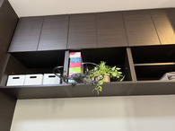
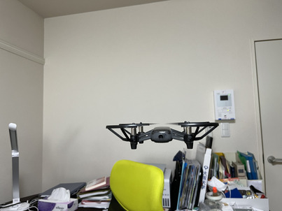

この記事はOUCC Advent Calendar 2022の24日目の記事です。前回の記事はカキのたねさんの「c#でAWSLambda関数を作ってみた」でした。

今回の記事のタイトルは「GolangでTello eduを遊んでみた?」です。
なぜ？がついているのでしょうか。考えてみてください。

<br />
<br />
<br />
<!-- 
[](https://blog.oucc.org/wp-content/uploads/2022/12/gopher_color.png)
 The Go gopher was designed by Renee French -->
<br />
<br />
はじめまして、Namifuji です。今日は家庭でも簡単に楽しむことができるドローンtello eduについてご紹介させていただきます。

## まず、tello eduとはなんぞ？

Tello、Tello eduはドローン界のAppleと言われるDJIと、CPU部分をIntelで共同開発し、Ryze Techから販売されているトイドローンです。機能的にも立派にドローンです。
https://www.ryzerobotics.com/
上記のURLから約1万〜２万円で購入することができます。
そのため、皆さんのクリスマスプレゼントには持ってこいの品だと思います。
法律の許す範囲内で楽しんでいただけたらなと思います。
またTelloはスマホのアプリもしくはGolang、Python、Scrachを通じて操作することができます。
さらに取得した飛行風景をVRや、スマホ、コンピュータを用いることで手軽に見ることができます。
他にも顔識別や音声認識の機能も追加することができるようです。


## 環境
OS: macOS Ventura 13.0.0
Goのバージョン: go1.16 darwin/arm64
Pythonのバージョン:Python 3.10.9

IDE: Goland
エディタ: visual studio code

## 準備
 Golangのフレームワークであるgobotをインストール
 ```go
$ go get -d -u gobot.io/x/gobot/...
```

## やったこと

1、ドローン自体の動作確認
スマホ版のアプリからドローンに接続し、動作確認

結果:飛んだ 。
<br/>
ここで先に以下で用いるドローンの飛行写真はアプリやGolangなどで飛ばした場合とすべて共通で用います。理由としましてはドローンを飛ばすときに発生する音があまりにも大きくて、近所迷惑にならないか不安で、撮る余裕があまりありませんでした。
<br/>
<br/>


<br/>
<br/>

2、 gobotのフレームワークを使わずに、飛ばす。

```go
package main

import "net"

func main() {
	conn, _ := net.Dial("udp", "192.168.10.1:8889")
	conn.Write([]byte("command"))
	conn.Write([]byte("takeoff"))
	conn.Write([]byte("flipoff"))
}

```
<br/>

<br/>
結果:飛んだ 。
<br/>

<br/>
3. gobotを使って飛ばす。

```go
package main

import (
        "fmt"
        "time"

        "gobot.io/x/gobot"
        "gobot.io/x/gobot/platforms/dji/tello"
)

func main() {
        drone := tello.NewDriver("8888")

        work := func() {                                // この関数内に実行する動作を設定
                drone.TakeOff()

                gobot.After(5*time.Second, func() {
                        drone.Land()
                })
        }

        robot := gobot.NewRobot("tello",
                []gobot.Connection{},
                []gobot.Device{drone},
                work,
        )

        robot.Start()
}
```
<br/>

<br/>
結果:成功。
<br/>
<br/>

4 pythonでも飛ぶの確認
```python
import socket
import time

socket = socket.socket(socket.AF_INET, socket.SOCK_DGRAM)
tello_address = ('192.168.10.1' , 8889)

socket.sendto('command'.encode('utf-8'),tello_address)
socket.sendto('takeoff'.encode('utf-8'),tello_address)
```
結果:成功

上記で用いたコードから分かるように、ドローンを飛ばすためのプログラム自体はとても簡単に書けます。
接続先のipアドレスとポートを設定し、コマンドを送信するだけで遊べます。
Golang自体も簡単なプログラムを書く程度であれば、他の言語で何か作った経験があればすぐに理解できると思います。

上記の例ではただ単にドローンを離陸させただけです。

５　それ以外にしたこと
そこでドローンを空中で回転させたり、ドローンの高度を設定できるようにします。以下のgobotのドキュメントの参考にしました。(https://pkg.go.dev/gobot.io/x/gobot/platforms/dji/tello)
それによって入力したキーに応じて空中で一回転したり、時間と共に高度を上げたり、下げたりすることができました。
```go
package main

import (
	"gobot.io/x/gobot"
	"gobot.io/x/gobot/platforms/dji/tello"
	"gobot.io/x/gobot/platforms/keyboard"
)

func handleKeyboardInput(drone *tello.Driver) func(interface{}) {
	return func(data interface{}) {
		key := data.(keyboard.KeyEvent).Key

		switch key {
		case keyboard.A:              // 左へ移動
			drone.Left(3)
		case keyboard.D:              // 右へ移動
			drone.Right(3)
		case keyboard.U:              // 前方へ移動
			drone.Forward(3)
		case keyboard.J:              // 後方へ移動
			drone.Backward(3)
		case keyboard.L:              // 着陸
			drone.Land()
		case keyboard.E:              // 終了
			return
		case keyboard. B:             // 後ろ向きに回転
			drone.BackFlip()
		default:                           // 移動しない
			drone.Forward(0)
			drone.Backward(0)
			drone.Left(0)
			drone.Right(0)
		}
	}
}

func main() {
	keys := keyboard.NewDriver()
	drone := tello.NewDriver("8889")

	work := func() {
		drone.TakeOff()
		drone.BackFlip()

		for {
			keys.On(keyboard.Key, handleKeyboardInput(drone))
		}
	}

	robot := gobot.NewRobot("tello",
		[]gobot.Connection{},
		[]gobot.Device{drone},
		work,
	)

	robot.Start()
}

```

## 終わりに
当日になって始めたので、とても中身の薄い内容となってしまいました。
そのため、春休みなど時間があるときに画像認識の機能などの機能もつけてみたいと思った。

<!--more-->


<br />
telloを動かすコードは数多く公開されているので、それらを使うことで簡単に動かすことも可能です。
今回紹介したこと以外にもtelloについているカメラを使って人の顔を判別して、特定の人を追いかけるプログラムなども作ることができるようです。
